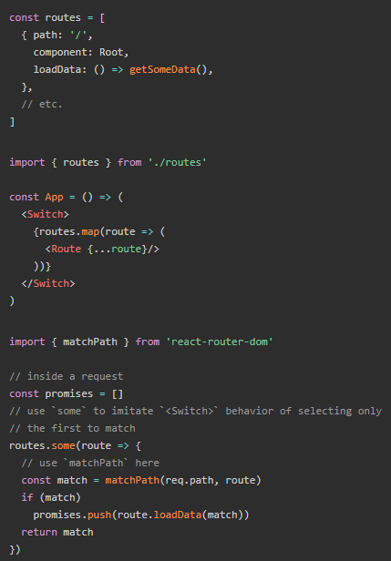
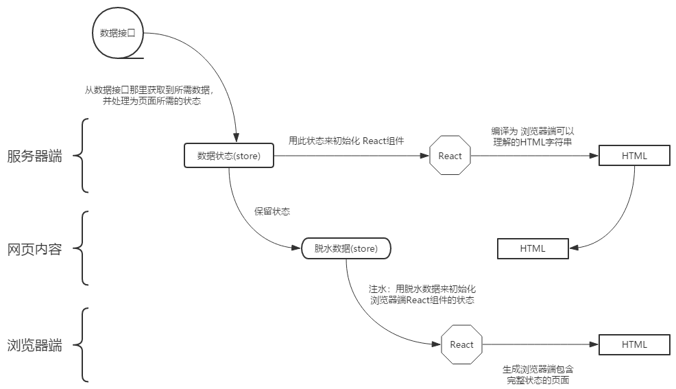

最近看了下 `React SSR`相关的东西，这里记录一下相关内容

>本文实例代码已经上传到 [github](https://github.com/accforgit/blog-data/tree/master/ReactSSR)，感兴趣的可参见 [Basic](https://github.com/accforgit/blog-data/tree/master/ReactSSR/Basic) | [SplitChunkV](https://github.com/accforgit/blog-data/tree/master/ReactSSR/SplitChunkV)

## 初识 React SSR

`nodejs`遵循 `commonjs`规范，文件的导入导出如下：
```js
// 导出
module.exports = someModule
// 导入
const module = require('./someModule')
```
而我们通常所写的 `react`代码是遵循 `esModule`规范的，文件的导入导出如下：
```js
// 导出
export default someModule
// 导入
import module from './someModule'
```

所以想要让 `react`代码兼容于服务器端，就必须先解决这两种规范的兼容问题，实际上 `react`是可以直接以 `commonjs`规范来书写的，例如：
```js
const React = require('react')
```
这样一看似乎就是个写法的转换罢了，没什么问题，但实际上，这只是解决了其中一个问题而已，`react`中常见的渲染代码，即 `jsx`，`node`是不认识的，必须要编译一次
```js
render () {
  // node是不认识 jsx的
  return <div>home</div>
}
```

客户端编译 `react`代码用到最多的就是 `webpack`，服务器端同样可以使用，这里使用 `webpack`的作用有两个：

- 将 `jsx`编译为 `node`认识的原生 `js`代码
- 将 `exModule`代码编译成 `commonjs`的

`webpack`示例配置文件如下：
```js
// webpack.server.js
module.exports = {
  // 省略代码...
  module: {
    rules: [
      {
        test: /\.js$/,
        loader: 'babel-loader',
        exclude: /node_modules/,
        options: {
          // 需要支持 react
          // 需要转换 stage-0
          presets: ['react', 'stage-0', ['env', {
            targets: {
              browsers: ['last 2 versions']
            }
          }]]
        }
      }
    ]
  }
}
```
有了这份配置文件之后，就可以愉快的写代码了

首先是一份需要输出到客户端的 `react`代码：
```js
import React from 'react'

export default () => {
  return <div>home</div>
}
```
这份代码很简单，就是一个普通的 `react stateless`组件

然后是负责将这个组件输出到客户端的服务器端代码：
```js
// index.js
import http from 'http'
import React from 'react'
import { renderToString } from 'react-dom/server'
import Home from './containers/Home/index.js'

const container = renderToString(<Home />)

http.createServer((request, response) => {
  response.writeHead(200, {'Content-Type': 'text/html'})
  response.end(`
    <!DOCTYPE html>
    <html lang="en">
    <head>
      <meta charset="UTF-8">
      <meta name="viewport" content="width=device-width, initial-scale=1.0">
      <meta http-equiv="X-UA-Compatible" content="ie=edge">
      <title>Document</title>
    </head>
    <body>
      <div id="root">${container}</div>
    </body>
    </html>
  `)
}).listen(8888)

console.log('Server running at http://127.0.0.1:8888/')
```
上述代码就是启动了一个 `node http`服务器，响应了一个 `html`页面源码，只不过相比于常见的 `node`服务器端代码而言，这里还引入了 `react`相关库

我们通常所写的 `React`代码，其渲染页面的动作，其实是 `react`调用浏览器相关 `API`实时进行的，即页面是由 `js`操纵浏览器`DOM API`组装而成，服务器端是无法调用浏览器 `API`的，所以这个过程无法进行，这个时候就需要借助 `renderToString`了

`renderToString`是 `React`提供的用于将 `React`代码转换为浏览器可直接识别的 `html`字符串的 `API`，可以认为此 `API`提前将浏览器要做的事情做好了，直接在服务器端将`DOM`字符串拼凑完成，交给 `node`输出到浏览器

上述代码中的变量 `container`，其实就是如下的 `html`字符串：
```html
<div data-reactroot="">home</div>
```
所以，`node`响应到浏览器端的就是一个正常的 `html`字符串了，浏览器直接展示即可，由于浏览器端不需要下载 `react`代码，代码体积更小，也不需要实时拼接 `DOM`字符串，只是简单地进行渲染页面的动作，因而服务器端渲染的速度会比较快

另外，除了 `renderToString`之外，`React v16.x`还提供了另外一个功能更加强大的 `API`：`renderToNodeStream`
`renderToNodeStream`支持直接渲染到节点流。渲染到流可以减少你的内容的第一个字节（`TTFB`）的时间，在文档的下一部分生成之前，将文档的开头至结尾发送到浏览器。 当内容从服务器流式传输时，浏览器将开始解析`HTML`文档，有的文章称此 `API`的渲染速度是 `renderToString`的三倍（到底几倍我没测过，不过一般情况下渲染速度会更快是真的）

所以，如果你使用的是 `React v16.x`，你还可以这么写：
```js
import http from 'http'
import React from 'react'
// 这里使用了 renderToNodeStream
import { renderToNodeStream } from 'react-dom/server'
import Home from './containers/Home/index.js'

http.createServer((request, response) => {
  response.writeHead(200, {'Content-Type': 'text/html'})
  response.write(`
    <!DOCTYPE html>
    <html lang="en">
    <head>
      <meta charset="UTF-8">
      <meta name="viewport" content="width=device-width, initial-scale=1.0">
      <meta http-equiv="X-UA-Compatible" content="ie=edge">
      <title>Document</title>
    </head>
    <body>
      <div id="root">
  `)
  const container = renderToNodeStream(<Home />)
  // 这里使用到了 数据流的概念，所以需要以流的形式进行传送数据
  container.pipe(response, { end: false })
  container.on('end', () => {
    // 响应流结束
    response.end(`
      </div>
      </body>
      </html>
    `)
  })
}).listen(8888)

console.log('Server running at http://127.0.0.1:8888/')
```

### BOM / DOM 相关逻辑同构

有了 `renderToString / renderToNodeStream`之后，似乎服务器端渲染触手可及，但实际上还差得远了，对于如下 `react`代码：
```js
const Home = () => {
  return <button onClick={() => { alert(123) }}>home</button>
}
```
期望是点击按钮的时候，浏览器会弹出一个提示 `123`的弹窗，但是如果只是按照上述的流程，其实这个事件并不会被触发，原因在于 `renderToString`只会解析基本的 `html DOM`元素，并不会解析元素上附加的事件，也就是会忽略掉 `onClick`这个事件

`onClick`是个事件，在我们通常所写的代码中（即非 `SSR`）， `React`是通过对元素进行 `addEventListener`来进行事件的注册，也就是通过 `js`来触发事件，并调用相应的方法，而服务器端显然是无法完成这个操作的，除此之外，一些与浏览器相关的操作也都是无法在服务器端完成的

不过这些并不影响 `SSR`，`SSR`目的之一是为了能让浏览器端更快地渲染出页面，用户交互操作的可执行性不必非要跟随页面 `DOM`同时完成，所以，我们可以将这部分浏览器相关执行代码打包成一个 `js`文件发送到浏览器端，在浏览器端渲染出页面后，再加载并执行这段 `js`，整个页面自然也就拥有了可执行性

>为了简化操作，下面在服务器端引入 [Koa](https://github.com/koajs/koa)

既然浏览器端也需要运行一遍 `Home`组件，那么就需要另外准备一份给浏览器端使用的`Home`打包文件：
```js
// client
import React from 'react'
import ReactDOM from 'react-dom'

import Home from '../containers/Home'

ReactDOM.render(<Home />, document.getElementById('root'))
```
就是平常写得浏览器端 `React`代码，把 `Home`组件又打包了一次，然后渲染到页面节点上

另外，如果你用的是 `React v16.x`，上述代码的最后一句建议这么写：
```js
// 省略代码...
ReactDOM.hydrate(<Home />, document.getElementById('root'))
```
`ReactDOM.render` 与 `ReactDOM.hydrate` 之间主要的区别就在于后者有更小的性能开销（只用于服务器端渲染），更多详细可见 [hydrate](https://reactjs.org/docs/react-dom.html#hydrate)

需要将这份代码打包成一段 `js`代码，并传送到浏览器端，所以这里还需要对类似的客户端同构代码进行 `webpack`的配置：
```js
// webpack.client.js
const path = require('path')

module.exports = {
  // 入口文件
  entry: './src/client/index.js',
  // 表示是开发环境还是生产环境的代码
  mode: 'development',
  // 输出信息
  output: {
    // 输出文件名
    filename: 'index.js',
    // 输出文件路径
    path: path.resolve(__dirname, 'public')
  },
  // ...
}
```
这份配置文件与服务器端的配置文件 `webpack.server.js`相差无几，只是去除了服务器端相关的一些配置罢了

此配置文件声明将 `Home`组件打包到 `public`目录下，文件名为 `index.js`，所以我们只要在服务器端输出的 `html`页面中，将这个文件加载进去即可：
```js
// server
// 省略无关代码...
app.use(ctx => {
  ctx.response.type = 'html'
  ctx.body = `
    <!DOCTYPE html>
    <html lang="en">
      <head>
        <meta charset="UTF-8">
        <meta name="viewport" content="width=device-width, initial-scale=1.0">
        <meta http-equiv="X-UA-Compatible" content="ie=edge">
        <title>Document</title>
      </head>
      <body>
        <div id="root">${container}</div>
        <!-- 引入同构代码 -->
        <script src="/index.js"></script>
      </body>
    </html>
  `
})
app.listen(3000)
```

对于 `Home`这个组件来说，它在服务器端被运行了一次，主要是通过 `renderToString/renderToNodeStream`生成纯净的 `html`元素，又在客户端运行了一次，主要是将事件等进行正确地注册，二者结合，就整合出了一个可正常交互的页面，这种服务器端和客户端运行同一套代码的操作，也称为 **同构**

## 路由同构(Router)

解决了事件等 `js`相关的代码同构后，还需要对路由进行同构

一般情况下在 `react`代码中会使用 `react-router`进行路由的管理，这里在服务器端传送给浏览器端的同构代码中，依旧按照通用做法即可（`HashRouter/BrowserRouter`），这里以 `BrowserRouter`为例

路由的定义：
```js
import React, { Fragment } from 'React'
import { Route } from 'react-router-dom'

import Home from './containers/Home'
import Login from './containers/Login'

export default (
  <Fragment>
    <Route path='/' exact component={Home}></Route>
    <Route path='/login' exact component={Login}></Route>
  </Fragment>
)
```
浏览器端代码引入：
```js
import React from 'react'
import ReactDOM from 'react-dom'
// 这里以 BrowserRouter 为例，HashRouter也是可以的
import { BrowserRouter } from 'react-router-dom'
// 引入定义的路由
import Routes from '../Routes'
const App = () => {
  return (
    <BrowserRouter>
      {Routes}
    </BrowserRouter>
  )
}
ReactDOM.hydrate(<App />, document.getElementById('root'))
```

主要在于服务器端的路由引入：
```js
// 使用 StaticRouter
import { StaticRouter } from 'react-router-dom'
import Routes from '../Routes'
// ...
app.use(ctx => {
  const container = renderToNodeStream(
    <StaticRouter location={ctx.request.path} context={{}}>
      {Routes}
    </StaticRouter>
  )
  // ...
})
```
服务器端的路由是无状态的，也就是不会记录一些路由的操作，无法自动获知浏览器端的路由变化和路由状态，因为这都是浏览器的东西，`React-router 4.x`为服务器端提供了 `StaticRouter`用于路由的控制，此`API`通过传入的 `location`参数来被动获取当前请求的路由，从而进行路由的匹配与导航，更多详细可见 [StaticRouter](https://reacttraining.com/react-router/web/api/StaticRouter)

## 状态同构(State)

当项目比较大的时候，通常我们会使用 `redux`来对项目进行数据状态的管理，为了保证服务器端的状态与客户端状态的一致性，还需要对状态进行同构

服务器端的代码是给所有用户使用的，必须要独立开所有用户的数据状态，否则会导致所有用户共用了同一个状态

```js
// 这种写法在客户端可取，但在服务器端会导致所有用户共用了同一个状态
// export default createStore(reducer, applyMiddleware(thunk))
export default () => createStore(reducer, applyMiddleware(thunk))
```
注意上述代码导出的是一个函数而不是一个 `store`对象，想要获取 `store`只需要执行这个函数即可：
```js
import getStore from '../store'
// ...
<Provider store={getStore()}>
  <StaticRouter location={ctx.request.path} context={context}>
    {Routes}
  </StaticRouter>
</Provider>
```
这样一来就能保证服务器端在每次接收到请求的时候，都重新生成一个新的 `store`，也就相当于每个请求都拿到了一个独立的全新状态

上面只是解决了状态独立性问题，但 `SSR`状态同步的关键点在于异步数据的同步，例如常见的数据接口的调用，这就是一个异步操作，如果你像在客户端中使用 `redux`来进行异步操作那样在服务器端也这样做，那么虽然项目不会报错，页面也能正常渲染，但实际上，这部分异步获取的数据，在服务器端渲染出的页面中是缺失的

这很好理解，服务器端虽然也可以进行数据接口的请求操作，但由于接口请求是异步的，而页面渲染是同步的，很可能在服务器响应输出页面的时候，异步请求的数据还没有返回，那么渲染出来的页面自然就缺失数据了

既然是因为异步获取数据的问题导致数据状态的丢失，那么只要保证能在服务器端响应页面之前，就拿到页面所需要的正确数据，问题也就解决了

这里其实存在两个问题：

- 需要知道当前请求的是哪个页面，因为不同的页面所需要的数据一般都是不同的，所需要请求的接口和数据处理的逻辑也都是不同
- 需要保证服务器端在响应页面之前就已经从接口拿到了数据，也就是拿到了处理好的状态(`store`)

对于第一个问题，[react-router](https://reacttraining.com/react-router/web/guides/server-rendering) 其实已经在 `SSR`方面给出了解决方案，即通过 [配置路由/route-config](https://reacttraining.com/react-router/web/example/route-config) 结合 [matchPath](https://reacttraining.com/react-router/web/api/matchPath)，找到页面上相关组件所需的请求接口的方法并执行：



另外，`react-router`提供的 `matchPath`只能识别一级路由，对于多级路由来说只能识别最顶级的那个而会忽略子级别路由，所以如果项目不存在多级路由或者所有的数据获取和状态处理都是在顶级路由中完成的，那么使用 `matchPath`是没有问题的，否则就可能出现子级路由下的页面数据丢失问题

对于这个问题，`react-router`也给出了 [解决方案](https://github.com/ReactTraining/react-router/tree/master/packages/react-router-config)，即由开发者自行使用 `react-router-config`中提供的 `matchRoutes` 来替代 `matchPath`

对于第二个问题，其实这就容易多了，就是 `js`代码中常见的异步操作同步化，最常用的 `Promise` 或 `async/await`都可以解决这个问题

```js
const store = getStore()
const promises = []
// 匹配的路由
const mtRoutes = matchRoutes(routes, ctx.request.path)
mtRoutes.forEach(item => {
  if (item.route.loadData) {
    promises.push(item.route.loadData(store))
  }
})
// 这里服务器请求数据接口，获取当前页面所需的数据，填充到 store中用于渲染页面
await Promise.all(promises)
// 服务器端输出页面
await render(ctx, store, routes)
```

然而，解决了这个问题之后，另一个问题又来了

前面说了，`SSR`的过程要保证服务器端和客户端页面的数据状态一致，根据上述流程，服务器端最终会输出一个带有数据状态的完整页面，但是客户端这边的代码逻辑，是首先渲染出一个没有数据状态的页面架子，之后才会在 `componentDidMount`之类的钩子函数里发起数据接口请求拿到数据，进行状态处理，最后得到的页面才和服务器端输出的一致

那么在客户端代码拿到数据之前的这段时间，客户端的数据状态其实是空的，而服务器端的数据状态是完整的，所以两端数据状态不一致，就会出问题

解决这个问题的流程，其实就是数据的 **脱水** 和 **注水**

在服务器端，当服务端请求接口拿到数据，并处理好数据状态(例如 `store`的更新)后，保留住这个状态，在服务器端响应页面`HTML`的时候，将这个状态一并传递给浏览器，这个过程，叫做**脱水**(`Dehydrate`)；在浏览器端，就直接拿这个**脱水**数据来初始化 `React`组件，也就是客户端不需要自己发起请求获取数据处理状态了，因为服务器端已经做好了这件事情，直接从服务器端那里获取处理好的状态即可，这个过程叫**注水**(`Hydrate`)



而服务器端将状态连同 `html`一并传送给浏览器端的方式，一般都是通过全局变量完成：
```js
ctx.body = `
  <!DOCTYPE html>
  <html lang="en">
    <head>
      <meta charset="UTF-8">
      <meta name="viewport" content="width=device-width, initial-scale=1.0">
      <meta httpquiv="X-UA-Compatible" content="ie=edge">
      <title>Document</title>
    </head>
    <body>
      <div id="root">${data.toString()}</div>
      <!-- 从服务器端拿到脱水的数据状态 -->
      <script>
        window.context = {
          state: ${JSON.stringify(store.getState())}
        }
      </script>
      <!-- 引入同构代码 -->
      <script src="/index.js"></script>
    </body>
  </html>
`
```

然后浏览器端在接收到服务器端发送来的页面后，就可以直接从 `window`对象上获取到状态了，然后使用此状态来更新浏览器端本身的状态即可：
```js
export const getClientStore = () => {
  // 从服务器端输出的页面上拿到脱水的数据
  const defaultState = window.context.state
  // 当做 store的初始数据（即注水）
  return createStore(reducer, defaultState, applyMiddleware(thunk))
}
```

## 引入样式

样式的引入就比较简单了，可以从两个角度来考虑：

- 在服务器端输出 `html`文档的同时，在 `html`上加个 `<style>`标签，此标签内部写入样式字符串，一同传送到客户端
- 在服务器端输出 `html`文档的同时，在 `html`上加个 `<link>`标签，此标签的 `href`指向一份样式文件，此样式文件就是页面的样式文件

这两种操作大体思路差不多，而且和在客户端渲染中引入样式的流程也差不多，主要是借助 `webpack`，通过 `loader`插件将 `react`组件内写入的样式提取出来，与此相关的 `loader`插件一般有 `css-loader`、`style-loader`、`extract-text-webpack-plugin / mini-css-extract-plugin`，如果使用了 `css`后处理器的话，那么可能还需要 `sass-loader`或`less-loader`等，这里不考虑这些复杂情形，只针对最基本的 `css`引入

### 内联样式

针对第一种使用内联样式，直接把样式嵌入到页面中，需要用到 `css--loader`和 `style-loader`， `css-loader`可以继续用，但是 `style-loader`由于存在一些跟浏览器相关的逻辑，所以无法在服务器端继续用了，但好在早就有了替代插件，[isomorphic-style-loader](https://github.com/kriasoft/isomorphic-style-loader)，此插件用法跟 `style-loader`差不多，但是同时支持在服务器端使用

[isomorphic-style-loader](https://github.com/kriasoft/isomorphic-style-loader) 会将导入 `css`文件转换成一个对象供组件使用，其中一部分属性是类名，属性的值是类对应的 `css`样式，所以可以直接根据这些属性在组件内引入样式，除此之外，还包括几个方法，`SSR`需要调用其中的 `_getCss`方法以获取样式字符串，传输到客户端

鉴于上述过程（即将 `css`样式汇总及转化为字符串）是一个通用流程，所以此插件项目内主动提供了一个用于简化此流程的 `HOC`组件：[withStyles.js](https://github.com/kriasoft/isomorphic-style-loader/blob/master/src/withStyles.js)

此组件所做的事情也很简单，主要是为 `isomorphic-style-loader`中的两个方法：`__insertCss` 和 `_getCss` 提供了一个接口，以 [Context](https://reactjs.org/docs/context.html) 作为媒介，传递各个组件所引用的样式，最后在服务端和客户端进行汇总，这样一来，就能够在服务端和客户端输出样式了

服务端：
```js
import StyleContext from 'isomorphic-style-loader/StyleContext'
// ...
const css = new Set()
const insertCss = (...styles) => styles.forEach(style => css.add(style._getCss()))
const container = renderToNodeStream(
  <Provider store={store}>
    <StaticRouter location={ctx.request.path} context={context}>
      <StyleContext.Provider value={{ insertCss }}>
        {renderRoutes(routes)}
      </StyleContext.Provider>
    </StaticRouter>
  </Provider>
)
```

客户端：
```js
import StyleContext from 'isomorphic-style-loader/StyleContext'
// ...
const insertCss = (...styles) => {
  const removeCss = styles.map(style => style._insertCss())
  return () => removeCss.forEach(dispose => dispose())
}

const App = () => {
  return (
    <Provider store={store}>
      <BrowserRouter>
        <StyleContext.Provider value={{ insertCss }}>
          {renderRoutes(routes)}
        </StyleContext.Provider>
      </BrowserRouter>
    </Provider>
  )
}
```

此高阶组件的用法，[isomorphic-style-loader](https://github.com/kriasoft/isomorphic-style-loader) 的 [README.md](https://github.com/kriasoft/isomorphic-style-loader/blob/master/README.md)上已经说得很清楚了，主要就是 [Context](https://reactjs.org/docs/context.html)（`isomorphic-style-loader@5.0.1`之前版本是旧版`Context API`，`5.0.1`及之后是新版`Context API`）以及高阶组件`HOC`的使用

### 外联样式

一般在生产环境大部分都是用外联样式，使用 `<link>`标签在页面上引入样式文件即可，这种其实和上面外联引入 `js`的做法是同一个处理逻辑，相比于内联 引入`CSS`更简单易懂些，服务端和客户端的处理流程也基本相同

[mini-css-extract-plugin](https://github.com/webpack-contrib/mini-css-extract-plugin) 是一个常用的抽取组件样式的 `webpack`插件，由于此插件本质上就是将样式字符串从各组件中抽取出来，整合到一个样式文件中，只是 `JS Core`的操作，所以不存在服务器端和浏览器端的说法，也就用不着进行同构，**以前是如何在纯客户端使用这个插件的，现在就怎么在 `SSR`中使用**，这里就不多说了


## 代码分割

`SSR`的一个重要目的就是加速首屏渲染，因此原有客户端渲染的优化措施，也应该在 `SSR`上使用，其中一个关键点就是代码分割

`React`的代码分割枯有很多，例如 [babel-plugin-syntax-dynamic-import](https://github.com/babel/babel/tree/master/packages/babel-plugin-syntax-dynamic-import)、[react-loadable](https://github.com/jamiebuilds/react-loadable)、[loadable-components](https://github.com/smooth-code/loadable-components)等

一般习惯于使用的库是 [react-loadable](https://github.com/jamiebuilds/react-loadable)，但是我使用的时候遇到了一些问题，想查 `issues`的时候，发现这个项目居然把 `issues`给关了，于是弃之，改用更 `modern` 的 [loadable-components](https://github.com/smooth-code/loadable-components)，此库[文档](https://www.smooth-code.com/open-source/loadable-components/docs/getting-started/)齐全，而且也考虑到了 [SSR](https://www.smooth-code.com/open-source/loadable-components/docs/server-side-rendering/)的情况，并且支持以`renderToNodeStream`的形式渲染页面，只需照着文档做就 `ok`了，很简单上手，这里也不多说了，具体可参见 [SplitChunkV](https://github.com/accforgit/blog-data/tree/master/ReactSSR/SplitChunkV)


## 总结

`SSR`配置起来还是比较麻烦的一个东西，不只是前端层面上的配置，还需要考虑到后端程序相关的东西，例如登录态、高并发、负载均衡、内存管理等，[Winter](https://github.com/wintercn) 曾表示对于 `SSR` 不太看好，其主要是用于 `SEO`，不太建议用做服务端渲染，其能够使用的场景不多，而且成本代价太大

所以对于实际开发来说，个人更建议直接使用业内相对成熟的轮子，例如 `React`的 [Next.js](https://github.com/zeit/next.js)，`Vue`的 [Nuxt.js](https://github.com/nuxt/nuxt.js)