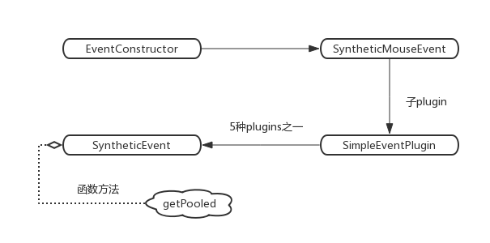

# React 事件机制源码概览

某次被问到 `React`事件机制的问题，关于这一块我确实不怎么清楚，因为平时大部分工作都是用 `Vue`，对于 `React`的熟悉程度只限于会用，具体实现逻辑还真没专门学习过，但是总不能就说自己不清楚吧，好在我了解 `Vue`的事件机制，于是就把 `Vue`的事件机制说了一遍，最后再来一句“我觉得 `React`应该和 `Vue`的差不多”

后来我想了下应该没那么简单，于是网上搜了下相关文章，发现果然是被我想得太简单了，`Vue`通过编译模板，解析出事件指令，将事件和事件回调附加到 `vnode tree`上，在 `patch`过程中的创建阶段和更新阶段都会对这个 `vnode tree`进行处理，拿到每个 `vnode`上附加的事件信息，就可以调用原生 `DOM API`对相应事件进行注册或移除，流程还是比较清晰的，而`React`则是单独实现了一套事件机制

>本文以 `React v16.5.2` 为基础进行源码分析

## 基本流程

在 `react`源码的 `react-dom/src/events/ReactBrowserEventEmitter.js`文件的开头，有这么一大段注释：
```js
/**
 * Summary of `ReactBrowserEventEmitter` event handling:
 *
 *  - Top-level delegation is used to ......
 * ......
 *
 * +------------+    .
 * |    DOM     |    .
 * +------------+    .
 *       |           .
 *       v           .
 * +------------+    .
 * | ReactEvent |    .
 * |  Listener  |    .
 * +------------+    .                         +-----------+
 *       |           .               +--------+|SimpleEvent|
 *       |           .               |         |Plugin     |
 * +-----|------+    .               v         +-----------+
 * |     |      |    .    +--------------+                    +------------+
 * |     +-----------.--->|EventPluginHub|                    |    Event   |
 * |            |    .    |              |     +-----------+  | Propagators|
 * | ReactEvent |    .    |              |     |TapEvent   |  |------------|
 * |  Emitter   |    .    |              |<---+|Plugin     |  |other plugin|
 * |            |    .    |              |     +-----------+  |  utilities |
 * |     +-----------.--->|              |                    +------------+
 * |     |      |    .    +--------------+
 * +-----|------+    .                ^        +-----------+
 *       |           .                |        |Enter/Leave|
 *       +           .                +-------+|Plugin     |
 * +-------------+   .                         +-----------+
 * | application |   .
 * |-------------|   .
 * |             |   .
 * |             |   .
 * +-------------+   .
 *                   .
 *    React Core     .  General Purpose Event Plugin System
 */
```

这段注释第一段文本内容被我省略掉了，其主要是在大概描述 `React`的事件机制，也就是这个文件中的代码要做的一些事情，大概意思就是说事件委托是很常用的一种浏览器事件优化策略，于是 `React`就接管了这件事情，并且还贴心地消除了浏览器间的差异，赋予开发者跨浏览器的开发体验，主要是使用 `EventPluginHub`这个东西来负责调度事件的存储，合成事件并以对象池的方式实现创建和销毁，至于下面的结构图形，则是对事件机制的一个图形化描述

根据这段注释，大概可以提炼出以下几点内容：

- `React`事件使用了事件委托的机制，一般事件委托的作用都是为了减少页面的注册事件数量，减少内存开销，优化浏览器性能，`React`这么做也是有这么一个目的，除此之外，也是为了能够更好的管理事件，实际上，`React`中所有的事件最后都是被委托到了 `document`这个顶级`DOM`上
- 既然所有的事件都被委托到了 `document`上，那么肯定有一套管理机制，所有的事件都是以一种先进先出的队列方式进行触发与回调
- 既然都已经接管事件了，那么不对事件做些额外的事情未免有些浪费，于是 `React`中就存在了自己的 合成事件(`SyntheticEvent`)，合成事件由对应的 `EventPlugin`负责合成，不同类型的事件由不同的 `plugin`合成，例如 `SimpleEvent Plugin`、`TapEvent Plugin`等
- 为了进一步提升事件的性能，使用了 `EventPluginHub`这个东西来负责合成事件对象的创建和销毁

下文均以下述这段代码为示例进行分析：
```js
export default class MyBox extends React.Component {
  clickHandler(e) {
    console.log('click callback', e)
  }
  render() {
    return (
      <div className="box" onClick={this.clickHandler}>文本内容</div>
    )
  }
}
```

## 事件注册

只看相关主体流程，其他诸如 `vnode`的创建等前提流程就不管了，从`setInitialDOMProperties`这个方法开始看起，这个方法主要用于遍历 `ReactNode`的 `props`对象，给最后将要真正渲染的真实 `DOM`对象设置一系列的属性，例如 `style`、`class`、`autoFocus`，也包括`innerHTML`、`event`的处理等，示例中 `.box`元素的 `props`对象结构如下：


这个方法中有个 `case`，就是专门用于处理事件的：
```js
// react-dom/src/client/ReactDOMComponent.js
else if (registrationNameModules.hasOwnProperty(propKey)) {
  if (nextProp != null) {
    if (true && typeof nextProp !== 'function') {
      warnForInvalidEventListener(propKey, nextProp);
    }
    // 处理事件类型的 props
    ensureListeningTo(rootContainerElement, propKey);
  }
}
```

其中的 `registrationNameModules`这个变量，里面存在一大堆的属性，都是与 `React`的事件相关：


例子中的 `onClick`这个 `props`显然符合，所以可以执行 `ensureListeningTo`这个方法：
```js
// react-dom/src/client/ReactDOMComponent.js
function ensureListeningTo(rootContainerElement, registrationName) {
  var isDocumentOrFragment = rootContainerElement.nodeType === DOCUMENT_NODE || rootContainerElement.nodeType === DOCUMENT_FRAGMENT_NODE;
  var doc = isDocumentOrFragment ? rootContainerElement : rootContainerElement.ownerDocument;
  listenTo(registrationName, doc);
}
```
这个方法中，首先判断了 `rootContainerElement`是不是一个 `document`或者 `Fragment`(文档片段节点)，示例中传过来的是 `.box`这个 `div`，显然不是，所以 `doc`这个变量就被赋值为 `rootContainerElement.ownerDocument`，这个东西其实就是 `.box`所在的 `document`元素，把这个`document`传到下面的 `listenTo`里了，**事件委托**也就是在这里做的，所有的事件最终都会被委托到 `document` 或者 `fragment`上去，大部分情况下都是 `document`，然后这个 `registrationName`就是事件名称 `onClick`

接着开始执行 `listenTo`方法，这个方法其实就是注册事件的入口了，方法里面有这么一句：
```js
// react-dom/src/events/ReactBrowserEventEmitter.js
var dependencies = registrationNameDependencies[registrationName];
```
`registrationName`就是传过来的 `onClick`，而变量 `registrationNameDependencies`是一个存储了 `React`事件名与浏览器原生事件名对应的一个 `Map`，可以通过这个 `map`拿到相应的浏览器原生事件名，`registrationNameDependencies`结构如下：


可以看到，`React`是给事件名做了一些跨浏览器兼容事情的，比如传入 `onChange`事件，会自动对应上 `blur change click focus`等多种浏览器原生事件

接下来，遍历这个 `dependencies`数组，进入到以下 `case`：
```js
// react-dom/src/events/ReactBrowserEventEmitter.js
switch (dependency) {
  // 省略一些代码
  default:
    // By default, listen on the top level to all non-media events.
    // Media events don't bubble so adding the listener wouldn't do anything.
    var isMediaEvent = mediaEventTypes.indexOf(dependency) !== -1;
    if (!isMediaEvent) {
      trapBubbledEvent(dependency, mountAt);
    }
    break;
}
```
除了 `scroll focus blur cancel close`方法走 `trapCapturedEvent`方法，`invalid submit reset`方法不处理之外，剩下的事件类型全走`default`，执行 `trapBubbledEvent`这个方法，`trapCapturedEvent` 和 `trapBubbledEvent`二者唯一的不同之处就在于，对于最终的合成事件，前者注册**捕获阶段**的事件监听器，而后者则注册**冒泡阶段**的事件监听器

>由于大部分合成事件的代理注册的都是**冒泡阶段**的事件监听器，也就是委托到 `document`上注册的是冒泡阶段的事件监听器，所以就算你显示声明了一个捕获阶段的 `React`事件，例如 `onClickCapture`，此事件的响应也会晚于原生事件的捕获事件以及**冒泡事件**
>实际上，所有原生事件的响应(无论是冒泡事件还是捕获事件)，都将早于 `React`合成事件(`SyntheticEvent`)，对原生事件调用 `e.stopPropagation()`将阻止对应 `SyntheticEvent`的响应，因为对应的事件根本无法到达`document` 这个事件委托层就被阻止掉了

二者区别不大，`trapBubbledEvent`用的最多，本示例也将执行这个方法，所以就跟着这个方法看下去：
```js
// react-dom/src/events/EventListener.js
// 对于本示例来说，topLevelType就是 click，element就是 document
function trapBubbledEvent(topLevelType, element) {
  if (!element) {
    return null;
  }
  var dispatch = isInteractiveTopLevelEventType(topLevelType) ? dispatchInteractiveEvent : dispatchEvent;

  addEventBubbleListener(element, getRawEventName(topLevelType),
  // Check if interactive and wrap in interactiveUpdates
  dispatch.bind(null, topLevelType));
}
```

`addEventBubbleListener`这个方法接收三个参数，在本示例中，第一个参数 `element`其实就是 `document`元素，`getRawEventName(topLevelType)`就是 `click`事件，第三个参数的 `dispatch`就是 `dispatchInteractiveEvent`，`dispatchInteractiveEvent`其实最后还是会执行 `dispatchEvent`这个方法，只是在执行这个方法之前做了一些额外的事情，这里不需要关心，可以暂且认为二者是一样的

看下 `addEventBubbleListener`这个方法：
```js
// react-dom/src/events/EventListener.js
export function addEventBubbleListener(
  element: Document | Element,
  eventType: string,
  listener: Function,
): void {
  element.addEventListener(eventType, listener, false);
}
```
这个方法很简单，就是用 `addEventListener`给 `document`注册了一个冒泡事件，`listener`这个事件的回调就是之前传入 `dispatch.bind(null, topLevelType)`

流程图如下：


## 事件分发

既然所有的事件都委托注册到了 `document`上，那么事件触发的时候，肯定需要一个事件分发的过程，来找到到底是哪个元素触发的事件，并执行相应的回调函数，需要注意的是，由于元素本身并没有注册任何事件，而是委托到了 `document`上，所以这个将被触发的事件是 `React`自带的合成事件，而非浏览器原生事件，但总之都是需要一个分发的过程的

在前面的 事件注册 中已经提到过，注册到 `document`上的事件，对应的回调函数都会触发 `dispatchEvent`这个方法，进入这个方法：

```js
// react-dom/src/events/ReactDOMEventListener.js
const nativeEventTarget = getEventTarget(nativeEvent);
let targetInst = getClosestInstanceFromNode(nativeEventTarget);
```
首先找到事件触发的 `DOM`和 `React Component`，找真实 `DOM`比较好找，直接取事件回调的 `event`参数的 `target | srcElement | window`即可，然后这个 `nativeEventTarget`对象上挂在了一个以 `__reactInternalInstance`开头的属性，这个属性就是  `internalInstanceKey`，其值就是当前 `React`实例对应的 `React Component`

然后继续往下看：
```js
try {
  // Event queue being processed in the same cycle allows
  // `preventDefault`.
  batchedUpdates(handleTopLevel, bookKeeping);
} finally {
  releaseTopLevelCallbackBookKeeping(bookKeeping);
}
```

`batchedUpdates`，字面意思就是批处理更新，这里实际上就是把当前触发的事件放入了批处理队列中，其中，`handleTopLevel`是事件分发的核心所在：
```js
// react-dom/src/events/ReactDOMEventListener.js
let targetInst = bookKeeping.targetInst;

// Loop through the hierarchy, in case there's any nested components.
// It's important that we build the array of ancestors before calling any
// event handlers, because event handlers can modify the DOM, leading to
// inconsistencies with ReactMount's node cache. See #1105.
let ancestor = targetInst;
do {
  if (!ancestor) {
    bookKeeping.ancestors.push(ancestor);
    break;
  }
  const root = findRootContainerNode(ancestor);
  if (!root) {
    break;
  }
  bookKeeping.ancestors.push(ancestor);
  ancestor = getClosestInstanceFromNode(root);
} while (ancestor);
```
首先在事件回调之前，根据当前组件，向上遍历得到其所有的父组件，存储到 `ancestors`中，由于所有的事件都委托到了 `document`上，所以在事件触发后，无论是冒泡事件还是捕获事件，其在相关元素上的触发肯定是要有一个次序关系的，比如在子元素和父元素上都注册了一个鼠标点击冒泡事件，事件触发后，肯定是子元素的事件响应快于父元素，所以在事件队列里，子元素就要排在父元素前面，而在事件回调之前就要进行缓存，原因在代码的注释里也已经解释得很清楚了，大概意思就是事件回调可能会改变 `DOM`结构，所以要先遍历好组件层级关系，缓存起来

继续往下：
```js
// react-dom/src/events/ReactDOMEventListener.js
for (let i = 0; i < bookKeeping.ancestors.length; i++) {
  targetInst = bookKeeping.ancestors[i];
  runExtractedEventsInBatch(
    bookKeeping.topLevelType,
    targetInst,
    bookKeeping.nativeEvent,
    getEventTarget(bookKeeping.nativeEvent),
  );
}
```
使用了一个 `for`循环来遍历这个 `React Component`及其所有的父组件，执行 `runExtractedEventsInBatch`方法，这里的遍历方法是从前往后遍历，前面说了，我们这里分析的是 `trapBubbledEvent`，也就是冒泡事件，所以这里对应到组件层级上就是由子元素到父元素，如果这里是分析 `trapCapturedEvent`，即捕获事件，那么这个从前往后的顺序就对应父元素到子元素了
提醒一点，无论是 `trapBubbledEvent`还是 `trapCapturedEvent`，这里都是针对 `document`元素而不是实际的元素，不要弄混了

至于循环中调用的 `runExtractedEventsInBatch`方法，其实就是事件执行的入口了

## 事件执行

`runExtractedEventsInBatch`这个方法中又调用了两个方法：`extractEvents`、`runEventsInBatch`，`extractEvents`用于构造合成事件，`runEventsInBatch`用于批处理 `extractEvents`构造出的合成事件

### 构造合成事件

#### 找到合适的合成事件的 `plugin`

先看 `extractEvents`
```js
// packages/events/EventPluginHub.js
let events = null;
for (let i = 0; i < plugins.length; i++) {
  // Not every plugin in the ordering may be loaded at runtime.
  const possiblePlugin: PluginModule<AnyNativeEvent> = plugins[i];
  if (possiblePlugin) {
    const extractedEvents = possiblePlugin.extractEvents(
      topLevelType,
      targetInst,
      nativeEvent,
      nativeEventTarget,
    );
    if (extractedEvents) {
      events = accumulateInto(events, extractedEvents);
    }
  }
}
```
首先遍历 `plugins`，这个 `plugins`就是所有事件合成 `plugins`的集合数组，一共 `5`种(`v15.x`版本是 `7`种)，这些 `plugins`都位于 `react-dom/src/events`这个文件夹下，以单独文件的形式存在，文件名以 `EventPlugin`结尾的就是，它们是在 `EventPluginHub`初始化阶段注入进去的：
```js
// react-dom/src/client/ReactDOMClientInjection.js
EventPluginHub.injection.injectEventPluginsByName({
  SimpleEventPlugin: SimpleEventPlugin,
  EnterLeaveEventPlugin: EnterLeaveEventPlugin,
  ChangeEventPlugin: ChangeEventPlugin,
  SelectEventPlugin: SelectEventPlugin,
  BeforeInputEventPlugin: BeforeInputEventPlugin,
});
```

`extractEvents`方法里用了一个 `for`循环，把所有的 `plugin`全都执行了一遍，个人理解没这个必要，找到合适的 `plugin`执行完之后就可以直接 `break`掉了
比如对于本示例的 `click`事件来说，合适的 `plugin`是 `SimpleEventPlugin`，其他的 `plugin`就算是进入走了一遍也只是做了个无用功而已，因为执行完其他 `plugin`后得到的 `extractedEvents`都不满足 `if (extractedEvents)`这个条件，无法给 `events`这个变量赋值或者覆盖赋值，当然，也可能这段代码还有其他比较隐秘的作用吧

`possiblePlugin.extractEvents` 这一句就是调用相应 `plugin`的构造合成事件的方法，其他的 `plugin`就不展开分析了，针对本示例的 `SimpleEventPlugin`，来看下它的 `extractEvents`：
```js
// react-dom/src/events/SimpleEventPlugin.js
const dispatchConfig = topLevelEventsToDispatchConfig[topLevelType];
if (!dispatchConfig) {
  return null;
}
```
首先，看下 `topLevelEventsToDispatchConfig`这个对象中有没有 `topLevelType`这个属性，只要有，那么说明当前事件可以使用 `SimpleEventPlugin`构造合成事件，对于本示例来说，`topLevelType`就是 `click`，而`topLevelEventsToDispatchConfig`结构如下：


这些属性就是一些常见的事件名，显然 `click`是 `topLevelEventsToDispatchConfig`的一个属性名，符合条件，可以继续往下执行，下面紧跟着的是一个 `switch...case`的判断语句，对于本示例来说，将在下面这个 `case`处 `break`掉：
```js
// react-dom/src/events/SimpleEventPlugin.js
case TOP_CLICK:
  // 省略了一些代码
  EventConstructor = SyntheticMouseEvent;
  break;
```
`SyntheticMouseEvent`可以看做是 `SimpleEventPlugin`的一个具体的子 `plugin`，相当于是对 `SimpleEventPlugin`这个大概念的 `plugin`又细分了一层，除了 `SyntheticMouseEvent`之外还有 `SyntheticWheelEvent`、`SyntheticClipboardEvent`、`SyntheticTouchEvent`等

#### 从合成事件对象池中取对象

设置好具体的 `EventConstructor`后，继续往下执行：
```js
// react-dom/src/events/SimpleEventPlugin.js
const event = EventConstructor.getPooled(
  dispatchConfig,
  targetInst,
  nativeEvent,
  nativeEventTarget,
);
accumulateTwoPhaseDispatches(event);
return event;
```

`getPooled`就是从 `event`对象池中取出合成事件，这种操作是 `React`的一大亮点，将所有的事件缓存在对象池中,可以大大降低对象创建和销毁的时间，提升性能

`getPooled`是 `EventConstructor`上的一个方法，这个方法是在 `EventConstructor`初始化的时候挂上去的，但归根到底，这个方法是位于 `SyntheticEvent`这个对象上，流程示意图如下：



这个 `getPooled`其实就是 `getPooledEvent`，在 `SyntheticEvent`初始化的过程中就被设置好初始值了：
```js
// packages/events/SyntheticEvent.js
addEventPoolingTo(SyntheticEvent);
// 省略部分代码
function addEventPoolingTo(EventConstructor) {
  EventConstructor.eventPool = [];
  EventConstructor.getPooled = getPooledEvent;
  EventConstructor.release = releasePooledEvent;
}
```
那么看下 `getPooledEvent`：
```js
// packages/events/SyntheticEvent.js
function getPooledEvent(dispatchConfig, targetInst, nativeEvent, nativeInst) {
  const EventConstructor = this;
  if (EventConstructor.eventPool.length) {
    const instance = EventConstructor.eventPool.pop();
    EventConstructor.call(
      instance,
      dispatchConfig,
      targetInst,
      nativeEvent,
      nativeInst,
    );
    return instance;
  }
  return new EventConstructor(
    dispatchConfig,
    targetInst,
    nativeEvent,
    nativeInst,
  );
}
```
首次触发事件的时候(在本示例中就是 `click`事件)，`EventConstructor.eventPool.length`为 `0`，因为这个时候是第一次事件触发，对象池中没有对应的合成事件引用，所以需要初始化，后续再触发事件的时候，就无需 `new`了，而是走上面那个逻辑，直接从对象池中取，通过 `EventConstructor.eventPool.pop();`获取合成对象实例

这里先看下初始化的流程，会执行 `new EventConstructor`这一句，前面说了，这个东西可以看做是 `SyntheticEvent`的子类，或者是由 `SyntheticEvent`扩展而来的东西，怎么扩展的呢，实际上是使用了一个 `extend`方法：
```js
const SyntheticMouseEvent = SyntheticUIEvent.extend({
  screenX: null,
  screenY: null,
  clientX: null,
  clientY: null,
  pageX: null,
  pageY: null,
  // 省略部分代码
})
```

首先，`SyntheticMouseEvent`这个合成事件，有自己的一些属性，这些属性其实和浏览器原生的事件回调参数对象 `event`的属性没多大差别，都有对于当前事件的一些描述，甚至连属性名都一样，只不过相比于浏览器原生的事件回调参数对象 `event`来说，`SyntheticMouseEvent` 或者说 合成事件`SyntheticEvent`的属性是由 `React`主动生成，经过 `React`的内部处理，使得其上附加的描述属性完全符合 `W3C`的标准，因此在事件层面上具有跨浏览器兼容性，与原生的浏览器事件一样拥有同样的接口，也具备`stopPropagation()` 和 `preventDefault()`等方法

对于本示例中的点击事件回调方法来说：
```js
clickHandler(e) {
  console.log('click callback', e)
}
```
其中的 `e`其实就是 合成事件而非浏览器原生事件的 `event`，所以开发者无需考虑浏览器兼容性，只需要按照 `w3c`规范取值即可，如果需要访问原生的事件对象，可以通过 `e.nativeEvent` 获得

`SyntheticUIEvent`这个东西主要就是往 `SyntheticMouseEvent`上加一些额外的属性，这里不用关心，然后这个 `SyntheticMouseEvent.extend`又是由 `SyntheticEvent`扩展 (`extend`)来的，所以最终会 `new SyntheticEvent`

先看下 `extend`方法：
```js
// packages/events/SyntheticEvent.js
SyntheticEvent.extend = function(Interface) {
  const Super = this;

  // 原型式继承
  const E = function() {};
  E.prototype = Super.prototype;
  const prototype = new E();
  // 构造函数继承
  function Class() {
    return Super.apply(this, arguments);
  }
  Object.assign(prototype, Class.prototype);
  Class.prototype = prototype;
  Class.prototype.constructor = Class;

  Class.Interface = Object.assign({}, Super.Interface, Interface);
  Class.extend = Super.extend;
  addEventPoolingTo(Class);

  return Class;
};
```
先来了个经典的**寄生组合式继承**，这种寄生方法最为成熟，大多数库都是使用这种继承方法，`React`这里也用了它，让`EventConstructor`继承于 `SyntheticEvent`，获得 `SyntheticEvent`上的一些属性和方法，如前面所说的 `eventPool`、`getPooled`等

既然存在继承关系，那么 `new EventConstructor`这个子类，自然就会调用父类 `SyntheticEvent`的`new`方法，也就是开始调用合成组件的构造器了，开始真正构造合成事件，主要就是将原生浏览器事件上的参数挂载到合成事件上，包括 `clientX`、`screenY`、`timeStamp`等事件属性， `preventDefault`、`stopPropagation`等事件方法，例如前面所说的通过 `e.nativeEvent`获得的原生事件就是在这个时候挂载上去的：
```js
// packages/events/SyntheticEvent.js
this.nativeEvent = nativeEvent;
```
挂载的属性都是经过 `React`处理过的，具备跨浏览器能力，同样，挂载的方法也和原生浏览器的事件方法有所不同，因为此时的事件附加在 `document`上的，所以调用一些事件方法，例如 `e.stopPropagation()`其实是针对 `document`元素调用的，跟原本期望的元素不是同一个，那么为了让合成事件的表现达到原生事件的效果，就需要对这些方法进行额外的处理

处理的方法也比较简单，就是加了一个标志位，例如，对于 `stopPropagation`来说， `React`对其进行了包装：
```js
// packages/events/SyntheticEvent.js
stopPropagation: function() {
  const event = this.nativeEvent;
  if (!event) {
    return;
  }

  if (event.stopPropagation) {
    event.stopPropagation();
  } else if (typeof event.cancelBubble !== 'unknown') {
    // The ChangeEventPlugin registers a "propertychange" event for
    // IE. This event does not support bubbling or cancelling, and
    // any references to cancelBubble throw "Member not found".  A
    // typeof check of "unknown" circumvents this issue (and is also
    // IE specific).
    event.cancelBubble = true;
  }

  this.isPropagationStopped = functionThatReturnsTrue;
}
```
首先就是拿到浏览器原生事件，然后调用对应的 `stopPropagation`方法，这里需要注意一下，这里的 `event`是由 `document`这个元素上的事件触发而生成的事件回调的参数对象，而非实际元素的事件回调的参数对象，说得明白点，就是给`document`上触发的事件，例如点击事件，调用了一下 `e.stopPropagation`，阻止事件继续往 `document` 或者 `Fragment` 的父级传播

```js
// packages/events/SyntheticEvent.js
// 这个函数其实就是返回了一个 true，与此对应的，还有个函数名为 functionThatReturnsFalse的函数，用来返回 false
function functionThatReturnsTrue() {
  return true;
}
```
关键在于 `this.isPropagationStopped = functionThatReturnsTrue;`这一句，相当于是设置了一个标志位，对于冒泡事件来说，当事件触发，由子元素往父元素逐级向上遍历，会按顺序执行每层元素对应的事件回调，但如果发现当前元素对应的合成事件上的 `isPropagationStopped`为 `false`值，则遍历的循环将中断，也就是不再继续往上遍历，当前元素的所有父元素的合成事件就不会被触发，最终的效果，就和浏览器原生事件调用 `e.stopPropagation()`的效果是一样的

捕获事件的原理与此相同，只不过是由父级往子级遍历的罢了

这些事件方法(包括 `stopPropagation`、`preventDefault`等)一般都是在事件回调函数内调用，而事件的回调函数则是在后面的批处理操作中执行的

```js
var event = EventConstructor.getPooled(dispatchConfig, targetInst, nativeEvent, nativeEventTarget);
accumulateTwoPhaseDispatches(event);
```

#### 拿到所有与当前触发事件相关的元素实例和事件回调函数

上述一大堆都是从上述代码的第一句 `getPooled`为入口进去的，主要是为了得到合成事件，拿到基本的合成事件以后，开始对这个合成事件进行进一步的加工，也就是 `accumulateTwoPhaseDispatches`这个方法要做的事情，这个方法涉及到的流程比较多，画个图清晰点：


代码和调用的方法都比较琐碎，但目标很清晰，就是保存当前元素及其父元素上挂在的所有事件回调函数，包括捕获事件(`captured`)和冒泡事件(`bubbled`)，保存到事件`event`的 `_dispatchListeners`属性上，并且将当前元素及其父元素的`react`实例（在 `v16.x`版本中，这里的实例是一个 `FiberNode`）保存到`event`的 `_dispatchInstances`属性上

拿到了所有与事件相关的元素实例以及事件的回调函数之后，就可以对合成事件进行批量处理了


### 批处理合成事件

入口是 `runEventsInBatch`
```js
// runEventsInBatch
// packages/events/EventPluginHub.js
export function runEventsInBatch(
  events: Array<ReactSyntheticEvent> | ReactSyntheticEvent | null,
  simulated: boolean,
) {
  if (events !== null) {
    eventQueue = accumulateInto(eventQueue, events);
  }
  const processingEventQueue = eventQueue;
  eventQueue = null;
  if (!processingEventQueue) {
    return;
  }
  if (simulated) {
    // react-test 才会执行的代码
    // ...
  } else {
    forEachAccumulated(
      processingEventQueue,
      executeDispatchesAndReleaseTopLevel,
    );
  }
  // This would be a good time to rethrow if any of the event handlers threw.
  rethrowCaughtError();
}
```
这个方法首先会将当前需要处理的 `events`事件，与之前没有处理完毕的队列调用 `accumulateInto`方法按照顺序进行合并，组合成一个新的队列，因为之前可能就存在还没处理完的合成事件，这里就又有得到执行的机会了

如果合并后的队列为 `null`，即没有需要处理的事件，则退出，否则根据 `simulated`来进行分支判断调用对应的方法，这里的 `simulated`标志位，字面意思是 `仿造的、假装的`，其实这个字段跟 `react-test`，即测试用例有关，只有测试用例调用 `runEventsInBatch`方法的时候， `simulated`标志位的值才为`true`，除了这个地方以外，`React`源码中还有其他的很多地方都会出现 `simulated`，都是跟测试用例有关，看到了不用管直接走 `else`逻辑即可，所以我们这里就走 `else`的逻辑，调用 `forEachAccumulated`方法
```js
// packages/events/forEachAccumulated.js
function forEachAccumulated<T>(
  arr: ?(Array<T> | T),
  cb: (elem: T) => void,
  scope: ?any,
) {
  if (Array.isArray(arr)) {
    arr.forEach(cb, scope);
  } else if (arr) {
    cb.call(scope, arr);
  }
}
```

这个方法就是先看下事件队列`processingEventQueue`是不是个数组，如果是数组，说明队列中不止一个事件，则遍历队列，调用 `executeDispatchesAndReleaseTopLevel`，否则说明队列中只有一个事件，则无需遍历直接调用即可

所以来看下 `executeDispatchesAndReleaseTopLevel`这个方法：
```js
// packages/events/EventPluginHub.js
const executeDispatchesAndReleaseTopLevel = function(e) {
  return executeDispatchesAndRelease(e, false);
};
// ...
const executeDispatchesAndRelease = function(
  event: ReactSyntheticEvent,
  simulated: boolean,
) {
  if (event) {
    executeDispatchesInOrder(event, simulated);

    if (!event.isPersistent()) {
      event.constructor.release(event);
    }
  }
};
```
`executeDispatchesAndReleaseTopLevel`又调用了 `executeDispatchesAndRelease`，然后 `executeDispatchesAndRelease`这个方法先调用了 `executeDispatchesInOrder`，这个方法是事件处理的核心所在：
```js
// packages/events/EventPluginUtils.js
// executeDispatchesInOrder
export function executeDispatchesInOrder(event, simulated) {
  const dispatchListeners = event._dispatchListeners;
  const dispatchInstances = event._dispatchInstances;
  if (__DEV__) {
    validateEventDispatches(event);
  }
  if (Array.isArray(dispatchListeners)) {
    for (let i = 0; i < dispatchListeners.length; i++) {
      if (event.isPropagationStopped()) {
        break;
      }
      // Listeners and Instances are two parallel arrays that are always in sync.
      executeDispatch(
        event,
        simulated,
        dispatchListeners[i],
        dispatchInstances[i],
      );
    }
  } else if (dispatchListeners) {
    executeDispatch(event, simulated, dispatchListeners, dispatchInstances);
  }
  event._dispatchListeners = null;
  event._dispatchInstances = null;
}
```
首先对拿到的事件上挂在的 `dispatchListeners`，也就是之前拿到的当前元素以及其所有父元素上注册的事件回调函数的集合，遍历这个集合，如果发现遍历到的事件的 `event.isPropagationStopped()`为 `true`，则遍历的循环直接 `break`掉，这里的 `isPropagationStopped`在前面已经说过了，它是用于标识当前 `React Node`上触发的事件是否执行了 `e.stopPropagation()`这个方法，如果执行了，则说明在此之前触发的事件已经调用 `event.stopPropagation()`，`isPropagationStopped`的值被置为 `functionThatReturnsTrue`，即执行后为 `true`，当前事件以及后面的事件作为父级事件就不应该再被执行了

这里当 `event.isPropagationStopped()`为 `true`时，中断合成事件的向上遍历执行，也就起到了和原生事件调用 `stopPropagation`相同的效果

如果循环没有被中断，则继续执行 `executeDispatch`方法，这个方法接下来又一层一层地调了很多方法，最终来到 `invokeGuardedCallbackImpl`：
```js
// packages/shared/invokeGuardedCallbackImpl.js
let invokeGuardedCallbackImpl = function<A, B, C, D, E, F, Context>(
  name: string | null,
  func: (a: A, b: B, c: C, d: D, e: E, f: F) => mixed,
  context: Context,
  a: A,
  b: B,
  c: C,
  d: D,
  e: E,
  f: F,
) {
  const funcArgs = Array.prototype.slice.call(arguments, 3);
  try {
    func.apply(context, funcArgs);
  } catch (error) {
    this.onError(error);
  }
};
```
关键在于这一句：
```js
func.apply(context, funcArgs);
```
`funcArgs`是什么呢？其实就是合成事件对象，包括原生浏览器事件对象的基本上所有属性和方法，除此之外还另外挂载了额外其他一些跟 `React`合成事件相关的属性和方法，而 `func`则就是传入的事件回调函数，对于本示例来说，就等于`clickHandler`这个回调方法：
```js
// func === clickHandler
clickHandler(e) {
  console.log('click callback', e)
}
```
将 `funcArgs`作为参数传入 `func`，也即是传入 `clickHandler`，所以我们就能够在 `clickHandler`这个函数体内拿到 `e`这个回调参数，也就能通过这个回调参数拿到其上面挂载的任何属性和方法，例如一些跟原生浏览器对象相关的属性和方法，以及原生事件对象本身(`nativeEvent`)

至此，事件执行完毕

这个过程流程图如下：


### 事件清理

事件执行完毕之后，接下来就是一些清理工作了，因为 `React`采用了对象池的方式来管理合成事件，所以当事件执行完毕之后就要清理释放掉，减少内存占用，主要是执行了上面提到过的位于 `executeDispatchesAndRelease`方法中的 `event.constructor.release(event);`这一句代码

这里面的 `release`就是如下方法：
```js
// packages/events/SyntheticEvent.js
function releasePooledEvent(event) {
  const EventConstructor = this;
  invariant(
    event instanceof EventConstructor,
    'Trying to release an event instance into a pool of a different type.',
  );
  event.destructor();
  if (EventConstructor.eventPool.length < EVENT_POOL_SIZE) {
    EventConstructor.eventPool.push(event);
  }
}
```
这个方法主要做了两件事，首先释放掉 `event`上属性占用的内存，然后把清理后的 `event`对象再放入对象池中，可以被后续事件对象二次利用

`event.destructor();`这句就是用于释放内存的，`destructor`这个方法的字面意思是 `析构`，也就表示它是一个析构函数，了解 `C/C++`的人应该对这个名词很熟悉，它一般都是用于 *清理善后*的工作，例如释放掉构造函数申请的内存空间以释放内存，这里的 `destructor`方法同样是有着这个作用

`destructor`是 `SyntheticEvent`上的方法，所以所有的合成事件都能拿到这个方法：
```js
// packages/events/SyntheticEvent.js
destructor: function() {
  const Interface = this.constructor.Interface;
  for (const propName in Interface) {
    if (__DEV__) {
      Object.defineProperty(
        this,
        propName,
        getPooledWarningPropertyDefinition(propName, Interface[propName]),
      );
    } else {
      this[propName] = null;
    }
  }
  this.dispatchConfig = null;
  this._targetInst = null;
  this.nativeEvent = null;
  this.isDefaultPrevented = functionThatReturnsFalse;
  this.isPropagationStopped = functionThatReturnsFalse;
  this._dispatchListeners = null;
  this._dispatchInstances = null;
  // 以下省略部分代码
  // ...
}
```
`JavaScript`引擎有自己的垃圾回收机制，一般来说不需要开发者亲自去回收内存空间，但这并不是说开发者就完全无法影响这个过程了，常见的手动释放内存的方法就是将对象置为 `null`，`destructor`这个方法主要就是做这件事情，遍历事件对象上所有属性，并将所有属性的值置为 `null`

## 总结

`React`的事件机制看起来还是比较复杂的，我自己看了几遍源码又对着调试了几遍，现在又写了分析文章，回头再想想其实主线还是比较明确的，过完了源码之后，再去看 `react-dom/src/events/ReactBrowserEventEmitter.js`这个源码文件开头的那一段图形化注释，整个流程就更加清晰了

顺便分享一个看源码的技巧，如果某份源码，比如 `React`这种，比较复杂，代码方法很多，很容易看着看着就乱了，那么就不要再干看着了，直接写个简单的例子，然后在浏览器上打断点，对着例子和源码一步步调试，弄明白每一步的逻辑和目的，多调试几次后，基本上就能抓到关键点了，后续再通读源码的时候，就会流畅很多了