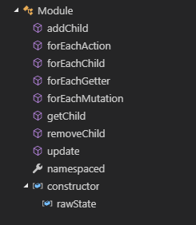
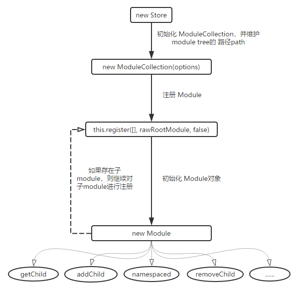
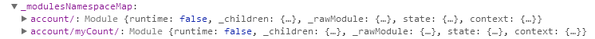
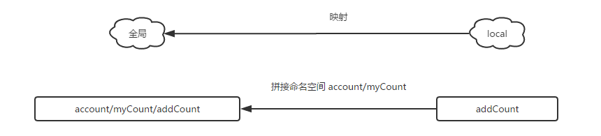
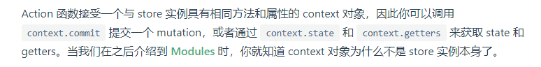
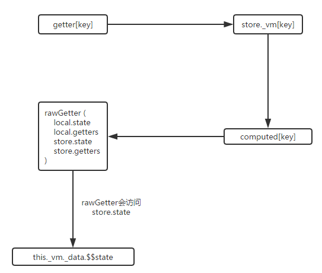

>本文以 `vuex v3.0.1`版本进行分析

## install

`vuex`提供了一个 `install`方法，用于给 `vue.use`进行注册，`install`方法对 `vue`的版本做了一个判断，`1.x`版本和 `2.x`版本的插件注册方法是不一样的：
```js
// vuex/src/mixin.js
if (version >= 2) {
  Vue.mixin({ beforeCreate: vuexInit })
} else {
  // override init and inject vuex init procedure
  // for 1.x backwards compatibility.
  const _init = Vue.prototype._init
  Vue.prototype._init = function (options = {}) {
    options.init = options.init
      ? [vuexInit].concat(options.init)
      : vuexInit
    _init.call(this, options)
  }
}
```
对于 `1.x`版本，直接将`vuexInit`方法混入到 `vueInit`方法中，当 `vue`初始化的时候，`vuex`也就随之初始化了
而对于 `2.x`版本，则是通过混入 `mixin`的方式，全局混入了一个 `beforeCreated`钩子函数

这个 `vuexInit`方法如下：
```js
function vuexInit () {
  const options = this.$options
  // store injection
  if (options.store) {
    this.$store = typeof options.store === 'function'
      ? options.store()
      : options.store
  } else if (options.parent && options.parent.$store) {
    this.$store = options.parent.$store
  }
}
```
目的很明确，就是把 `options.store` 保存在 `this.$store`中，`options`就是在 `new`一个 `vue`实例的时候，传入的参数集合对象，如果想使用 `vuex`的话，肯定要把 `store`传进来的，类似于下面的代码，所以可以拿到 `options.store`，`this`指的是当前 `Vue`实例，这个`options.store` 就是`Store`对象的实例，所以可以在组件中通过 `this.$store`访问到这个 `Store`实例
```js
const app = new Vue({
  el: '#app',
  // 把 store 对象提供给 “store” 选项，这可以把 store 的实例注入所有的子组件
  store,
  components: { Counter },
  template: '<div class="app"></div>'
})
```

## Store

上面在 `beforeCreate`生命周期中会拿到 `options.store`，这个 `store`自然也有初始化的过程

每一个 `Vuex` 应用的核心就是 `store`，所以需要有 `Store`的初始化过程，下面是一个最简单的 `Store`示例(来源于 [vuex的官网](https://vuex.vuejs.org/zh/guide/))：
```js
const store = new Vuex.Store({
  state: {
    count: 0
  },
  mutations: {
    increment (state) {
      state.count++
    }
  }
})
```
`Store`的源码位于 `vuex/src/store.js`，在这个类的 `constructor`中，`new`了一个 `vue`实例，所以`vuex`可以使用 `vue`的很多特性，比如数据的响应式逻辑

初始化`Store`的过程中，其实也是对 `modules`、`dispatch`、`commit`等进行了初始化操作


## 初始化module，构建module tree

在 `Store`类的初始化函数 `constructor`中，下面这句就是 `modules`的初始化入口：
```js
this._modules = new ModuleCollection(options)
```

`ModuleCollection`是一个 `ES6`的类
```js
// src/module/module-collection.js
constructor (rawRootModule) {
  // register root module (Vuex.Store options)
  this.register([], rawRootModule, false)
}
```

这个类的 `constructor`中调用了 `register`方法，第二个参数 `rawRootModule`就是 `Store`初始化时传进来参数对象 `options`

```js
// src/module/module-collection.js
register (path, rawModule, runtime = true) {
    // ...省略无关代码

    const newModule = new Module(rawModule, runtime)
    if (path.length === 0) {
      this.root = newModule
    } else {
      const parent = this.get(path.slice(0, -1))
      parent.addChild(path[path.length - 1], newModule)
    }

    // register nested modules
    if (rawModule.modules) {
      forEachValue(rawModule.modules, (rawChildModule, key) => {
        this.register(path.concat(key), rawChildModule, runtime)
      })
    }
  }
```
`register`方法中会 `new Module`，这个 `Module`就是用来描述单个模块的类，里面定义了与单个模块相关(`module`)的数据结构(`data struct`)、属性以及方法，大概如下：



这里面的方法、属性等，都和后续构建 `Module Tree`有关

由于每个 `module`都有其自己的 `state`、`namespaced`、`actions`等，所以在初始化 `module`的过程中，也会给每个 `module`对象上挂载这些属性或方法，例如，下面就是挂载 `state`的代码：

```js
// src/module/module.js
this._rawModule = rawModule
const rawState = rawModule.state

// Store the origin module's state
this.state = (typeof rawState === 'function' ? rawState() : rawState) || {}
```

开始初始化的时候，符合`path.length === 0`，所以执行 `this.root = newMudle`，接着遇到了 `if (rawModule.modules)`这个判断语句，前面说了 `rawModule`是传入的 `options`，所以这里的 `rawModule.modules`就是类似下面示例代码 `ExampleA`中的`modules`

```js
/**
 * 示例代码 ExampleA
 */
const store = new Vuex.Store({
  // ... 省略无关代码
  modules: {
    profile: {
      state: { age: 18 },
      getters: {
        age (state) {
          return state.age
        }
      }
    },
    account: {
      namespaced: true,

      state: {
        isAdmin: true,
        isLogin: true
      },
      getters: {
        isAdmin (state) {
          return state.isAdmin
        }
      },
      actions: {
        login ({ state, commit, rootState }) {
          commit('goLogin')
        }
      },
      mutations: {
        goLogin (state) {
          state.isLogin = !state.isLogin
        }
      },

      // 嵌套模块
      modules: {
        // 进一步嵌套命名空间
        myCount: {
          namespaced: true,
          state: { count: 1 },
          getters: {
            count (state) {
              return state.count
            },
            countAddOne (state, getters, c, d) {
              console.log(123, state, getters, c, d);
              return store.getters.count
            }
          },
          actions: {
            addCount ({ commit }) {
              commit('addMutation')
            },
            delCount ({ commit }) {
              commit('delMutation')
            },
            changeCount ({ dispatch }, { type } = { type: 1 }) {
              if (type === 1) {
                dispatch('addCount')
              } else {
                dispatch('delCount')
              }
            }
          },
          mutations: {
            addMutation (state) {
              console.log('addMutation1');
              state.count = state.count + 1
            },
            delMutation (state) {
              state.count = state.count - 1
            }
          }
        },

        // 继承父模块的命名空间
        posts: {
          state: { popular: 2 },
          getters: {
            popular (state) {
              return state.popular
            }
          }
        }
      }
    }
  }
})
```

所以这个判断是用于处理使用了 `module`的情况，如果存在 `modules`，则调用 `forEachValue`对 `modules`这个对象进行遍历处理

```js
export function forEachValue (obj, fn) {
  Object.keys(obj).forEach(key => fn(obj[key], key))
}
```

拿到 `modules`里面存在的所有 `module`，进行 `register`操作，这里面的 `key`就是每个 `module`的名称，例如 示例代码 `ExampleA`中的 `profile`、`account`

到这里再次调用 `this.register`方法的时候，`path.length === 0`就不成立了，所以走 `else`的逻辑，这里遇到了一个`this.get`方法：
```js
// src/module/module-collection.js
get (path) {
  return path.reduce((module, key) => {
    return module.getChild(key)
  }, this.root)
}
```
首先对 `path`进行遍历，然后对遍历到的项调用 `getChild`，这个`getChild`方法是前面 `Module`类中的方法，用于根据 `key`，也就是在当前模块中根据模块名获取子模块对象，与之对应的方法是 `addChild`，是给当前模块添加一个子模块，也就是建立父子间的关联关系：
```js
// src/module/module.js
this._children = Object.create(null)
// ...
addChild (key, module) {
  this._children[key] = module
}
// ...
getChild (key) {
  return this._children[key]
}
```
看到这里应该就有点思路了，上述一系列操作实际上就是为了以模块名作为属性 `key`，遍历所有模块及其子模块，构成一棵以 `this.root`为顶点的 `Modules Tree`，画成流程图的话会很清晰：



## 安装 module tree

上面构建好一棵 `module tree`之后，接下来就要 `install`这棵树了

```js
// src/store.js
const state = this._modules.root.state

installModule(this, state, [], this._modules.root)
```

这个方法里做了很多事情，一个个看

首先是对命名空间 `namespaced`的处理，如果发现当前 `module`具有 `namespaced`属性并且值为 `true`，则会将其注册到 `namespace map`，也就是存起来：
```js
const namespace = store._modules.getNamespace(path)

// register in namespace map
if (module.namespaced) {
  store._modulesNamespaceMap[namespace] = module
}
```
其中 `getNamespace`方法就是 `ModuleCollection`类上的方法，用于根据 `path`拼接出当前模块的完整 `namespace`
```js
getNamespace (path) {
  let module = this.root
  return path.reduce((namespace, key) => {
    module = module.getChild(key)
    return namespace + (module.namespaced ? key + '/' : '')
  }, '')
}
```

调用 `getNamespace`获得命名空间名称，然后将命名空间名称作为 `key`，将对应的命名空间所指的 `module`对象作为 `value`缓存到 `store._modulesNamespaceMap`上，方便后续根据 `namespace`查找模块，这个东西是可以通过 `this.$store._modulesNamespaceMap`取到的，例如，对于 `ExampleA`中的示例：




接下来是一个判断逻辑，符合 `!isRoot && !hot`条件才能执行，这里的 `isRoot`是在 `installModule`方法的开头定义的：
```js
const isRoot = !path.length
```
`path`就是 `module tree`维护的 `module`父子关系的状态，当 `path.length !== 0`时，`isRoot`就是 `true`，其实这里就是判断当前安装的模块是不是 `root`模块，也就是 `module tree`最顶层的节点，这个节点的 `path.length` 就是 `0`

由于 `module`的安装，在 `module tree`上就是从父级到子级，一开始执行 `installModule`方法时，传入的 `path`为 `[]`，则`path.length === 0`，所以会执行判断语句里面的代码

## 设置 state

```js
// src/store.js
if (!isRoot && !hot) {
  const parentState = getNestedState(rootState, path.slice(0, -1))
  const moduleName = path[path.length - 1]
  store._withCommit(() => {
    Vue.set(parentState, moduleName, module.state)
  })
}
```

调用了 `getNestedState`：
```js
function getNestedState (state, path) {
  return path.length
    ? path.reduce((state, key) => state[key], state)
    : state
}
```
这里实际上是通过一层层 `path.reduce`来查找最终的子模块的 `state`

例如，对于 `account/myCount`下的 `state`来说，它的 `path`是 `['account', 'myCount']`，全局 `state`结构如下：
```js
{
  profile: { ... },
  account: {
    isAdmin: true,
    isLogin: true,
    // 这是子模块 myCount的命名空间
    myCount: {
    // 这是子模块myCount的state
      count: 1
    },
    posts: {
      popular: 2
    }
  }
}
```
当对这个全局 `state` 和 `path = ['account', 'myCount']`调用 `getNestedState`方法时，最终将得到 `/myCount`的 `state`：
```js
{
  count: 1
}
```
查找到具体子模块的 `state`后，挂载到 `store._withCommit`上，至于为什么挂到这上，这里暂且不分析，后面会说到

## 构建本地上下文

接下来会执行一个 `makeLocalContext`方法：
```js
const local = module.context = makeLocalContext(store, namespace, path)
```
关于这个方法的作用，在它的注释上已经大概描述了一遍：
```js
/**
 * make localized dispatch, commit, getters and state
 * if there is no namespace, just use root ones
 */
function makeLocalContext (store, namespace, path) {
  // ...
}
```
大概意思就是，本地化 `dispatch` 、 `commit`、 `getter`、`state`，如果(当前模块)没有 `namespace`，则直接挂载到 `root module`上

可能还是不太明白说的是什么意思，实际上，这就是对命名空间模块的一个处理，是为了在调用相应模块的 `dispatch`、`commit`、`getters`以及 `state`的时候，如果模块使用用了命名空间，则自动在路径上追加上 `namespace`

比如，对于 `dispath`而言，如果当前模块存在 `namespace`，则在调用这个模块的 `dispatch`方法的时候，把 `namespace`拼接到 `type`上，然后根据这个拼接之后的 `type`来查找 `store`上的方法并执行：

```js
// makeLocalContext
dispatch: noNamespace ? store.dispatch : (_type, _payload, _options) => {
    const args = unifyObjectStyle(_type, _payload, _options)
    const { payload, options } = args
    let { type } = args

    if (!options || !options.root) {
      type = namespace + type
      if (process.env.NODE_ENV !== 'production' && !store._actions[type]) {
        console.error(`[vuex] unknown local action type: ${args.type}, global type: ${type}`)
        return
      }
    }

    return store.dispatch(type, payload)
  }
```

例如，对于 `ExampleA`代码而言，想要改变 `account/myCount`下的 `count`值，可以直接全局调用 `this.$store.dispatch('account/myCount/changeCount')`， 当 `type = 1`的时候又会执行 `dispatch('addCount')`，这个 `dispatch`其实是想要执行 `account/myCount`模块下的 `addCount`这个 `actions`，而不是 `root module`下的 `addCount`

于是，这里就进行了一个全路径 `type`的拼接，将当前模块的 `namespace`和 `type`拼接到一起，即 `account/myCount/` 与 `addCount`的拼接，最后就拼接成了  `account/myCount/addCount`，正是我们想要的 `path`，最后将这个全路径 `type`作为参数传给 `store.dispatch`方法，这个过程主要是简化了嵌套 `module`路径的拼接

`commit`的逻辑与此类似，不过 `getter` 和 `state` 就有点不一样了

```js
// src/store.js
// makeLocalContext

Object.defineProperties(local, {
  getters: {
    get: noNamespace
      ? () => store.getters
      : () => makeLocalGetters(store, namespace)
  },
  state: {
    get: () => getNestedState(store.state, path)
  }
})
```
对于 `getter`，如果没有 `namspace`则直接返回 `store.getters`，否则就调用 `makeLocalGetters`：
```js
// src/store.js
function makeLocalGetters (store, namespace) {
  const gettersProxy = {}

  const splitPos = namespace.length
  Object.keys(store.getters).forEach(type => {
    // skip if the target getter is not match this namespace
    if (type.slice(0, splitPos) !== namespace) return

    // extract local getter type
    const localType = type.slice(splitPos)

    // Add a port to the getters proxy.
    // Define as getter property because
    // we do not want to evaluate the getters in this time.
    Object.defineProperty(gettersProxy, localType, {
      get: () => store.getters[type],
      enumerable: true
    })
  })

  return gettersProxy
}
```
直接看这段代码可能不太清晰，所以这里带入一个例子看，比如对于 `account/myCount/count`这个 `getter`来说（即上述源码中的 `type`），它的 `namespace`就是 `account/myCount/`，它的 `localType`就是 `count`，当访问 `gettersProxy.count`这个 `getters`的时候，会自动指向全局的 `account/myCount/count`

然后是 `state`，调用了 `getNestedState`，这个方法前面已经说过了，作用和上面的大体一致，就不多说了

另外，这个过程中多次用到 `Object.defineProperty`来设置给对象上的属性设置 `get`函数，而不是直接给属性赋值，例如上面的 `localType`，这种做法的目的在代码上也已经注释得很清楚了，就是为了能够做到在访问的时候才计算值，既减少了实时运算量，主要是又能够保证获取到的值是实时准确的，这个跟 `vue`的响应式机制相关，这里就不多说了

综上， `makeLocalContext`这个方法实际上就是做了一个具有命名空间的子模块的 `dispatch`、`commit`、`getter`、`state`到全局的映射：



`vuex`的官网在介绍 [Actions](https://vuex.vuejs.org/zh/guide/actions.html) 这一节的时候，有这么一段话：



其中， `Action 函数接受一个与 store 实例具有相同方法和属性的 context 对象`这句话里的 `context`对象指的就是这里本地化的 `module`对象


## 注册 mutation action getter

### Mutation

首先是 `Mutation`：
```js
// src/store.js
module.forEachMutation((mutation, key) => {
  const namespacedType = namespace + key
  registerMutation(store, namespacedType, mutation, local)
})
```
这个 `forEachMutation`方法是挂在 `module`实例上的，这个方法没什么好说的，作用就是遍历当前 `module`上的 `mutations`，然后将这些 `mutation`作为参数传入 `registerMutation`方法中：
```js
// src/store.js
function registerMutation (store, type, handler, local) {
  const entry = store._mutations[type] || (store._mutations[type] = [])
  entry.push(function wrappedMutationHandler (payload) {
    handler.call(store, local.state, payload)
  })
}
```
该方法是给 `root store` 上的 `_mutations[types]` 添加 `wrappedMutationHandler` 方法（至于这个方法是干什么的是另外的问题，这里暂且不去看），而且 `store._mutations[type]`的值是一个数组，也就是说同一个`type` 的 `_mutations` 是可以对应多个 `wrappedMutationHandler`方法的

例如，对于 `ExampleA`中的 `account/myCount`这个 `module`来说，如果它的 `namespaced`属性不存在，或者其值是 `false`，即没有单独的命名空间，然后它的 `mutations`中又有个叫 `goLogin`的方法，这个方法在 `account`这个 `module`的 `mutations`中同样存在，于是 `state._mutations['account/goLogin']`的数组中就存在了两项，一个是 `account`下的 `goLogin`方法，一个是 `account/myCount`下的 `goLogin`方法

而如果 `account/myCount`的 `namespaced`为 `true`，就不存在这种情况了，因为这个时候，它的`goLogin`对应的 `type`是  `account/myCount/goLogin`

### action

```js
// src/store.js
module.forEachAction((action, key) => {
  const type = action.root ? key : namespace + key
  const handler = action.handler || action
  registerAction(store, type, handler, local)
})
```
逻辑其实和上面的 `Mutation`差不多，都是遍历所有的 `actions`，然后挂到 `store`的某个属性上，只不过 `action`是挂到 `store._actions`上，同样的，对于同一个 `key`，也可以对应多个 `action`方法，这也跟命名空间有关

### getter

```js
// src/store.js
module.forEachGetter((getter, key) => {
  const namespacedType = namespace + key
  registerGetter(store, namespacedType, getter, local)
})
```
`getter`和上面的逻辑也都是差不多的，遍历所有的 `getter`，然后挂到 `store`的某个属性上，只不过 `getter`是挂到 `store._wrappedGetters`上，另外，对于同一个 `key`，只允许存在一个值，如果存在多个值，则以第二个为准：
```js
// src/store.js
function registerGetter (store, type, rawGetter, local) {
  if (store._wrappedGetters[type]) {
    if (process.env.NODE_ENV !== 'production') {
      console.error(`[vuex] duplicate getter key: ${type}`)
    }
    return
  }
  store._wrappedGetters[type] = function wrappedGetter (store) {
    return rawGetter(
      local.state, // local state
      local.getters, // local getters
      store.state, // root state
      store.getters // root getters
    )
  }
}
```

最后，如果当前模块具有子模块，则遍历其所有子模块，给这些子模块执行 `installModule`方法，也就是把上面的步骤再次走一遍

至此，`installModule`方法就执行完了，这里再回头整体看一遍， 调用 `installModule`这个方法的时候，代码上面有两行注释：
```js
// src/store.js

// init root module.
// this also recursively registers all sub-modules
// and collects all module getters inside this._wrappedGetters
installModule(this, state, [], this._modules.root)
```
大概意思就是：
```
初始化 root module
同时也会递归地注册所有子 module
并且会将所有 module的 getters 收集到 this._wrappedGetters上
```

经过上述的分析，再看这段注释，就没什么难以理解的了，这个方法（`installModule`）就是用于包括子模块在内的所有模块的` state、getters、actions、mutations` 的一个初始化工作

## 初始化 store vm

接下来，又执行了 `resetStoreVM`：
```js
// src/store.js

// initialize the store vm, which is responsible for the reactivity
// (also registers _wrappedGetters as computed properties)
resetStoreVM(this, state)
```
这个方法的作用可以从它的注释上大概看出来，初始化  `store vm`，看到这个 `vm`我们应该想到 `vue`的实例 `vm`，这里实际上就是让 `store`借助 `vue`的响应式机制

并且会将 `_wrappedGetters`注册为 `computed`的属性，也就是计算属性，`_wrappedGetters`前面已经提到过了，就是各个模块的 `getters`的集合，计算属性在 `vue`中的特性之一是 **计算属性是基于它们的依赖进行缓存的。只在相关依赖发生改变时它们才会重新求值**，也就是做到了 **高效地实时计算**，这里就是想让 `store`上各个模块的 `getters`也具备这种特性

```js
// src/store.js
// resetStoreVM

store.getters = {}
const wrappedGetters = store._wrappedGetters
const computed = {}
forEachValue(wrappedGetters, (fn, key) => {
  // use computed to leverage its lazy-caching mechanism
  computed[key] = () => fn(store)
  Object.defineProperty(store.getters, key, {
    get: () => store._vm[key],
    enumerable: true // for local getters
  })
})
```
使用 `forEachValue`来遍历 `_wrappedGetters`，`forEachValue`前面也提到过了，所以这里的 `fn(store)`实际上就是：
```js
store._wrappedGetters[type] = function wrappedGetter (store) {
  return rawGetter(
    local.state, // local state
    local.getters, // local getters
    store.state, // root state
    store.getters // root getters
  )
}
```
也就是 `wrappedGetter`这个函数，返回一个 `rawGetter`方法执行的结果，这里的 `rawGetter`可以看作就是 `getter`计算得到的结果，所以我们在 `getter`方法的参数中拿到的四个参数指的就是上面四个：
```js
// https://vuex.vuejs.org/zh/api/#getters

state,       // 如果在模块中定义则为模块的局部状态
getters,     // 等同于 store.getters
rootState    // 等同于 store.state
rootGetters  // 所有 getters
```

拿到 `getter`之后，就把它交给 `computed`

接下来又定义了一个  `Object.defineProperty`：
```js
// src、store.js

Object.defineProperty(store.getters, key, {
  get: () => store._vm[key],
  enumerable: true // for local getters
})
```
将 `store.getters[key]`映射到 `store._vm[key]`上，也就是当访问 `store.getters[key]`的时候，就相当于获取`store._vm[key]`的计算值，至于这里的 `store_vm`又是什么，跟下面的逻辑有关：

```js
// src、store.js

store._vm = new Vue({
  data: {
    $$state: state
  },
  computed
})
```
`store._vm`实际上就是一个  `vue`实例，这个实例只有 `data`和 `computed`属性，就是为了借助 `vue`的响应式机制

这里实际上就是建立了一个 `state`与 `getter`的映射关系，因为 `getter`的计算结果肯定依赖于 `state`的，它们之间必然存在关联的关系，`Store`类上有个 `state`的访问器属性：
```js
// src/store.js

get state () {
  return this._vm._data.$$state
}
```
于是 `state` 到 `getter`的映射关系流程如下：



接下来是一个用于规范开发方式的逻辑：
```js
// enable strict mode for new vm
if (store.strict) {
  enableStrictMode(store)
}
```
`store.strict`这里的 `strict`是需要开发者在初始化 `Store`的时候显式声明的，一般似乎大家都不怎么关心这个，不过为了更好地遵循 `vuex`的开发规范，最好还是加上这个属性

`enableStrictMode`方法如下：
```js
// src/store.js

function enableStrictMode (store) {
  store._vm.$watch(function () { return this._data.$$state }, () => {
    if (process.env.NODE_ENV !== 'production') {
      assert(store._committing, `do not mutate vuex store state outside mutation handlers.`)
    }
  }, { deep: true, sync: true })
}
```
上面说了，`store._vm`其实就是一个 `vue`实例，所以它有 `$watch`方法，用于检测 `this._data.$$state`的变化，也就是 `state`的变化，当 `state`变化的时候，`store._committing`的值必须为 `true`

这个 `store._committing`的值在 `Store`的初始化代码中就已经定义了，值默认为 `false`：
```js
// src/store.js

this._committing = false
```

这个值的修改是在 `_withCommit`方法中:
```js
_withCommit (fn) {
  const committing = this._committing
  this._committing = true
  fn()
  this._committing = committing
}
```
确保在执行 `fn`的时候， `this._committing`值为 `true`，然后执行完了再重置回去，这个 `_withCommit`的执行场景一般都是对 `state`进行修改，例如 `commit`：
```js
// src/store.js

commit (_type, _payload, _options) {
  // 省略无关代码
  // ...
  this._withCommit(() => {
    entry.forEach(function commitIterator (handler) {
      handler(payload)
    })
  })
  // 省略无关代码
  // ...
}
```
`enableStrictMode`主要就是为了防止不通过 `vuex`提供的方法，例如 `commit`、`replaceState`等，非法修改 `state`值的情况，在开发环境下会报警告

## 总结

从上述分析来看，`vuex`的初始化基本上与 `store`的初始化紧密相关，`store`初始化完毕，`vuex`基本上也就初始化好了，不过过程中涉及到的部分还是比较多的

分析到现在，都是在说初始化，`vuex`的 `api`几乎没说上多少，而`vuex`的能力就是通过 `api`来体现的，有空再分析下 `vuex api`相关的吧