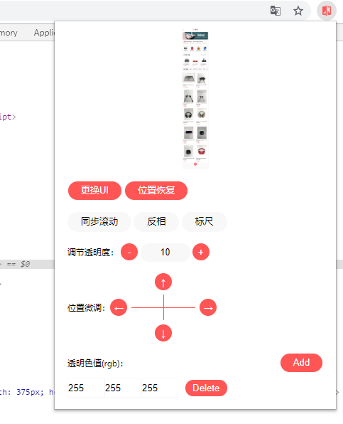

<del>（切图仔）</del>前端开发者一大重要的职责就是将 `UI`画稿转化为实际可用的页面，效果图的还原度在相当大的程度上决定了 `UI` 和 `PM`的满意度

一般情况下，拿到设计稿后，懒散点的可能直接看图软件打开，肉眼测距就开搞了，负责点的会打开 `PS`或者更正规的 `Photoshop`，力图精确到 `px`，这两种方法各有利弊，前者的还原度大概率堪忧，后者耗时耗力，能把眼睛看瞎，最后都不一定能过得了设计师的像素眼

鄙人不才，恰好热衷并擅长于肉眼测距，只要不是苛刻到死盯像素级的差异，那么完全足够交差，然而天有不测风云，公司的设计部近来加大了对设计稿还原度的较真劲头，导致我与设计师之间摆头的频率直线拉升，一来二去之后筋疲力尽，细细想来，不是长久之计，于是决定着手从根源上解决这个问题

## uipx-chrome-plugin

肉眼测距与 `PS`测量各有利弊，最好能摒弃糟粕并把这两个的优点结合到一起，肉眼测距的优点是短平快，缺点是不够精确，`PS`测距的优点是够精确，缺点是太慢了，碰上赶进度的需求根本来不及，所以需要做到既快又准

那么，如果把还原稿从 `PS`中移到正在开发的页面上，再加上一些必要的辅助能力，比如测距，这不就能解决上面的问题了吗？

一般情况下，无论开发 `PC`端的页面还是移动端的页面，我们都是习惯于在 `PC`的浏览器上进行调试，既然是浏览器，那么我首先就想到浏览器扩展插件了

这个插件最好具备以下几个功能：

- 测距 
  测量设计稿与页面还原图之间元素位置、尺寸的差异，类似于 `PS`的标尺，方便调节
- 反相 
  一是方便对比差异，二是对于一个像素来说，与其反相过后并设置透明度为 `0.5`的像素混合重叠后，合成后的颜色将变为灰色，这是一个很直观的判定像素是否相同的因素
- 透明度调节 
  一是方便对比差异，二是辅助反相
- 拖拽UI设计稿 
  还是方便对比差异
- 位置微调 
  对 拖拽UI设计稿 功能的补充
- 透明化非必要的色值 
  比如，对于一张设计稿来说，它的背景如果是白色，那么在对比的时候，这个白色的背景完全可以透明化处理，只露出主体元素，排除了非必要元素的干扰

于是，可以先上效果图了：

需求点有了，设计稿有了，实现就很简单了

此 `chrome`扩展插件，主要分为三个部分

### popup

也就是上面那个图，鼠标点浏览器的右上角扩展插件图标后出现的页面

这个页面就是个展示层，整合上面所说的那几个功能点，响应用户的操作，主要就是页面绘制与事件注册

### content

注入到实际开发页面上的代码，用于响应 `popup`的动作

前端操作图片最方便的就是 `canvas`了，通过将设计稿绘制到 `canvas`上，可以很轻易地实现上面说的那几个功能点

此脚本会向页面上追加一个 `canvas`元素，设计稿的承载以及功能点的实现，例如反相、透明等都在这个 `canvas`上实现

### background

此脚本是作为一个数据缓存库来用的，因为 `popup`的生命周期很短，展现了就是生成，消失了就是销毁，无法长时间地保存变量值，需要通过此脚本来间接保存

插件的运行就是依靠这三部分相互通信完成，核心代码很简单，我就不多说了，感兴趣的可以自己看下，[源码地址](https://github.com/accforgit/uipx-chrome-plugin)

## uipx-webpack-plugin

由于 `uipx-chrome-plugin` 是一个 `chrome`的扩展插件，无法在移动端使用，而移动端几乎又是我现今开发的全部场景，有些不太方便，虽然一般而言也都是在 `chrome`的模拟移动设备下完成移动端开发，但不实际弄到真机上总感觉不得劲，于是在小伙伴的启发下，决定将 `uipx-chrome-plugin`改造成一个 `webpack` 插件，表现形式就直接<del>（抄）</del>参考 [vconsole-webpack-plugin](https://github.com/diamont1001/vconsole-webpack-plugin)

具体原理基本上和 `uipx-chrome-plugin`差不多，只不过是平台 `API`差异罢了，另外，此插件完全是通过 `js`注入的，所以也不像 `uipx-chrome-plugin`那样可以直接写 `html`，不过这都很容易解决

此插件已经发布到 [npm](https://www.npmjs.com/package/uipx-webpack-plugin) 了，可以直接下载使用，源代码也已经上传到 [Github](https://github.com/accforgit/uipx-webpack-plugin) 感兴趣的可以下载使用

## 小结

这两个插件代码层面上没什么难度，但确实又可以解决实际问题，这种轮子还是可以造一造的，另外，轮子的代码和平时业务代码的差异还是比较大的，更能体现出一个人的编码水平和风格，没有业务的桎梏，在写代码的时候有更大的发挥空间，不失为自省吾身的一种途径