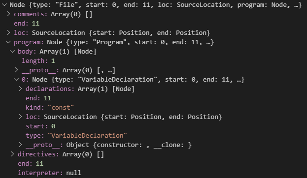

代码的复用是一件很常见的事情，如果是公共代码的复用那还好说，直接做成一个内部私有库，想用的话安装一下 `npm`包就行了，但是业务代码的复用就不好做成包了，一般都是复制粘贴

我一般写代码的时候，如果觉得某段业务代码以前见过其他人写过，那么考虑到业务优先性，只要别人的代码不是写得太烂，我一般会优先抄别人的代码，省得自己再写一遍
然后我就遇到了一个问题，公司目前前端项目大部分都是 `vue`，早期没有 `ts`这个说法，后来新项目才逐渐引入 `ts`，所以新项目用的是 `vue-ts`，而一般想抄的老代码都是没有引入 `ts`的，固然，这二者是可以兼容存在的，但对于有着轻微代码洁癖的我来说，还是不想看到同一个项目代码里掺杂着 `ts`和非 `ts`两种写法的，所以只要有时间，我都会尽量手动把老代码转化为 `ts`规范的

难度倒是没多少，只不过每一份都要手动转一遍，转得多了我忽然陷入沉思，我好像 `repeat myself`了啊，不太能忍，于是决定写一个自动将 `vue-js`转成 `vue-ts`的工具

这个工具的代码已经被我放到 [github](https://github.com/accforgit/TransVue2Ts) 上了，并且为了方便使用，我已经将其做成了一个 [npm](https://www.npmjs.com/package/transvue2ts) 包，感兴趣的可以亲自试一下

## @babel

涉及到 `js`语法转换的东西，第一时间想到的就是 `babel`了，`babel`早就提供了丰富完善的 `js`语法的解析与反解析工具

### @babel/parser

[@babel/parser](https://babeljs.io/docs/en/babel-parser) 是负责解析 `js`语法的工具，可以理解为将 `js`语法转化为 `ast`，方便开发者进行自定义处理，通过 `plugins`来支持多种 `js`语法，例如 `es6`、`es7`、`ts`、`flow`、`jsx`甚至是一些实验室的语法(`experimental language proposals`)等

例如：
```js
const code = 'const a = 1'
const ast = require("@babel/parser").parse(code)
```
转换后的 `ast`就是一个对象，数据结构描述的就是 `const a = 1`这个表达式


对这个 `ast`进行遍历，就可以获得所有当前解析的 `js`语法的信息，自然也能对其进行修改

### @babel/generator

有解析就有反解析，[@babel/generator](https://babeljs.io/docs/en/babel-generator)用于将 [@babel/parser](https://babeljs.io/docs/en/babel-parser)解析出的 `ast`转化回字符串形式的 `js`代码

```js
const code = 'const a = 1;'
const ast = require("@babel/parser").parse(code)
const codeStr = require('@babel/generator').default(ast).code
code === codeStr // => true
```

## 其他

一般 [@babel/parser](https://babeljs.io/docs/en/babel-parser)、[@babel/generator](https://babeljs.io/docs/en/babel-generator) 和 [@babel/traverse](https://babeljs.io/docs/en/babel-traverse)会一起出现使用，前两个前面已经介绍过了，至于 [@babel/traverse](https://babeljs.io/docs/en/babel-traverse)，其主要作用就是对 [@babel/parser](https://babeljs.io/docs/en/babel-parser)生成的 `ast`进行遍历，提供了一些方法，省得开发者自己去做各种判断

不过我这里写的这个程序，因为不需要太过细致的解析，所以没用 [@babel/traverse](https://babeljs.io/docs/en/babel-traverse)这个东西，我按照自己的意愿对 `ast`进行遍历操作

除此之外，[babel](https://babeljs.io/docs/en/)还提供了一些其他的工具库啦帮助库啦，一般都不太用得到，想要详细了解的可以自己去看[文档](https://babeljs.io/docs/en/)

本文下面所说的操作，基本上都是在 [@babel/parser](https://babeljs.io/docs/en/babel-parser) 转换后的 `ast`，以及 [@babel/generator](https://babeljs.io/docs/en/babel-generator) 解析后的代码字符串上进行的


## props

`vue`官网对于 `props`的介绍在 [props](https://cn.vuejs.org/v2/api/#props)

因此 `props`的以下几种写法都是符合规范的：
```js
export default {
  props: ['size', 'myMessage'],
  props: {
    a: Number,
    b: [Number, String],
    c: 'defaultValue',
    d: {
      type: [Number, String]
    }
    e: {
      type: Number,
      default: 0,
      required: true,
      validator: function (value) {
        return value >= 0
      }
    }
  }
}
```

上述转换为 `ts`对应如下：
```js
export default class YourComponent extends Vue {
  @Prop() readonly size: any | undefined
  @Prop() readonly myMessage: any | undefined
  @Prop({ type: Number }) readonly a: number | undefined
  @Prop([Number, String]) readonly b: number | string | undefined
  @Prop() readonly c!: any
  @Prop({ type: [Number, String] }) readonly d: number | string | undefined
  @Prop({ type: Number, default: 0, required: true, validator: function (value) {
    return value >= 0
  } }) readonly e!: number
}
```
`ok`，那就好办了，首先 `props`值的类型只有 `Array<string>` 和 对象 这两种类型

### 数组类型

`Array<string>`类型很好办，就一个转换模板：
```js
@Prop() readonly propsName: any | undefined
```
只需要遍历 `Array<string>`类型的 `props`，然后，把 `propsName`替换成真正的值即可

### 对象类型

对象类型的转化模板在数组类型的模板上，多加了一些字符串，主要就是 `@Prop`的参数：
```js
@Prop({ type: typeV, default: defaultV, required: requiredV, validator: validatorV }) readonly propsName: typeV
```

`props` 这个大对象的每个属性，都是一个 `propsName`，这个是确定的，然后 `propsName`对应的值，可能是 `type`，`type` 分为单类型(例如 `Number`)，以及类型数组(例如 `[Number, String]`)；可能是一个对象，这个对象下的属性最少为 `0`个，最多为 `4`个，如果这个对象存在一个属性名为 `type`的属性，则这个属性的值也需要判断单类型和类型数组，其他属性直接取原值即可

无论 `props`对象的属性值是对象还是 `type`，都需要处理 `type`，所以一个专门处理 `type`的方法 `handlerType`

如此一来，如果是 `type`，则 `handlerType`直接处理好；如果是对象，则遍历这个对象的属性，发现属性是 `type`，则调用 `handlerType`进行处理，否则直接原样作为 `@Prop`的参数即可

## data

`vue`官网对于 `data`的介绍在 [data](https://cn.vuejs.org/v2/api/#data)

`data`的类型可以是 `Object` 或 `Function`，即以下几种写法都合法：
```js
export default {
  data: {
    a: 1
  },
  data () {
    return {
      a: 1
    }
  },
  data: function () {
    return {
      a: 1
    }
  }
}
```
上述转换为 `ts`对应如下：
```js
export default class YourComponent extends Vue {
  a: number = 1
}
```
所以这里就很明了了，就是取 `data`返回值对象的每个属性，作为 `class`的属性，好像转换一下就行了

但是，`data`其实还可以这么写：
```js
export default {
  data () {
    const originA = 1
    return {
      a: originA
    }
  }
}
```
当 `data`是 `Function` 类型时，在 `return`之前，还可以运行一段代码，这段代码的运行结果可能影响到 `data`的值

这种写法并不少见，所以不可忽视，但如何处理 `return`之前的代码？
我的做法是将 `return`之前的代码放到 `created`生命周期函数中，并且在 `created`中的这些代码之后，再对每个 `data`重新赋一遍值
比如，对于上面的代码来说，转换成 `ts`，可以这么做：
```js
export default class YourComponent extends Vue {
  a: any = null
  created () {
    const originA = 1
    this.a = originA
  }
}
```
所以，这就又涉及到 `data`对 `created`的数据修改了，这里可以考虑强制先处理 `data`，但是我看了下，其实这里写两段逻辑也并不复杂，所以我就不严格规定处理的顺序了

## model

`vue`官网对于 `model`的介绍在 [model](https://cn.vuejs.org/v2/api/#model)

`model`中引用了 `props`中的值，所以 `model`的使用其实是需要 `props`配合的

```js
export default {
  model: {
    prop: 'checked',
    event: 'change'
  },
  props: {
    checked: {
      type: Boolean
    }
  }
}
```

上述转换为 `ts`对应如下：
```js
export default class YourComponent extends Vue {
  @Model('change', { type: Boolean }) readonly checked!: boolean
}
```
可见，`@Model`是具备声明 `props`的功能的，在 `@Model`中声明了的 `props`，就没必要在 `@Prop`中再声明一遍了，所以我这里安排了一下处理顺序，先处理 `model`，再处理 `props`，并且在处理 `props`的时候，将 `model`中已经声明了的 `props`筛选掉

当然，你也可以不专门先处理 `model`再处理 `props`，只要在处理 `model`的时候判断一下，是否在此之前已经处理过 `props`了，根据结果来做相应的处理流程，但这样未免有些麻烦，需要根据 `props`的处理与否来写两段逻辑，这两段逻辑比上面 `data`影响 `created`的要复杂一些，所以这里我就直接按照顺序处理了，省得给自己找麻烦

## computed

`vue`官网对于 `model`的介绍在 [computed](https://cn.vuejs.org/v2/api/#computed)

以下几种 `computed`的写法都是正确的
```js
export default {
  computed: {
    a () { return true },
    b: function () { return true },
    d: {
      get () { return true },
      set: function (v) { console.log(v) }
    }
  }
}
```
`vue-property-decorator`并没有提供专门的用于 `computed`的修饰器，因为 `ES6`的 `get/set`语法本身就可以替代 `computed`
上述转换为 `ts`对应如下：
```js
export default class YourComponent extends Vue {
  get a () { return true }
  get b () { return true },
  get d (){ return true },
  set d (v) { console.log(v) }
}
```
除此之外，`computed`其实还支持箭头函数的写法：
```js
export default {
  computed: {
    e: () => { return true }
  }
}
```
但是 `class`语法的 `get/set`不支持箭头函数，所以不好转换，另外因为箭头函数会改变 `this`的指向，而 `computed`计算的就是当前 `vue`实例上的属性，所以一般也不推荐在 `computed`中使用箭头函数，固然你可以在箭头函数的第一个参数上获得当前 `vue`实例，但这就未免有点多此一举的嫌疑了，所以我这里略过对箭头函数的处理，只会在遇到 `computed`上的箭头函数时，给你一个提示


## watch

`vue`官网对于 `watch`的介绍在 [watch](https://cn.vuejs.org/v2/api/#watch)

以下都是合法的 `watch`写法：
```js
export default {
  watch: {
    a: function (val, oldVal) {
      console.log('new: %s, old: %s', val, oldVal)
    },
    // 方法名
    b: 'someMethod',
    // 该回调会在任何被侦听的对象的 property 改变时被调用，不论其被嵌套多深
    c: {
      handler: function (val, oldVal) { /* ... */ },
      deep: true
    },
    // 该回调将会在侦听开始之后被立即调用
    d: {
      handler: 'someMethod',
      immediate: true
    },
    e: [
      'handle1',
      function handle2 (val, oldVal) { /* ... */ },
      {
        handler: function handle3 (val, oldVal) { /* ... */ },
        immediate: true
      }
    ],
    // watch vm.e.f's value: {g: 5}
    'e.f': function (val, oldVal) { /* ... */ }
  }
}
```
上述转换为 `ts`对应如下：
```js
export default class YourComponent extends Vue {
  @Watch('a')
  onAChanged(val: any, oldVal: any) {}
  @Watch('b')
  onBChanged (val: any, oldVal: any) {
    this.someMethod(val, oldVal)
  }
  @Watch('c', { deep: true })
  onCChanged (val: any, oldVal: any) {}
  @Watch('d', { deep: true })
  onDChanged (val: any, oldVal: any) {}
  @Watch('e')
  onE1Changed (val: any, oldVal: any) {}
  @Watch('e')
  onE2Changed (val: any, oldVal: any) {}
  @Watch('e'， { immediate: true })
  onE3Changed (val: any, oldVal: any) {}
  @Watch('e.f')
  onEFChanged (val: any, oldVal: any) {}
}
```
写法还是很多的，所以判断分支肯定少不了

`watch`下的每个属性都是一个需要进行 `watch`的 `vue`响应值，这些属性的值可以是字符串、函数、对象和数组，共四种类型

其中，字符串类型就是相当于调用当前 `vue`实例里的方法，函数类型就是调用这个函数，比较简单；
对于对象类型，其具有三个属性：`handler`、`deep`、`immediate`，三个属性都是可选，其中 `handler`的值是函数或字符串，其他两个属性的值都是 `boolean`类型；
对于数组类型，其每一个数组项，其实都相当于是字符串类型、函数类型和对象类型的聚合，所以实际上只要处理这三种类型即可，数组类型则直接遍历数组项，每个数组项的类型肯定在这三个类型之内，按照类型调用相应的处理方法即可。

这是主体部分，除此之外，还需要考虑 `handler`函数的形式，以下几种函数的写法都是合法的：
```js
export default {
  watch: {
    a: function {},
    b () {},
    c: () => {},
    d: async function {},
    e: async () => {}
  }
}
```
不仅在 `watch`里面，其他一些 `vue`实例属性，比如 `created`、`computed`等，只要是可能出现函数的地方，都需要考虑到这些写法
当然，除此之外，还有 `Generator`函数，但我这里不考虑，有更好的 `async/await`可用，为什么非要用 `Generator`

## methods

`vue`实例的方法，都作为 `methods`这个对象的属性存在，每个方法都是一个函数，所以只需要将原 `methods`下的所有方法取出，转换为 `class`的方法即可，没什么工作量
不过需要注意的是，函数的写法有很多，还可以支持 `async/await`，这些写法都需要考虑到

## lifeCycle

`vue`的生命周期钩子函数有很多，还有一些第三方的钩子函数，例如 `vue-router`：
```js
const vueLifeCycle = ['beforeCreate', 'created', 'beforeMount', 'mounted', 'beforeUpdate', 'updated', 'activated', 'deactivated', 'beforeDestroy', 'destroyed', 'errorCaptured', 'beforeRouteEnter', 'beforeRouteUpdate', 'beforeRouteLeave']
```
这些钩子函数其实就是函数，跟 `methods`的处理方法一样

## component 

这个比较简单，转化一下然后拼接
```js
export default {
  components: {
    a: A,
    B
  },
}
```
上述转换为 `ts`对应如下：
```js
@Component({
  components: {
    a: A,
    B
  }
})
export default class TransVue2TS extends Vue {}
```
所以就是把原 `components`的属性全部映射一遍即可

## mixins

`vue`官网对于 `mixins`的介绍在 [mixins](https://cn.vuejs.org/v2/api/#mixins)

其值类型为 `Array<Object>`

```js
export default {
  mixins: [A, B]
}
```
上述转换为 `ts`对应如下：
```js
export default class TransVue2TS extends Mixins(A, B) {}
```
原本 `extends Vue`改成 `extends Mixins`，并且 `Mixins`的参数就是原 `mixins`的所有数组项

## provide && inject

当我考虑如何处理这两个的时候，看了下 `vue`官网，官网上对于这两个是这么说的：

>provide 和 inject 主要为高阶插件/组件库提供用例。并不推荐直接用于应用程序代码中。

并且在这段话上，还专门用红色感叹号标识了一下，说白了就是不建议你在业务代码中，因为这不利于数据的追踪，完全可以使用成熟的 `vueBus`或者 `vuex`代替，一般也不会用到这个东西的，我写这个转换程序也是为了转换业务代码，所以我没有对这两个做处理，如果发现代码中存在这两个属性，会提示你自己手动处理

## emit && ref

这两个都只是一种类似语法糖的东西，可以不做处理

## 文件处理

上述是针对一份 `.vue`文件的详细处理的逻辑，想要真正的接入实际文件乃至文件夹的处理，自然少不了文件的读取和更新操作，这就涉及到 `node`的文件处理内容了，不过并不复杂，就不多说了

## npm 包

代码写完之后，为了简化使用流程，我将其打包成了一个 [npm](https://www.npmjs.com/package/transvue2ts)包上传到 [npm](https://www.npmjs.com/package/transvue2ts)上去了，想要使用的话，只需要下载这个包，然后在命令行中输入指令即可
```
npm i transvue2ts -g
```
安装完之后，默认是跟 `vue-cli`一样，会把此库的路径写到系统的 `path`中，直接打开命令行工具即可使用，同时支持单文件和文件目录耳朵转化
`transvue2ts`是库的指令，第二个参数是需要处理的文件(夹)的 **完整全路径**
例如：
处理 `E:\project\testA\src\test.vue`文件：
```
transvue2ts E:\project\testA\src\test.vue
=>
输出路径：E:\project\testA\src\testTs.vue
```
处理 `E:\project\testA\src`文件夹下的所有 `.vue`文件：
```
transvue2ts E:\project\testA\src
=>
输出路径：E:\project\testA\srcTs
```
对于单文件来说，其必须是 `.vue`结尾，转化后的文件将输出到同级目录下，文件名为原文件名 + `Ts`，例如 `index.vue` => `indexTs.vue`；
对于文件目录来说，程序将会对此文件目录进行递归遍历，找出这个文件夹下所有的 `.vue`文件进行转化，转化后的文件将按照原先的目录结构全部平移到同级目录下的一个新文件夹中，例如 `/src` => `/srcTs`

## 总结

这个转化程序看起来很麻烦的样子，概括一下，其实就三步：

- 列举所有需要进行转化的 `vue-js`语法及其多变的写法
- 列举 `js-ts`语法之间的转化映射关系
- 写语法转化代码

本质上这个程序就是一个翻译器，将 `vue-js`语法翻译成 `vue-ts`语法，难点在于你要找到二者之间所有语法的映射关系，并知道如何进行处理，所以实际上大部分都是体力活

只要你明白了这其中的套路，其实换个什么 `vue` 转 `wepy`，或者 `react`转微信小程序，其实都是一样，都是翻译器，都是体力活，只不过有些很轻松，也就是搬几块砖的事情，而有些体力活比较辛苦还需要动脑子罢了
