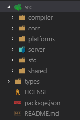
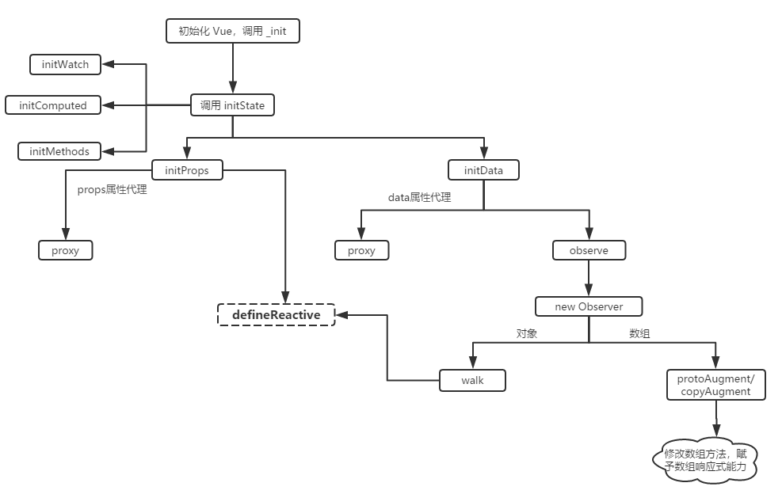
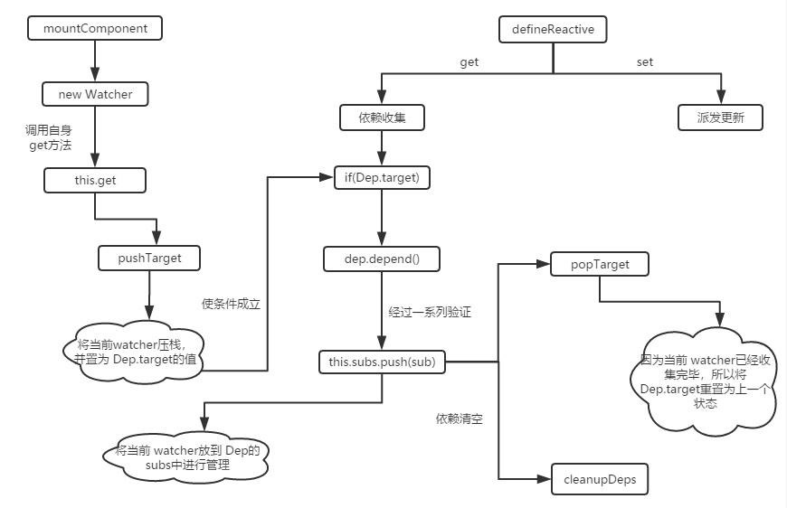
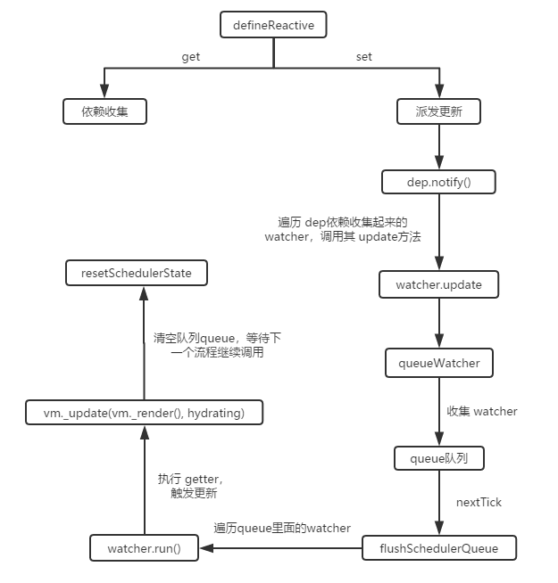

前段时间把 `vue`源码抽时间看了一遍，耐心点看再结合网上各种分析文章还是比较容易看明白的，没太大问题，唯一的问题就是

看完即忘


当然了，也不是说啥都不记得了，大概流程以及架构这些东西还是能留下个印象的，对于 `Vue`的构建算是有了个整体认知，只是具体到代码级别的细节很难记住多少，不过也情有可原嘛，又不是背代码谁能记住那么多逻辑绕来绕去的东西？

不过嘛，如果能加深对这些细节的印象那也是最好不过了，于是就决定写几篇文章吧，但不可能从头到尾把 `Vue`全写一遍，太多了也没那时间，想来想去，响应式这个东西几年前就已经被列入《三年前端，五年面试》考试大纲，那就它吧

>本文以 `vue@^2.6.6` 进行分析

## 初始化

首先找入口，`vue`源码的`src`目录下，存放的就是未打包前的代码，这个目录下又分出几个目录：



`compiler`跟模板编译相关，将模板编译成语法树，再将 `ast`编译成浏览器可识别的 `js`代码，用于生成 `DOM`

`core`就是 `Vue`的核心代码了，包括内置组件(`slot`、`transition`等)，内置 `api`的封装(`nextTick`、`set`等)、生命周期、`observer`、`vdom`等

`platforms`跟跨平台相关，`vue`目前可以运行在`web`和 `weex`上，这个目录里存在的文件用于抹平平台间的 `api`差异，赋予开发者无感知的开发体验

`server`存放跟服务器渲染(`SSR`)相关的逻辑

`sfc`，缩写来自于 `Single File Components`，即 `单文件组件`，用于配合 `webpack`解析 `.vue`文件，由于我们一般会将单个组件的 `template`、`script`、`style`，以及自定义的 `customBlocks`写在一个单 `.vue`文件中，而这四个都是不同的东西，肯定需要在解析的时候分别抽离出来，交给对应的处理器处理成浏览器可执行的 `js`文件

`share`定义一些客户端和服务器端公用的工具方法以及常量，例如生命周期的名称、必须的 `polyfill`等

其他的就废话不多说了，直接进入主题，数据的响应式肯定是跟 `data` 以及 `props`有关，所以直接从 `data`以及 `props`的初始化开始

`node_modules\vue\src\core\instance\state.js`文件中的 `initState`方法用于对 `props`、`data`、`methods`等的初始化工作，在 `new vue`的时候，会调用 `_init`方法，此方法位于 `Vue`的原型 `Vue.prototype`上，这个方法就会调用 `initState`

```js
// node_modules\vue\src\core\instance\index.js
function Vue (options) {
  if (process.env.NODE_ENV !== 'production' &&
    !(this instanceof Vue)
  ) {
    warn('Vue is a constructor and should be called with the `new` keyword')
  }
  this._init(options)
}
// 往 Vue构造函数的 prototyp上挂载 _init方法
initMixin(Vue)
```
```js
// node_modules\vue\src\core\instance\init.js
export function initMixin (Vue: Class<Component>) {
  Vue.prototype._init = function (options?: Object) {
    // ...
    // 初始化 props  data  watch 等
    initState(vm)
    // ...
  }
```
 `initState`方法如下：
```js
// node_modules\vue\src\core\instance\state.js
export function initState (vm: Component) {
  vm._watchers = []
  const opts = vm.$options
  if (opts.props) initProps(vm, opts.props)
  if (opts.methods) initMethods(vm, opts.methods)
  if (opts.data) {
    initData(vm)
  } else {
    observe(vm._data = {}, true /* asRootData */)
  }
  if (opts.computed) initComputed(vm, opts.computed)
  if (opts.watch && opts.watch !== nativeWatch) {
    initWatch(vm, opts.watch)
  }
}
```
可见，在此方法中，分别调用了 `initProps`、`initMethods`、`initData`、`initComputed`、`initWatch`方法，这些方法中对 `props`、`methods`、`data`、`computed`、`watch`进行了初始化过程，本文只是分析响应式，所以其他抛开不谈，只看 `initProps` 和 `initData`

`initProps`中，主要是使用了一个 `for...in`对 `props`进行遍历，调用 `defineReactive`方法将每个 `props`值变成响应式的值`defineReactive`正是 `vue`响应式的核心方法，放到后面再说；

并且又调用 `proxy`方法把这些 `props`值代理到 `vue`上，这样做的目的是能够让直接访问 `vm.xxx` 得到和访问 `vm._props.xxx`同样的效果（也就是代理了）

>上面的意思具体点就是，你定义在 `props`中的东西（比如：`props: { a； 1 }`），首先会被附加到 `vm._props`对象的属性上(即 `vm._props.a`)，然后遍历 `vm._props`，对其上的属性进行响应式处理（对 `a`响应式处理），但是我们一般访问 `props`并没有看到过什么 `this._props.a`的代码，而是直接 `this.a`就取到了，原因就在于 `vue`内部已经为我们进行了一层代理
>
>首先附加在 `vm._props`上的目的是方便 `vue`内部的处理，只要是挂载 `vm._props`上的数据就都是 `props`而不是 `data`或 `watch`什么的，而代理到 `vm`上则是方便开发者书写

```js
// node_modules\vue\src\core\instance\state.js
const sharedPropertyDefinition = {
  enumerable: true,
  configurable: true,
  get: noop,
  set: noop
}
export function proxy (target: Object, sourceKey: string, key: string) {
  sharedPropertyDefinition.get = function proxyGetter () {
    return this[sourceKey][key]
  }
  sharedPropertyDefinition.set = function proxySetter (val) {
    this[sourceKey][key] = val
  }
  Object.defineProperty(target, key, sharedPropertyDefinition)
}
```
`proxy`方法的原理其实就是使用 `Object.defineProperty`的 `get` 和 `set`方法代理了属性的访问


最后，这里面还有个 `toggleObserving`方法，这个方法是 `vue`内部对逻辑的一个优化，如果当前组件是根组件，那么根组件是不应该有 `props`的，但是呢，你给根组件加个 `props`，`vue`也不会报错，子组件的 `props`可以由父元素改变，但是根组件是没有父组件的，所以很显然根组件的 `props`肯定是不会改变的，也就没必要对这种 `props`进行依赖收集了

这里调用 `toggleObserving`就是禁止掉根组件 `props`的依赖收集

`initData`里做的事情跟 `initProps`差不多，首先，会把 `data`值取出放到 `vm._data`上，由于`data`的类型可以是一个对象也可以是一个函数，所以这里会判断下，如果是函数则调用 `getData`方法获取 `data`对象，否则直接取 `data`的值即可，不传 `data`的话，默认 `data`值是空对象 `{}`
```js
let data = vm.$options.data
data = vm._data = typeof data === 'function'
  ? getData(data, vm)
  : data || {}
```

这个 `getData`其实就是执行了传入的 `function`类型的`data`，得到的值就是对象类型的 `data`
```js
export function getData (data: Function, vm: Component): any {
  // ...
  // 使用 call执行 function类型的data，得到对象类型的data
  return data.call(vm, vm)
  // ...
}
```

另外，`initData`并没有直接对 `data`进行遍历以将 `data`中的值都变成是响应式的，而是另外调用 `observe`方法来做这件事，`observe`最终也调用了 `defineReactive`，但是在调用之前，还进行了额外的处理，这里暂时不说太多，放到后面和  `defineReactive`一起说；除此之外，`initData`也调用了 `proxy`进行数据代理，作用和 `props`调用 `proxy`差不多，只不过其是对 `data`数据进行代理

## 构建 Observe

现在回到上面没说的 `observe` 和 `defineReactive`，由于 `observe`最终还是会调用 `defineReactive`，所以就直接从 `observe`说起

`observe`，字面意思就是观察、观测，其主要功能就是用于检测数据的变化，由于其属于响应式，算是 `vue`的一个关键核心，所以其专门有一个文件夹，用于存放相关逻辑文件

```js
// node_modules\vue\src\core\observer\index.js
export function observe (value: any, asRootData: ?boolean): Observer | void {
  /// ...
  {
    ob = new Observer(value)
  }
  /// ...
}
```
`observe`方法中，主要是这一句 `ob = new Observer(value)`，这个 `Observer`是一个 `class`类
```js
// node_modules\vue\src\core\observer\index.js
export class Observer {
  // ...
  constructor (value: any) {
    this.value = value
    this.dep = new Dep()
    this.vmCount = 0
    def(value, '__ob__', this)
    if (Array.isArray(value)) {
      if (hasProto) {
        protoAugment(value, arrayMethods)
      } else {
        copyAugment(value, arrayMethods, arrayKeys)
      }
      this.observeArray(value)
    } else {
      this.walk(value)
    }
  }
  // ...
}
```
在其 `constructor`中，做了一些事情，这里的 `new Dep()`的 `Dep`也是跟响应式相关的一个东西，后面再说，然后调用了 `def`，这个方法很简单，就是调用 `Object.defineProperty`将当前实例（`this`）添加到`value`的 `__ob__`属性上：
```js
// node_modules\vue\src\core\util\lang.js
export function def (obj: Object, key: string, val: any, enumerable?: boolean) {
  Object.defineProperty(obj, key, {
    value: val,
    enumerable: !!enumerable,
    writable: true,
    configurable: true
  })
}
```
`vue`里很多地方都用到了 `Object.defineProperty`，可以看出这个东西对于 `vue`来说还是很重要的，少了它会很麻烦，而 `IE8`却不支持 `Object.defineProperty`，所以 `Vue`不兼容 `IE8`也是有道理的

在前面的 `observe`方法中，也出现过 `__ob__`这个东西：
```js
if (hasOwn(value, '__ob__') && value.__ob__ instanceof Observer) {
  ob = value.__ob__
}
```
可以看到，`__ob__`在这里用于做重复校验，如果当前数据对戏 `value`上已经有了 `__ob__`属性并且此属性是由 `Observer`构造而来，则直接返回这个值，避免重复创建

回到 `Observer`类，接下里会判断 `value`是不是数组，如果是数组，再判断 `hasProto`是否为 `truth`值，这个 `hasProto`就是用于检测当前浏览器是否支持使用 `__proto__`的：
```js
// node_modules\vue\src\core\util\env.js
// can we use __proto__?
export const hasProto = '__proto__' in {}
```
如果是就调用 `protoAugment`，否则调用 `copyAugment`，后者可以看做是前者兼容 `__proto__`的一个 `polyfill`，这两个方法的目的是一样的，都是用于改写 `Array.prototype`上的数组方法，以便让数组类型的数据也具备响应式的能力

换句话说，数组为什么对数组的修改，也能触发响应式呢？原因就在于 `vue`内部对一些常用的数组方法进行了一层代理，对这些数组方法进行了修改，关键点在于，在调用这些数组方法的时候，会同时调用 `notify`方法：
```js
// node_modules\vue\src\core\observer\array.js
// notify change
ob.dep.notify()
```
`ob`就是 `__ob__`，即数据对象上挂载的自身的观察者，`notify`就是观察者的通知事件，这个后面放到 `defineReactive`一起说，这里调用 `notify`告诉 `vue`数据发生变化，就触发了页面的重渲染，也就相当于是数组也有了响应式的能力

完了之后，继续调用 `observeArray`进行深层便利，以保证所有嵌套数据都是响应式的

接上面，如果是对象的话就无需那么麻烦，直接调用 `this.walk`方法：
```js
walk (obj: Object) {
  const keys = Object.keys(obj)
  for (let i = 0; i < keys.length; i++) {
    defineReactive(obj, keys[i])
  }
}
```
`walk`方法会对传入的对象进行遍历，然后对每一个遍历到的数据调用 `defineReactive`方法，终于到这个方法了，无论是 `props`的初始化还是 `data`的初始化最后都会调用这个方法，前面那些都是一些差异性的分别处理

大概看一眼 `defineReactive`这个方法，最后调用的 `Object.defineProperty`很显眼，原来是在这个函数中修改了属性的 `get` 以及 `set`，这两个方法很重要，分别对应所谓的 **依赖收集** 和 **派发更新**

先上个上述所有流程的简要示意图，有个大体印象，不然说得太多容易忘



## 依赖收集

先看 `get`
```js
// node_modules\vue\src\core\observer\index.js
get: function reactiveGetter () {
  const value = getter ? getter.call(obj) : val
  if (Dep.target) {
    dep.depend()
    if (childOb) {
      childOb.dep.depend()
      if (Array.isArray(value)) {
        dependArray(value)
      }
    }
  }
  return value
}
```
首先，如果当前属性以及显式定义了 `get`方法，则执行这个 `get`获取到值，接着判断 `Dep.target`

这里又出现了一个新的东西： `Dep`，这是一个 `class`类，比较关键，是整个依赖收集的核心

```js
// node_modules\vue\src\core\observer\dep.js

// The current target watcher being evaluated.
// This is globally unique because only one watcher
// can be evaluated at a time.
Dep.target = null
const targetStack = []

export function pushTarget (target: ?Watcher) {
  targetStack.push(target)
  Dep.target = target
}

export function popTarget () {
  targetStack.pop()
  Dep.target = targetStack[targetStack.length - 1]
}
```
进入 `Dep`的定义，此类的静态属性 `target`初始化的值是 `null`，但是可以通过两个暴露出去的方法来修改这个值

另外，在 `Dep.target = null`的上面还有一段注释，主要是说由于同一时间只能有一个 `watcher`被执行(当前执行完了再进行下一个)，而这个 `Dep.target`的指向就是这个正在执行的 `watcher`，所以 `Dep.target`就应该是全局唯一的，这也正是为什么 `target`是个静态属性的原因

那么现在由于 `Dep.target`是 `null`，不符合 `if(Dep.target){}`，所以这个值肯定在什么地方被修改了，而且应该是通过 `pushTarget` 或 `popTarget`来修改的

所以什么地方会调用这两个方法？

这又得回到 `get`了，什么时候会调用 `get`？访问这个属性，也就是数据的时候就会调用这个数据的 `get`(如果有的话)，什么时候会访问数据呢？当然是在渲染页面的时候，肯定需要拿到数据来填充模板

那么这就是生命周期的事了，这个过程应该发生在 `beforeMount` 和 `mount`中间

```js
// node_modules\vue\src\core\instance\lifecycle.js

// we set this to vm._watcher inside the watcher's constructor
// since the watcher's initial patch may call $forceUpdate (e.g. inside child
// component's mounted hook), which relies on vm._watcher being already defined
new Watcher(vm, updateComponent, noop, {
  before () {
    if (vm._isMounted && !vm._isDestroyed) {
      callHook(vm, 'beforeUpdate')
    }
  }
}, true /* isRenderWatcher */)
```
主要是 `new Watcher`这句代码，`as we all konw`，`vue` 使用观察者模式实现响应式逻辑，前面的 `Observe`是监听器，那么这里的 `Watcher`就是观察者，数据的变化会被通知给 `Watcher`，由 `Watcher`进行视图更新等操作

进入 `Watcher`方法

其构造函数 `constructor`的最后：
```js
this.value = this.lazy
    ? undefined
    : this.get()
```
`this.lazy`是传入的修饰符，暂时不用管，这里可以认为直接调用 `this.get()`

```js
get () {
  pushTarget(this)
  let value
  const vm = this.vm
  try {
    value = this.getter.call(vm, vm)
  } catch (e) {
    if (this.user) {
      handleError(e, vm, `getter for watcher "${this.expression}"`)
    } else {
      throw e
    }
  } finally {
    // "touch" every property so they are all tracked as
    // dependencies for deep watching
    if (this.deep) {
      traverse(value)
    }
    popTarget()
    this.cleanupDeps()
  }
  return value
}
```
可以看到，在 `Watcher`的 `get`方法中，上来就调用了 `pushTarget`方法，所以就把当前这个 `watcher` `push`到 `targetStack`(位于 `Dep`的定义文件中)数组中去了，并且把 `Dep.target`的值置为这个 `watcher`

所以，从这里可以看出 `targetStack`数组的作用就是类似于一个栈，栈内的项就是  `watcher`

`try...catch...finally`的 `finally`语句中，首先根据 `this.deep`来决定是否触发当前数据子属性的 `getter`，这里暂时不看，然后就是调用 `popTarget`，这个方法就是将当前 `watcher`出栈，并将 `Dep.target`指向上一个 `watcher`

然后 `this.cleanupDeps()`其实就是依赖清空，因为已经实现了对当前 `watcher`的依赖收集，`Dep.target`已经指向了其他的 `watcher`，所以当前 `watcher`的订阅就可以取消了，腾出空间给其他的依赖收集过程使用

接着执行 `value = this.getter.call(vm, vm)`，这里的 `this.getter`就是：
```js
// node_modules\vue\src\core\instance\lifecycle.js
updateComponent = () => {
  vm._update(vm._render(), hydrating)
}
```
`_update` 和 `_render`都是挂载在 `Vue.prototype`上的方法，跟组件更新相关，`vm._render`方法返回一个 `vnode`，所以肯定涉及到数据的访问，不然怎么构建 `vnode`，既然访问数据，那么就会调用数据的 `get`方法(如果有的话)

那么就又回到前面了：

```js
// node_modules\vue\src\core\observer\index.js
get: function reactiveGetter () {
  const value = getter ? getter.call(obj) : val
  if (Dep.target) {
    dep.depend()
    if (childOb) {
      childOb.dep.depend()
      if (Array.isArray(value)) {
        dependArray(value)
      }
    }
  }
  return value
}
```
经过上面 `Watcher`的构建过程，可以知道这个时候 `Dep.target`其实的指向已经已经被更正为当前的 `watcher`了，也就是 `trueth`值，可以进入条件语句

首先执行 `dep.depend()`，`dep`是在 `defineReactive`方法中 `new Dep`的实例，那么看下 `Dep`的 `depend`方法
```js
// node_modules\vue\src\core\observer\dep.js
depend () {
  if (Dep.target) {
    Dep.target.addDep(this)
  }
}
```
`Dep.target`此时条件成立，所以继续调用 `Dep.target`上的 `addDep`方法，`Dep.target`指向 `Watcher`，所以看 `Watcher`的 `addDep`方法
```js
addDep (dep: Dep) {
  const id = dep.id
  if (!this.newDepIds.has(id)) {
    this.newDepIds.add(id)
    this.newDeps.push(dep)
    if (!this.depIds.has(id)) {
      dep.addSub(this)
    }
  }
}
```

首先通过 `id`避免重复添加同一数据，最后又调用了 `dep.addSub`将当前 `Watcher`添加到 `Dep`中去

这里出现了几个变量，`newDepIds`、`newDeps`、`depIds`、`deps`，这几个变量其实就是在 `Dep`添加 `watcher`之前的一次校验，以及方便后续移除订阅，提升 `vue`的性能，算是 `vue`内部一种优化策略，这里不用理会

```js
// node_modules\vue\src\core\observer\dep.js
addSub (sub: Watcher) {
  this.subs.push(sub)
}
```
最终，在 `Dep`中，会把 `watcher` `push`到 `Dep`的 `subs`数组属性中

即，最终 `props`和 `data`的响应式数据的 `watcher`都将放到 `Dep`的 `subs`中，这就完成了一次依赖收集的过程

继续回到 `defineReactive`，在调用了 `dep.depend()`之后，还有几行代码：
```js
// node_modules\vue\src\core\observer\index.js
let childOb = !shallow && observe(val)
// ...
if (childOb) {
  childOb.dep.depend()
  if (Array.isArray(value)) {
    dependArray(value)
  }
}
```
递归调用 `observe`，保证子属性也是响应式的，如果当前值是数组，那么保证这个数组也是响应式的

这个依赖收集过程，简要示意图如下：



## 派发更新

依赖收集的目的就是将所有响应式数据通过 `watcher`收集起来统一管理，当数据发生变化的时候，就通知视图进行更新，这个更新的过程就是派发更新

继续看 `defineReactive`的 `set`方法，这个方法实现派发更新的主要逻辑
```js
// node_modules\vue\src\core\observer\index.js
set: function reactiveSetter (newVal) {
  const value = getter ? getter.call(obj) : val
  /* eslint-disable no-self-compare */
  if (newVal === value || (newVal !== newVal && value !== value)) {
    return
  }
  /* eslint-enable no-self-compare */
  if (process.env.NODE_ENV !== 'production' && customSetter) {
    customSetter()
  }
  // #7981: for accessor properties without setter
  if (getter && !setter) return
  if (setter) {
    setter.call(obj, newVal)
  } else {
    val = newVal
  }
  childOb = !shallow && observe(newVal)
  dep.notify()
}
```
首先是一系列的验证判断，可以不用管，然后设置数据的值为传入的值，这是一般 `set`函数都会执行的方法

然后到 `childOb = !shallow && observe(newVal)`，一般情况下，`shallow`都是 `trueth`值，所以会调用 `observe`，经过上面的分析，我们知道这个 `observe`就是依赖收集相关的东西，这里的意思就是对新设置的值也进行依赖收集，加入到响应式系统中来

接下来这行代码才是关键：
```js
dep.notify()
```

看下 `Dep`：
```js
// node_modules\vue\src\core\observer\dep.js
notify () {
  // stabilize the subscriber list first
  const subs = this.subs.slice()
  // ...
  for (let i = 0, l = subs.length; i < l; i++) {
    subs[i].update()
  }
}
```
`notify`方法中，遍历了 `subs`，对每个项调用 `update`方法，经过前面的分析我们知道，`subs`的每个项其实都是依赖收集起来的 `watcher`，这里也就是调用了 `watcher`的 `update`方法，通过 `update`来触发对应的 `watcher`实现页面更新

所以，`Dep`其实就是一个 `watcher`管理模块，当数据变化时，会被 `Observer`监测到，然后由 `Dep`通知到 `watcher`

```js
update () {
  /* istanbul ignore else */
  if (this.lazy) {
    this.dirty = true
  } else if (this.sync) {
    this.run()
  } else {
    queueWatcher(this)
  }
}
```
`this.lazy` 跟 `computed`相关，`computed`是惰性求值的，所以这里只是把 `this.dirty`设为 `true`，并没有做什么更新的操作；

`this.sync`跟 `watch`相关，如果 `watch`设置了这个值为 `true`，则是显式要求 `watch`更新需要在当前 `Tick` 一并执行，不必放到下一个 `Tick`

这两个暂时不看，不扩充太多避免逻辑太乱，正常流程会执行 `queueWatcher(this)`
```js
// node_modules\vue\src\core\observer\scheduler.js
export function queueWatcher (watcher: Watcher) {
  const id = watcher.id
  if (has[id] == null) {
    has[id] = true
    if (!flushing) {
      queue.push(watcher)
    } else {
      // if already flushing, splice the watcher based on its id
      // if already past its id, it will be run next immediately.
      let i = queue.length - 1
      while (i > index && queue[i].id > watcher.id) {
        i--
      }
      queue.splice(i + 1, 0, watcher)
    }
    // queue the flush
    if (!waiting) {
      waiting = true

      if (process.env.NODE_ENV !== 'production' && !config.async) {
        flushSchedulerQueue()
        return
      }
      nextTick(flushSchedulerQueue)
    }
  }
}
```
`queueWatcher`首先会根据 `has[id]`来避免同一 `watcher`的重复添加，接下来引入了队列的概念，`vue`并不会在每次数据改变的时候就立即执行 `watcher`重渲染页面，而是把这些 `watcher` 先推送到一个队列里，然后在`nextTick` 里调用 `flushSchedulerQueue`批量执行这些 `watcher`，更新 `DOM`

这里在 `nextTick`里执行 `flushSchedulerQueue`的目的就是为了要等到当前 `Tick`中所有的 `watcher`都加入到 `queue`中，再在下一 `Tick`中执行队列中的 `watcher`

看下这个 `flushSchedulerQueue`方法，首先对队列中的 `watcher`根据其 `id`进行排序，将 `id`小的 `watcher`放在前面(父组件 `watcher`的 `id`小于子组件的)， 排序的目的也已经在注释中解释地很清楚了：
```js
// node_modules\vue\src\core\observer\scheduler.js

// Sort queue before flush.
// This ensures that:
// 1. Components are updated from parent to child. (because parent is always
//    created before the child)
// 2. A component's user watchers are run before its render watcher (because
//    user watchers are created before the render watcher)
// 3. If a component is destroyed during a parent component's watcher run,
//    its watchers can be skipped.
queue.sort((a, b) => a.id - b.id)
```
大概意思就是，在清空队列之前对队列进行排序，主要是为了以下 `3`点

- 组件的更新是由父到子的（因为父组件的创建在子组件之前），所以 `watcher`的创建也应该是先父后子，执行顺序也应该保持先父后子

- 用户自定义 `watcher`应该在 渲染 `watcher`之前执行（因为用户自定义 `watcher`的创建在 渲染`watcher`之前）

- 如果一个组件在父组件的 `watcher` 执行期间被销毁，那么这个子组件的 `watcher` 都可以被跳过

排完序之后，使用了一个 `for`循环遍历队列，执行每个 `watcher`的 `run`方法，那么就来看下这个 `run`方法

```js
// node_modules\vue\src\core\observer\watcher.js
run () {
  if (this.active) {
    const value = this.get()
    if (
      value !== this.value ||
      // Deep watchers and watchers on Object/Arrays should fire even
      // when the value is the same, because the value may
      // have mutated.
      isObject(value) ||
      this.deep
    ) {
      // set new value
      const oldValue = this.value
      this.value = value
      if (this.user) {
        try {
          this.cb.call(this.vm, value, oldValue)
        } catch (e) {
          handleError(e, this.vm, `callback for watcher "${this.expression}"`)
        }
      } else {
        this.cb.call(this.vm, value, oldValue)
      }
    }
  }
}
```
首先判断 `this.active`，这个 `this.active`的初始值是 `true`，那么什么时候会变成 `false`呢？当 `watcher`从所有 `Dep`中移除的时候，也就是这个 `watcher`移除掉了，所以也就没有什么派发更新的事情了

```js
// node_modules\vue\src\core\observer\watcher.js
teardown () {
  // ...
  this.active = false
}
```

接着执行 `const value = this.get()`获取到当前值，调用 `watcher`的 `get`方法的时候会执行 `watcher`的 `getter`方法：
```js
// node_modules\vue\src\core\observer\watcher.js
get () {
  pushTarget(this)
  let value
  const vm = this.vm
  try {
    value = this.getter.call(vm, vm)
  } catch (e) {
    // ...
  }
  // ...
  return value
}
```
而这个 `getter`前面已经说了，其实就是：
```js
// node_modules\vue\src\core\instance\lifecycle.js
updateComponent = () => {
  vm._update(vm._render(), hydrating)
}
```
也就是执行了 `DOM`更新的操作

回到 `flushSchedulerQueue`，在执行完 `watcher.run()`之后，还有些收尾工作，主要是执行了 `resetSchedulerState`方法

```js
// node_modules\vue\src\core\observer\scheduler.js
function resetSchedulerState () {
  index = queue.length = activatedChildren.length = 0
  has = {}
  if (process.env.NODE_ENV !== 'production') {
    circular = {}
  }
  waiting = flushing = false
}
```
这个方法主要是用于重置队列状态，比如最后将 `waiting`、`flushing`置为 `false`，这样一来，当下次调用 `queueWatcher`的时候，就又可以往 `queue`队列里堆 `watcher`了

回到 `queueWatcher`这个方法
```js
if (!flushing) {
  queue.push(watcher)
} else {
  // if already flushing, splice the watcher based on its id
  // if already past its id, it will be run next immediately.
  let i = queue.length - 1
  while (i > index && queue[i].id > watcher.id) {
    i--
  }
  queue.splice(i + 1, 0, watcher)
}
```
当 `flushSchedulerQueue`执行，进行批量处理 `watcher`的时候，`flushing`将被置为 `true`，这个时候如果再次添加新的 `user watcher`进来，那么就会立即添加到 `queue`中去

这里采取改变 `queue`的方式是原数组修改，也就是说添加进去的 `watcher`会立即加入到 `flushSchedulerQueue`批处理的进程中，因而在 `flushSchedulerQueue`中对 `queue`的循环处理中，`for`循环是实时获取 `queue`的长度的

```js
// node_modules\vue\src\core\observer\scheduler.js
function flushSchedulerQueue () {
  // ...
  for (index = 0; index < queue.length; index++) {
    // ...
  }
  // ...
}
```

另外，新加入的 `watcher`加到 `queue`的位置也是根据`id`进行排序的，契合上面所说的 `watch`执行先父后子的理念

大体流程示意图如下：



## 总结

`vue`的代码相比于 `react`的其实还是挺适合阅读的，我本来还打算打断点慢慢看，没想到根本没用到，这也表明了`vue`的轻量级确实是有原因的

少了各种模式和各种系统的堆砌，但同时又能满足一般业务的开发需要，代码体积小意味着会有更多的人有兴趣将其接入移动端，概念少意味着小白也能快速上手，俗话说得小白者得天下，`vue`能与 `react`这种顶级大厂团伙化规模维护的框架库分庭抗礼也不是没有道理的