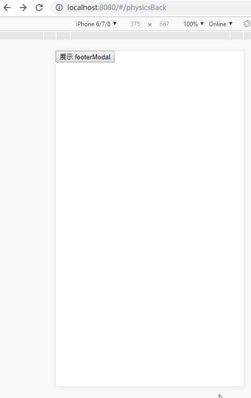

移动端作为互联网重要入口，<del>切图仔</del>前端工程师开发移动端页面早已是司空见惯的事了，并且其中大部分都是内嵌于客户端(`app`，小程序)的 `h5`页面，即 `webview`

有次被同事问到一个问题，他有个需求，是一个内嵌在客户端`app`内的页面，有个功能点是拦截客户端的返回操作，实现页面内弹层的显示与隐藏，拦截点包括 `app`页面上自带的返回按钮以及安卓机的物理按钮，类似于下面这种：


点击购物车，则购物车元素从页面底部弹起显示，点击遮罩层，则弹层关闭隐藏，这是很正常的操作，而除此之外，还需要实现的一个功能是，点击屏幕返回键或者安卓机的物理返回键，也能够关闭弹层，并且保证页面不发生跳转

我听了微微一笑，问他，<del>哪个傻叉 `PM`提的需求？，`h5`怎么拦截 `app`甚至是物理按钮的操作？你当时没有怼他吗？</del>客户端那边有提供拦截返回的 `sdk`接口吗？同事回答 `sdk`没有提供这个能力，他觉得不好实现，但 `PM`坚持要做这个功能

于是我抱着<del>反正不是我的需求，我天马行空章口就来瞎提建议也没关系</del>助人为乐的态度思考了一会，谁知还真让我想到了一个方案（我不确定以前是不是在什么地方看到过，总之就是想到了），回来验证了一下，确实是可行的

关键点在于，**利用返回操作会触发路由改变的特性来模拟达到拦截的效果**，并不是真的监听或者拦截到了屏幕返回键或者物理返回键的点击


## 路由配置

假设需要进行模拟拦截返回操作的主页面路由为 `/physicsBack`，其下有个子路由 `/physicsBack/footerModal`，当路由为 `/physicsBack`时就只显示页面，当路由为 `/physicsBack/footerModal`时，就在 `/physicsBack`上弹起弹层

这里的 `/physicsBack/footerModal`说起来是子路由，但实际上我们只是想利用其作为路由的一个能力——即拦截返回操作，所以实际上并不真的需要为这个路由配置一个页面，你当然也可以这么做，最后也能实现效果，但未免麻烦了些

这里我将 `/physicsBack` 和 `/physicsBack/footerModal`全部指向同一个页面，即主页面，然后通过对路由的监听，来控制弹层的显隐

路由配置如下：
```js
 const router = new VueRouter({
  routes: [{
    path: '/physicsBack/(footerModal)?',
    component: physicsBack
  }]
 })
```
`/physicsBack/(footerModal)?`同时匹配 `/physicsBack` 和 `/physicsBack/footerModal`，所以无论路由是 `/physicsBack` 还是 `/physicsBack/footerModal`，都将指向 `physicsBack`这个页面，达到即使路由在这两个中来回切换，但页面也毫无变化的目的

## 路由监听

虽然在路由 `/physicsBack` 和 `/physicsBack/footerModal`中切换不会引起页面的切换，自始至终都停留在 `physicsBack`组件上，但却可以在 `physicsBack`组件中对路由进行监听，进而根据监听到的路由变化来控制弹层的显隐：
```js
watch: {
  $route (to, from) {
    this.manageFooterModal(to.path, from.path)
  }
}
// ...
manageFooterModal (toPath, fromPath) {
  if (toPath === '/physicsBack/footerModal') {
    this.visible = true
  } else if (fromPath === '/physicsBack/footerModal') {
    this.visible = false
  }
}
```
当 `toPath`是 `/physicsBack/footerModal`，表示将切换到这个路由，前面已经规定了，当路由切换到这个位置时，显示弹层；

当 `fromPath`是 `/physicsBack/footerModal`，表示从有弹层的页面回退或者跳走，则关闭弹层

这里你不用 `watch`也是可以的，用 `vue-router`提供的路由守卫钩子函数(`beforeRouteEnter`、`beforeRouteUpdate`、`beforeRouteLeave `)也能够达到同样的效果，这些钩子函数只是进一步简化了流程，但本质都还是一样的，目的都是实现对路由的监听与控制，所以你哪怕不想依赖于框架提供的能力，通过设置原生监听函数 `window.addEventListener('hashchange', callback)` 或 `window.addEventListener('popstate', callback)` 照样可以实现功能

除了通过路由控制之外，页面元素肯定也必须能够对弹层显隐进行控制，例如点击某个元素弹起弹层，这样才贴合真实使用场景

同样的，由于弹层的显隐实际上是由路由的切换控制，所以页面内部想要改变弹层的显隐，也必须通过路由切换来完成：
```js
changeVisible () {
  if (this.visible) {
    this.$router.go(-1)
  } else {
    this.$router.push('/physicsBack/footerModal')
  }
}
```

由于这实际上是利用了系统的返回能力，所以无论你在浏览器上还是客户端 `app`的 `webview`内，无论是使用屏幕返回还是物理返回键，都可以达到同样的效果

实现的效果如下：



做了个 [Live Demo](https://accforgit.github.io/simulationBack/index.html#/physicsBack)，感兴趣的可以亲自试下，代码也已经上传到 [github](https://github.com/accforgit/blog-data/tree/master/%E4%B8%80%E7%A7%8D%E7%A7%BB%E5%8A%A8%E7%AB%AF%E6%A8%A1%E6%8B%9F%E5%AE%9E%E7%8E%B0%E8%BF%94%E5%9B%9E%E6%8B%A6%E6%88%AA%E7%9A%84%E6%96%B9%E6%A1%88)

## 小结

本文所说的通过路由来模拟拦截返回键的能力，不仅仅可以应用在弹层例子上，其他跟返回相关的操作理论上都可以发挥想象，例如返回重定向，禁止用户退出页面<del>(这是什么傻叉需求啊)</del>等