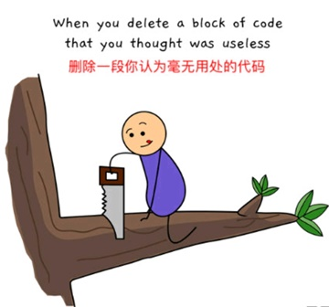
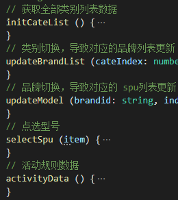

本文其实可以看成是对 [接手前端新项目？这里有些注意点你可能需要留意一下](https://juejin.im/post/5b99c824f265da0ac55e3980) 的补充，主要是我在平时写代码过程中得到的一些经验

## 使用 typescript

忘了从哪里看到的一句话，意思是使用了 `typescript`的项目，将比不使用的项目体积多出 `30%`，当然，这多出来的 `30%`代码只是你本地需要写的代码，项目打包完毕后，是否使用 `ts`，项目体积基本上是一样大的

`ts`的好处我就不多加赘述了，其最实用的就是类型检查，同时增强编辑器的提示功能，需要注意的是，既然接入了 `ts`，那就尽量把 `ts`的优势体现出来，不要为了偷懒把 `typescript` 写成了 `anyscript`，否则还不如不加

另外，经常听人说，小项目没必要接入 `ts`，只有大项目才需要，实际上，按照我的感觉，没必要分什么大的小的，容易造成迷惑，你为公司写的项目肯定不会小到哪里去的，而且肯定不是写完了就不管了，后续肯定需要多次迭代维护的，无脑接入就行了

至于你自己写的个人项目，那就看你自己心情了，因为代码都是你自己的，你自己应该知道自己在写啥

## 不要在模板里写太多的逻辑

无论是 `react` 还是 `vue`，模板或者 `jsx`中都不要写太多的逻辑，模板就是用来放布局的，尽量不要干其他的事情，逻辑最好全部放到 `js`中，掺杂了大量逻辑的模板，不仅会让模板面目全非，很难一眼看清楚页面布局，同时维护起来也很困难，因为模板中只是支持部分 `js`的语法，并不是全部，一段逻辑可能在 `js`中很轻易地就能实现，但在模板中，因为语法局限，要绕一大圈才能搞定

例如，当拍下一个商品后，会有一个对应的商品状态流传的进度页面，这个页面的底部可能存在按钮，当商品拍下还没发货时，显示 __催发货__，当商品发货后，显示 __确认收货__，当商品确认收货后，显示 __去评价__，这只是最基本的，复杂一点，可能有五种以上的按钮，搞不好还要根据当前流转的状态来决定要同时显示几个按钮，加起来十几种的按钮排列显示方式

对于这种情形，我看到过最多的解决方式就是直接在模板里 `if..else`，大 `if` 套小 `if`，`if`的判断体可能还要依赖于不止一个条件，那真是惨不忍睹，半屏幕的模板看下来，结果发现其实只是为了显示页面最底部那两个按钮，想改哪个按钮，首先得层层追踪清楚这个按钮到底写了哪些以及哪几层条件，为了兼顾 `UI`，还要确认一下改了之后会不会影响到显示效果，瞎浪费时间

```html
<div class="bottom_btn">
  <div class="single" v-if="status === '1'">
    <button @click="buttonClick('sendBySelfBtn')" class="button">修改物流单号</button>
  </div>
  <div class="single" v-else-if="status === '2'">
    <button @click="buttonClick('moneyDetail')" class="button grey" >查看打款进度</button>
  </div>
  <div class="single" v-else-if="status === '3'">
    <button class="button grey" @click="buttonClick('cancelBtn')">取消寄卖</button>
  </div>
  <div class="single" v-else-if="status === '4'">
    <button class="button grey" @click="buttonClick('reSell')">重新上架</button>
  </div>
  <!-- 同时显示两个按钮 -->
  <div class="double" v-else>
    <button class="button grey" @click="buttonClick('cancelBtn')">自行寄件</button>
    <button class="button grey" v-if="status === '5'" @click="buttonClick('cancelForOnlyTip')">取消寄卖</button>
    <button class="button grey" v-else @click="buttonClick('cancelBtn')">召回商品</button>
  </div>
</div>
```

而如果按照模板归模板，逻辑归 `js`的规范，那么你模板上只需要清清楚楚地把布局写好就行了，而那些逻辑直接放到 `js`上，哪怕你还是依旧写 `if..else`，`js`代码的 `if...else`也比`jsx`这些 `js`与 `html`混合的 `if..else`好看点，更何况，用 `js`来写，完全可以优化逻辑，什么 `map`查询、什么策略模式稍微用上一用，就会好看很多

```html
<div class="bottom_btn">
  <button class="btn1" @click="btnClick(btnData.leftEventName)">{{btnData.leftTxt}}</button>
  <button v-if="rightBtnTxt" @click="btnClick(btnData.rightEventName)" class="btn2">{{btnData.rightTxt}}</button>
</div>
```
上述模板就清晰很多了，我一眼就知道这里放了一个或者两个按钮，至于按钮的点击事件是什么、按钮的文案是什么，什么时候显式什么按钮，显式一个还是两个按钮等，那就是 `js`的事情了，模板只负责展示

```js
updateBtn () {
  const statusSignleBtnMap = {
    1: {
      txt: '修改物流单号',
      eventName: 'sendBySelfBtn'
    },
    2: {
      txt: '查看打款进度',
      eventName: 'moneyDetail'
    },
    3: {
      txt: '取消寄卖',
      eventName: 'cancelBtn'
    },
    4: {
      txt: '重新上架',
      eventName: 'reSell'
    },
  }
  const statusDoubleBtnMap = {
    5: {
      txt: '取消寄卖',
      eventName: 'cancelForOnlyTip'
    }
  }
  let btnData = statusBtnMap[status]
  if (btnData) {
    this.btnData = {
      leftTxt: btnData.txt,
      leftEventName: btnData.eventName
    }
  } else {
    this.btnData = {
      leftTxt: 'cancelBtn',
      leftEventName: '自行寄件',
      rightTxt: statusDoubleBtnMap[status].txt,
      rightEentName: statusDoubleBtnMap[status].eventName
    }
  }
}
btnClick (eventName) {
  // 这里再根据 eventName 进行相应的按钮点击处理
}
```
需要展示的按钮信息全部在 `btnData`上，想增加或删除或修改按钮，只需要修改 `statusSignleBtnMap` 或 `statusDoubleBtnMap` 即可，无论逻辑有多少，无非都是修改对象属性的事情，非常清晰

## 分支语句优化

业务代码少不了 `if...else`，甚至有些功能代码都是放在 `if...else`的代码块中，写好分支语句，将能显著地提升代码的可阅读性

### 不要在判断分支里写太长的逻辑

一屏下来看不到分支语句的结束括号，再继续往下看很容易忘记当前是什么 `case`了，还要往上翻一翻才清楚，从代码编写的角度看，也不应该在一个代码块中写太多的逻辑，如果发现就是需要写很长的逻辑，那么就把这些逻辑放到另外一个函数中

### 提前结束分支

如果发现分支能够提前结束，那么立刻结束，在某些时候这能大大减少 `if...else`的嵌套层数
```js
function fn1(a, b) {
  let c = null
  if (a > b) {
    c = a + b
  } else {
    if (a === 0) {
      c = b + new Date()
    } else if (a === 1) {
      c = a / b
    } else {
      c = a * b
    }
  }
  return c
}
```
可优化成：
```js
function fn2(a, b) {
  if (a > b) {
    // 提前结束
    return a + b
  }
  let c = null
  if (a === 0) {
    c = b + new Date()
  } else if (a === 1) {
    c = a / b
  } else {
    c = a * b
  }
  return c
}
```
可以看到，`fn1`比 `fn2`少了一层 `if...else`的嵌套，这只是简单的示例代码，一般情况下业务代码里的 `if...else`可不仅只有两层，时机合理的情况下，把五六层的分支嵌套打平成一层，那舒爽……

## 关键页面从源头做好组件拆分

网站的一些关键页面，例如首页、详情页，在构建之初就要大概规划好布局，划分好子组件，不要说什么提前优化并不一定好之类的，因为这些关键页面肯定是需要长期存在并且持续迭代的，这是毫无疑问的事情，不存在你提前优化好了结果后面根本用不上的情况

如果没有规划好，后面再想优化那就有点考验人性了，因为人都是有惰性的，再加上大家都忙得很，需求都写不完，谁愿意去优化代码，再加上这份代码早不知被多少人改过了，改别人的代码都跟吃屎似的，优化别人的代码简直要升天，谁愿意干？当积少成多终于不堪忍受想要优化的时候，可能你需要付出数倍的精力，再加上可以接受可能弄出 `bug`来的勇气，才能做好优化，何苦来哉？

当然，子组件的划分也不是说越细越好，要保持一个平衡，这个平衡怎么把握呢？按照我的经验来看，这个组件整体模板加 `js`方法最起码要有`100`行以上，如果低于这个行数，考虑一下是不是划分的太细了，也不要不超过 `400行`，超过了就要考虑一下是不是能再拆一下，这是大部分情况下的做法，也不是绝对的，还是要根据实际情况来权衡

例如，对于详情页来说，一般都可以分为 __头部banner + 商品标题描述区__、__sku选择区__、__评价区__、__详情描述+图片区__、__底部按钮区__，这些区域基本上都是可以相互独立存在的，或者说耦合性很低，可以看成独立的组件进行维护管理

### 降低组件耦合性

组件划分的一大原则是，尽量降低耦合性

首页、详情页这种关键页面，需要的数据和方法绝对不会少的，这么多的数据和方法混杂在同一个地方，维护起来绝对不轻松，每修改或调用某个数据和方法，都要先看下到底有哪些数据和方法依赖当前的数据和方法，只有在确保当前修改不会影响到其他数据和方法的时候，才能真正开始修改的动作，这是一件无意义且耗时耗力的重复性事情

并且可以预见的是，谁都不敢轻易删除某个数据或方法，尽管这个数据和方法可能永远用不到了，因为数据和方法太多了，想要理清这些数据之间的关系耗时耗力，不如就扔在那里，不改不会出错，改了可能就弄出 `bug`了，长此以往，页面上的无效代码也就越来越多，数据和方法也越来也多，逻辑越来越复杂，到了最后，恨不得将其推翻重来，只可惜，你可能还是不敢，因为你连删除一个数据或方法都不敢，怎么可能敢重构？



而如果能在一开始就划分好组件，将数据和方法打散到独立的组件中，那么每个子组件内部的数据和方法肯定就没那么多了，增删改查前都只需要扫一眼即可清楚所有数据和方法间的联系，更新起来也就更得心应手


当然，组件的划分也不是越细越好，要有一个权衡

如果你发现 `A`组件的很多数据和方法都与`B`组件重合，对 `A`组件的修改很大概率会导致 `B`组件的更新，那么考虑将 `A`组件和 `B`组件合并成一个组件，组件的一大目标是提升复用性，两个耦合严重的组件显然不容易复用，还多出一些交互的逻辑

组件的绝大部分数据和方法都应该能在内部维护，这样，以后进行迭代的时候，需要更新哪个区域的内容就到对应的组件里去修改，不影响其他组件的逻辑，少部分公共的数据和方法应该放在父组件中进行维护，子组件直接通过 `props`取父组件中的数据即可

如果不是特别需要的话，建议不要使用 `vuex`，这个东西用起来确实挺爽，但追踪起来肯定没有 `props`那么直观，`vuex`的使用建议也是如此，只有当你感觉需要用的时候才用，否则就没必要用，徒增繁琐，而据我的经验来看，绝大多数的项目都并不需要这个东西

### 用好 mixin

当你需要在一些关键页面上例如首页、详情页加入一个存活时间很短很可能只用一次再也不用的运营活动时，你会怎么做？直接开撸，该加数据加数据该加方法加方法，一般都是这么做的

但问题在于活动结束后，你怎么办？

最好的做法是直接移除所有活动相关逻辑，还原到这个页面本来的面目，但是通常来说很难还原了，因为你当初已经将运营活动相关逻辑与页面本来的主体逻辑代码混杂在了一起，就像是把一把沙子混进一堆屎山里，确实能重新将所有的沙子全部挑出，但很显然耗时耗力，更何况，大多数人根本不会移除失效的代码，而是直接在代码中加入一个逻辑上的开关，关掉这个开关，相关代码就不再运行或者即时是运行了也不会对主体逻辑产生任何影响

于是，随着运营活动的多次迭代，开关越加越多，失效的代码也越来越多

屎山中混入了越来越多的沙子，不仅难吃还硌牙，How Dare You!

我的做法是，如果活动相关逻辑与主体代码的耦合性较低，那么考虑独立成一个组件，但大多数情况下，运营活动的逻辑都会与主体代码息息相关，耦合性很高，这个时候最好将活动相关逻辑尽量全部独立到 一个 `mixin` 中，尽量减少对主文件数据的修改，最好通过尽量少的接口来进行 `mixin`与主文件的交互，保证即使 `mixin`中的方法报错了，或者直接移除这个 `mixin`，也不会对主文件造成实质性的影响

页面上添加的运营活动数量越多，越能体现这种划分的好处，主体文件只关心主体逻辑，各个活动逻辑都有各自对应的 `mixin`文件，大家各司其职，将因添加了越来越多运营活动页面的复杂度从指数级将至常数级


还有一个技巧是，如果需要在主文件中修改 `mixin`的数据或调用 `mixin`的方法，那么建议这个数据或方法具备清晰的 `mixin`归属，比如给这个 `mixin`中的数据命名为 `mixinSomeData` 或方法命名为 `mixinSomeMethod`，如果不止有一个 `mixin`，还可以单独标识每个 `mixin`，比如 `mixinASomeData`、`mixinBSomeData`，这样在主文件中使用这些数据或方法时，一眼就知道这是`mixin`并且是哪个 `mixin`的数据或方法

做好了这些工作后，那么后续要下掉这个运营活动就很简单了，直接删掉主文件对这个运营活动对应的 `mixin`文件的引用，删掉主文件中所有引用 `mixin`中数据和方法的地方即可

关于这个 `mixin`，我还想多说一句，既然用了 `mixin`，那么就要尽量减少 `mixin`与主体代码之间的交互，否则耦合得太严重，理解一段逻辑需要在两个文件中来回对比着看，还不如直接写在一起，我看过将一个页面拆分出两个 `mixin`的操作，这两个 `mixin`以及主体逻辑之间的数据交互那叫一个千丝万缕，一段正常的逻辑非要在三个文件中穿梭游走，看得我涕泗横流

## 尽量使用纯函数

纯函数是为了保证相同的输入能得到相同的输出，在调用这个函数的时候，不需要考虑更高作用域的变量会不会对函数的运行造成什么影响，主要目的也是为了解耦

当然，在很多情况下，除非是通用的工具方法，否则方法的调用或多或少都会与全局 `data`相关，那么这种情况下我们能做的就是进来减少不相关的高作用域变量参与运算

## 充分利用变量

定义了一个变量后，那么就要充分发挥这个变量的作用，可有可无的变量为什么要定义出来？

### 能用一个数据或一个方法解决的问题就不要用两个

我经常在项目中看到，明明用一个变量或方法就能解决的问题，却用了好几个变量或方法才解决，不仅增加了代码量，维护起来也颇费心力

比如，如果当前的订单流转状态是 `status: 4`，那么就显示一个弹窗，否则就不显示，而这个 `status`是从接口中获取的，那么弹窗组件的显示逻辑完全可以用 `v-if="status === 4"`来完成，没必要再重新申请一个专门用来控制弹窗显示的变量 `this.modalShow`（如果这个变量还有其他的作用那另说），因为在其他人接手维护的时候，这个人想要弄清弹窗到底什么时候显示，就必须先找到 `modalShow`，再从 `modalShow`找到 `status`，平白增添了一个环节

### 赋予变量特定的能力

前后端分离的项目，页面上的主要数据基本上都来自于一个主要的接口，根据接口返回的数据进行页面的数据显示和渲染，比如后端接口返回的数据格式：
```json
{
  "code": "0",
  "data": {
    "title": "IPhone XS Max 全网通 95xin",
    "price": "6200",
    "userName": "小王",
    "status": 4
  }
}
```
经常看到的一种做法是，接口返回的数据中有多少数据，就在本地申请多少个变量来承载：
```js
this.title = res.title
this.price = res.price
this.userName = res.userName
this.status = res.status
// ...
```
一般来说，一个常用的页面，页面上所需要的数据可能有十个以上，那么按照这种逻辑就需要申请十个以上的本地变量，数据回来之后啥也没干，直接先给十个本地变量赋个值，于是浩浩荡荡一长串的赋值语句就先占了大半屏

我是不太推崇这种做法的
第一是这种写法太繁琐，要首先定义这十来个变量，然后再对它们一一赋值，如果后续维护的时候，接口数据结构改变，那么变量的定义和赋值也都要跟着变，而这完全都是没必要的事情

第二从代码维护的角度看，这也不是一个好习惯，我看到 `status`这个变量，我首先要弄明白这个变量从何而来，然后还要弄清楚是否在什么位置修改过这个变量，`status`的功能并不明确

我的习惯是直接用一个变量，比如 `baseData`来承接这些数据： `this.baseData = res.data`，然后要使用其中某项数据的时候，比如 `status`，那么直接 `baseData.status`即可

变量只是用于指向数据的一个指针，对于计算机来说，只要数据明确，那么指向数据的变量是什么都无关紧要，但是对于维护代码的开发者来说，变量不仅要承载数据，最好还要有其特定的含义，比如给变量起一个自解释的变量名，除此之外，其实还可以再进一步，额外赋予变量名特定的含义


我赋予了 `baseData`这个变量一个清晰的能力，每个页面都会有一个 `baseData`，只要看到这个变量，那么毫无疑问，这个变量中存储的都是接口返回的页面主体数据，而不是计算出来或者自定义的什么数据，这个数据在被第一次赋值之后就再也不会改变，我只需要 `baseData`这一个变量就可以承接住所有的接口数据，哪怕后续接口数据结构改变了我也不需要跟着重新定义和重新赋值本地数据

当然，这只是针对那些获取到了就不再改变的接口数据，如果某个接口数据后续还需要多次再加工，或者有特定的作用和含义等，那最好还是单独定义一个变量进行承载，这也是一个权衡

## 非正常逻辑和主要变量、方法要写好注释

很多人都不喜欢写注释，我刚毕业的时候也不喜欢写，觉得是在浪费时间，但是我早已经改变了想法，**必要的注释是必不可少的**

当然，我不是鼓励滥写注释，每一行代码都对应一行注释，那就太多了，又不是写小说，另外，注释应当是解释型的而不是描述型的，比如，下述注释就是描述型的，而且是没必要的注释，简单代码的注释只会扰乱视线：
```js
// 将 b 与 c 的和赋值给 a
const a = b + c
```
这行注释就是脱裤子放屁，多此一举，因为是个会写代码的人一眼都能看出来这行代码是干啥的

好的解释型注释示例：
```js
// -1 是为了抹平可能存在的 1px 的距离偏差
this.isfilterFixed = scroll2Top() >= (filterDomTop - 1)
```
这个注释就很好了，因为这个 `-1`出现得很突兀，没有经验的人一眼看上去会觉得莫名其妙，为什么最后要 `-1`呢，不 `-1`逻辑上也没问题啊，于是代码上面的注释就恰到其时地解决了这个困惑

这里的 `-1` 就是所谓的非正常逻辑

一个长期迭代的项目中，肯定存在为了实现某个功能而进行的某种妥协或者 `hack`，结果必然导致出现非正常逻辑的代码，而且数量肯定不会少，给这些非正常逻辑加上注释，避免了后续接手人的困惑之旅，更避免了无意间可能触碰到的 `bug`

另外，一些页面上常用的数据和方法最好也要写好注释，比如对于一个 `vue`组件来说，我现在的习惯是，会给每一个 `data`、每一个 `methods`写好注释：




怎么样？看着是不是很繁琐？

这种写法其实是当初带我的一个组长要求这么做的，我一开始也很反感，老子写的代码自解释，为什么要写这么多注释？但是当我忍住不适写了一段时间后，我却越来越欣赏这种写法了

首先，一个组件的 `data`和 `methods`肯定不会太多的（只要你知道怎么正确的划分组件），所以其实就算是为每一个 `data`、每一个 `methods`写注释，也没多少，但带来的收益却很可观，当然，这是潜在的后续收益，不是能立刻体现出来的收益，类似于前人栽树后人乘凉吧

我在尽量确保变量名自解释的前提下，又给每个变量写好了注释，进一步明确变量的作用，不仅是后续接手人，哪怕是我自己写代码，当看到一个变量的时候，根本你不用多想，直接根据编辑器的提示功能就知道这个变量是干啥的了，如果有什么需要注意的地方也都清清楚楚，根本不存在需要停下来弄清楚变量作用的事情，写起代码来行云流水，自己写得爽，接手的人看起来也爽

当然，你要非要说自己代码自解释我也没办法，只能让你去看看 `Vue`或者 `React`的源代码，为什么 `Vue`和 `React`中存在那么多注释呢，而且有的还一大段一大段的注释，难道你比 `Vue` 和 `React`的作者还厉害？他们都不懂代码自解释？不如你去教教他们？


`React`源码一角

## 选择器名，最好带特殊标记

最起码从目前来看，前端正处于并将长期处于要写页面的阶段，当你某天发现页面上某个数据或者样式显示的有点问题，于是你在 `chrome`上打开这个页面，选取元素的选择器名，比如 `title`，然后项目代码中全局搜索，赫然发现出现了几十个 `title`，于是你不得不进一步定位到对应的页面组件，在这个页面组件上搜，结果你发现这个页面组件又划分为好几个子组件，然后还是有十几个 `title`，于是你不得不继续定位到准确的子组件，继续搜，结果发现就算是在这一个子组件还是有几个 `title`，没办法了，只能肉眼筛选了

本应该一步到位的操作，硬生生被截断成了好几步，不仅耗时耗力，心里还会很不爽

所以，最好避免 `title`、`box`、`bottom` 这种太过通泛的选择名，考虑 `prod-title`、`user-box`、`btn-bottom`这种更具体的进行替代，当然，也不是让你把类名写得越长越精确越好，那也是没必要的，只要你多写一个限定字母，其实就能大幅度减少整个项目中的同名类名，这主要是为了方便搜索，而不是为了加长类名而加长，所以你类名写得再长，但如果你用这种形式也是不可取的：
```scss
.page {
  &-user {
    &-box {
      &-name {
      }
    }
  }
}
```
那么最后一层 `name`的类名其实是 `page-user-box-name`，看起来是很精确也很长，但是这没什么卵用啊，我在项目代码全局根本搜不到 `page-user-box-name` 这个东西，只能搜到 `page`、`user`、`box`、`name`这些分割开的单词，而毫无疑问的，这些通泛的字母，全局会有很多

对于这种子类名与父类名高度耦合的写法，反正我是深恶痛绝的，不仅搜起来难搜，就是肉眼去找也很难找，比直接将通泛单词当成类名的做法还可恶，当然，写的人是很爽了

## 总结

对于三年及以下的技术人员来说，最重要的事情其实还是多写代码，并且在写的同时多思考，同样的一个需求我上次是怎样实现的，出现了什么问题，那么这次有没有更好的解决方法避免这个问题，先思而后行方能有所进步，若是同样一个需求，你现在的实现方案和一年前一样，那么这期间你写再多的代码也都是堆砌罢了

我见过太多工作三五年而工作经验只有一年的人，前期不趁着刚毕业精力充沛的情况下夯实基础，到了职场下半场你拿什么和别人拼？