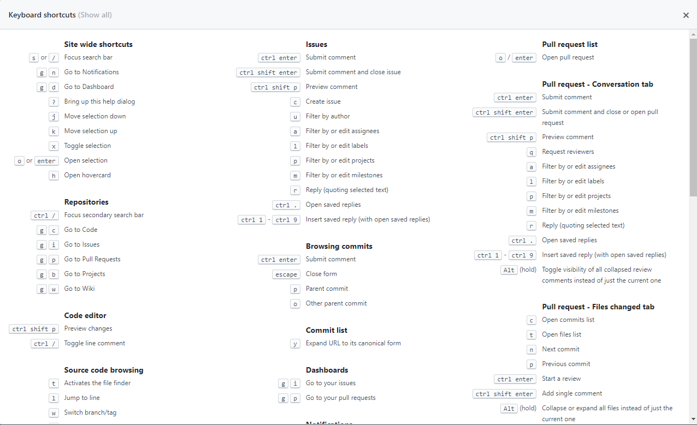

# 自动解析当前 github仓库的目录列表

我在 github上有个维护时间比较长的 [repository](https://github.com/accforgit/DayLearnNote)，开始时只有几个文件，后来文件数目逐渐增多，期间整理了好几次，现在已经整理成了好几个文件夹了，有时候想找某个文件的时候，但是不确定到底在哪个文件夹里面，于是就凭感觉一个一个文件夹试过去，层级少点还好，但是层级一多，就算是明确知道在哪个文件夹里，一层层点进去也要点好几次

于是心中一动，就想着把当前仓库的目录结构列出来，直接写在 `README.md`文件上，想看哪个文件直接点，一次点击即可，手写目录肯定是不太友好的，因为我可能频繁增删文件，甚至是再次整理文件结构，而且也不具备通用性，万一哪天又想把另外一个仓库也列出目录结构，那么又要手写一遍，所以最好写个代码程序来帮我完成这种工作

先看效果图：


### 递归获取所有文件路径

目标是输出目录的层级结构，那么首先要把当前仓库根目录下所有文件的路径获取到，思路很清晰的，先用 `fs.readdirSync`读取目录，并且递归循环子目录，直到最后一层

```js
function getDirStruct(basePath = __dirname) {
  const files = fs.readdirSync(basePath)
  files.forEach(file => {
    // 处理先不要显示的文件
    if (excludeFile.indexOf(file) !== -1 || excludePrefix.some(pre => file.indexOf(pre) === 0)) return
    const fullPath = path.resolve(basePath, file)
    const fileStats = fs.statSync(fullPath)
    // 如果是文件夹，则继续遍历其子文件
    return fileStats.isDirectory(file) ? getDirStruct(fullPath) : absolutePath.push(fullPath)
  })
}
```

这里获取到的是所有文件在本地目录的绝对全路径，但是后面是需要把这个东西上传到 `github`的，所以需要把这个绝对路径改为相对路径，用于拼接文件的 `url`地址

```js
// 绝对路径转相对路径
const rPath = path.relative(__dirname, apath)
```

这里有几个小点需要注意下

- 排除无用的干扰文件

程序不可能直接运行在 `github`页面上的，所以你需要把仓库下载下来，再本地目录中运行程序，那么因为使用了 `git`的缘故，所以根目录中肯定存在一个  `.git`文件夹，这个文件夹里的东西很多，而且你也不太可能希望展示这个东西，所以最好排除掉

类似的还有一些 `img`文件夹，里面存了很多图片，你可能也不想展示出来，因为太占篇幅了而且也没什么用，所以也要排除掉

- 不同平台的路径分隔符

不同平台上的文件路径分隔符是不一样的，在 `windows`上 路径分隔符是 `\`，而在 `POSIX`(即类 `UNIX`系统，包括 `Mac`、`Linux`)上则是 `/`，所以需要区别处理

`nodejs`中可通过 `path.sep`来获取当前操作系统的文件路径分隔符

- 递归

文件的逐级读取涉及到递归操作，如果目录层级不是深到令人智熄的地步，那么除了程序运行时间比较长以外，不会有什么问题，但是如果是读取类似于 `node_modules`这种文件夹，而且嵌套很深，那么就可能导致 **栈溢出**，程序直接 `boom`

那么这里就不得不提到 `尾递归`了，`尾递归`就能很好地避免 `栈溢出`问题，关于 `尾递归`，参见 [知乎：什么是尾递归？](https://www.zhihu.com/question/20761771)

## 目录树（层级结构）

获取到了所有文件路径之后，需要对这些文件路径按照进行整理，得到一棵 `Dir Tree`，就是一个用于描述这些文件路径的层级结构的数据

这里构建的 `Dir Tree`类似下述结构：

```js
{
  _children: ['README.md', 'LICENSE'],
  'CSS': {
    _children: ['CSS-Note-1.md', 'CSS-Note-2.md', '性能优化.md'],
  },
  'Vue': {
    _children: ['性能优化.md', '新特性.md'],
    '无渲染Vue组件': {
      ...
    }
  }
}
```

每个目录层级下，对于单文件，直接存入这个层级下的一个名为 `_children`的数组属性中，对于文件夹，则将文件夹的名字作为这个层级下一个属性名，然后这个属性的值，再按照上述规则进行递归，直到最后一层

当然，这个 `Dir Tree`的结构仁者见仁智者见智，只要你觉得顺眼怎么样都可以，这里只是举了一个栗子◎

数据结构确定了，下面就需要将文件路径数组整理成上面的结构，例如，对于 `/project/demo/src/index.js`这个路径，需要整理成：
```js
const tree = {
  project: {
    demo: {
      src: {
        _children: ['index.js']
      }
    }
  }
}
```

那么这里就有个问题了，在建立这个 `tree`对象之前，`tree`这个数据可能是没有 `project`这个属性的，又或者有 `project`属性，但是这个属性下没有 `demo`这个属性

解决的方法，很明显的一个就是逐级判断，没有这个属性的，就加上去，然后当构造出 `tree.project.demo.src`结构的时候，再在这个结构上，加上 `._children = ['index.js']`结构，这个过程其实可以简化一下，比如借助 `元编程`

例如，你要是觉得不要每次都要判断到底有没有这个属性，那么就可以使用 `es6 Proxy`，实现自动添加属性的能力：

```js
function autoAddProperty() {
  return new Proxy({}, {
    get(target, key, receiver) {
      if (!(key in target)) {
          target[key] = autoAddProperty()
        }
        return Reflect.get(target, key, receiver)
    }
  })
}
// 用法
const obj = autoAddProperty()
obj.a.b.c.d = 1
console.log(obj.a.b.c.d)  // => 1
```

当然，除了 `proxy`之外，也可以借助 `eval`，本示例使用的就是 `eval`，因为代码更简洁，`eval` 这个方法可能很多 `JavaScript`书籍上都会提到不要随便用，对于新手来说，这个特性坑比较多，所以在不明确其副作用的情况下，还是最好不要用，但并不是说不能用，如果用这个特性多写一行代码就能另外少写十行，那为什么不用一用？

更多关于元编程的内容，可见 [知乎： 怎么理解元编程？](https://www.zhihu.com/question/23856985)、  [【资源集合】 ES6 元编程（Proxy & Reflect & Symbol）](http://www.jqhtml.com/16198.html)

## 输出结构

数据结构搞定了，那么最后的输出就很简单了，就是按照层级进行解构，同样是需要用到尾递归，值得稍微提一下的就是，想让输出的目录结构呈现出一种次序关系，那么就需要在递归中记住层级关系，可通过指定一个参数 `level`来实现，根据这个参数的值来决定制表符 `\t`的数量，从而控制缩进来表现层级

```js
function formatLink(obj = structs, basePath = '', level = 1) {
  // ...
}
```

另外，给大家说个小 `tip`，`github`页面上是可以使用快捷键的，例如在一个 `github`仓库页面上按下 `t`键，就会激活查找文件模式，不同的页面，例如账户个人主页和某个仓库页面可用的快捷键可能所有差别，而且这些快捷键很多，想要凭记忆记下来可能有些困难，可以按下 `shift + /`键，即可在当前 `github`页面弹出一个 `modal`弹窗，上面就显示当前页面所有可用的快捷键



## 总结

本文示例代码已经放到 [github](https://github.com/accforgit/DayLearnNote/blob/master/getDirStruct.js)上了，嗯，这个 [github](https://github.com/accforgit/DayLearnNote)仓库下 [README.md](https://github.com/accforgit/DayLearnNote/blob/master/README.md)上展示的目录层级结构，就是根据这份文件生成的

最后，有需要简历的吗？准备换个地方，看看外面的风景