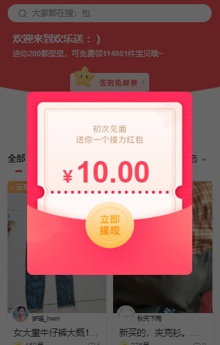

对于一些快速迭代的产品来说，特别是移动端 `C`端产品，基于用户运营的目的，在 `app`首页给用户展示各种各样的弹窗是很常见的事情，在产品初期，由于迭代版本和运营策略变化地还不是太大，所以可能觉得没什么，但当产品运营到后期，各种八竿子打不着的运营策略轮番上阵，弹窗的样式、逻辑等都变了不知道多少遍的时候，问题就出来了



由于前期没有做好规划，首页的弹窗组件可能放了十多个甚至更多，不仅是首页有，首页内又引入了十多个个子组件，这些子组件内也有，搞不好这些子组件内还有子组件，子组件的子组件同样还有弹窗，每个弹窗都有对应的一组控制显隐逻辑，分散在多个组件多个方法中，但是首页只有一个页面，你不可能让所有符合显示条件的弹窗，全都一下子弹出来，反正我是没见过这么做的 `app`，那么如何管理这些弹窗就成了头等大事

而往往当你意识到这一点的时候，很可能也正是局势发展到无法控制的时候 <del>治不了，等死吧</del>

>场景：A弹窗和 B弹窗位于主组件内，C弹窗位于主组件的子组件 C中，D弹窗位于主组件的子组件 B中，E弹窗位于主组件的子组件F的子组件G中
>
>PM：我希望刚进入这个页面的时候，只有当 A弹窗 和 B弹窗以及 C弹窗，都不展示的时候，才展示 D弹窗，如果 D弹窗展示过了，除非 B弹窗之后又展示了一遍，否则无论什么情况下都不展示 E弹窗
>
>FE：？？？

所以，防患于未然是很重要的 <del>别问我是怎么有这个感悟的</del>

稍加思考一下，其实这件事情并不难办，<del>交给后端通过接口控制所有弹窗的显隐就行了</del> 主要是架构的提前规划，以及低耦合的代码逻辑

## 弹窗的配置化

先确定一个大体思路，首先，必须要明确地知道当前页面共有哪些弹窗组件，包括页面的子组件以及子组件的子组件内的弹窗组件，这是必须的，否则你连有哪些组件都不知道怎么精确控制？

所以，还是上面那句话，提前规划，防患于未然是很重要的，不然等页面迭代了几十版，当初写代码的人都不在了你才想到去统计一下页面上到底有多少个弹窗，那真是够你喝一壶的

那么就需要在一个地方统一把这些弹窗全记录下来，方便管理，于是可以得到下面这种数据结构：
```js
// modalMap.js
export default {
  // 记录首页 index页面内的弹窗项
  index: {
    modalList: [{
      name: 'modal_1',
      level: 10,
      show: true
    }, {
      name: 'modal_2',
      level: 22,
      show: true
    }, {
      name: 'modal_3',
      level: 70,
      show: true
    }],
    children: {
      child1: {
        modalList: [{
          name: 'modal_1_1',
          level: 8,
          show: true
        }, {
          name: 'modal_1_2',
          level: 62,
          show: true
        }],
        children: {
          child1_1: {
            modalList: [{
              name: 'modal_1_1_1',
              level: 8,
              show: true
            }, {
              name: 'modal_1_1_2',
              level: 60,
              show: true
            }]
          }
        }
      }
    }
  }
  // ...还可以继续记录其他页面的弹窗结构
}
```
`modalMap.js`文件记录每个页面内所有的弹窗项，例如，首页 `index`内的弹窗项都在属性名`index`对于的值数据结构中，`index`这个页面主组件内存在两个 `modal`，可以分别命名为 `modal_1`和 `modal_2`，如果 `index`这个页面主组件的子组件内也有 `modal`，则继续嵌套，例如，`index`主组件的子组件 `child1`中也有 `modal`，那么就把 `child1`放到 `index`的 `children`中继续记录，以此类推

这种结构看起来比较清晰，主组件及主组件内的子组件内的 `modal`都很清晰，一目了然，当然，你可以不用这种结构，完全取决于你，这里就暂时这么定义

每个 `modal`除了 `name`之外，还有 `level` 和 `show`属性

`level` 用于标识当前 `modal`的层级，每个页面正常只能同时展示一个 `modal`，但如果有多个 `modal`都同一时间都满足展示的条件，则对比它们的 `level`值，哪个大就优先展示哪个，其余的忽略掉，杜绝一个页面可能提示展示多个弹窗的情况；

`show`属性则是在 `modal`内部来决定 `modal`最终是否展示，这样一来就可以无视外界条件，很轻松地通过配置来禁止掉弹窗的显示

## 通过发布/订阅模式来管理弹窗

弹窗的配置结构已经确定了，下一步就是对这些配置的管理了

一般情况下，多个页面同时满足条件需要进行展示的场景，大多数都是发生在刚进入页面，页面发出多个请求，这些请求的返回结果分别控制对应的一个弹窗的展示

因为发出去的这些请求很可能分属于不同的业务线或部门管辖，相互独立，所以说如果把弹窗的控制权交给后端来做，其实是有点困难的，再加上请求是异步的，前端想要用意大利面条式代码来保证弹窗之间的互斥性也不太容易，综合起来，也就导致了当页面上迭代出了数十个以上弹窗的时候，如果没有提前规划好，还是很容易出现弹窗同时展示的问题的

这里暂时就以刚进入页面的情况为例，进行逻辑梳理

首先，我需要知道页面上有哪些弹窗可能会在刚进入页面的时候弹出来（即通过接口控制单个弹窗的展现与否），然后在所有弹窗的数据都拿到了的时候（即跟弹窗相关的接口都已经返回数据），才进行弹窗的展示

这种情况比较适合使用发布/订阅者模式，单个接口的数据返回就是一个订阅，当所有接口都订阅之后，就进行发布，也就是弹窗展示

```js
// modalManage.js
class ModalManage {
  constructor (modalList) {
    this.modalFlatMap = {}
    this.modalList = modalList
  }
  // ... 
}
```
通过 `ModalManage`类来管理弹窗，此类在初始化时接收一个参数 `modalList`，这个参数其实就是刚进入页面时，页面上所有可能展示的弹窗(包括子组件的弹窗)的名称集合，也就是必须要知道页面上到底有多少个可能同时展示的弹窗，以上述示例代码 `modalMap.js`为例， `index`页面的 `modalList`值就是 `['modal_1', 'modal_2', 'modal_3', 'modal_1_1', 'modal_1_2', 'modal_1_1_1', 'modal_1_1_2']`

这里其实直接传弹窗数量就行了，`index`中有 `7`个弹窗可能同时展示，所以可以直接传 `7`，我这里之所以要传名称进去，实际上是为了方便调试，如果代码出问题了，比如页面上实际有 `5`个接口可以控制 `5`个弹窗的展示，但你却只订阅了 `4`次，如果只传数字，你就需要一个个找过去看是哪一个忘记订阅了，但如果传名称，你一下子就能调试出来，也就是代码的可维护性会好一点

当页面上任意一个弹窗的状态（即是否满足展示的条件）确定下来后，就进行订阅操作：
```js
// modalManage.js
add (name, dataInfo) {
  // level, handler
  if (this.modalList.indexOf(name) !== -1) {
    if (!this.modalFlatMap[name]) {
      this.modalFlatMap[name] = dataInfo
      this.notify()
    } else {
      console.log('重复订阅')
    }
  } else {
    console.log('无效订阅')
  }
}
```

`this.modalFlatMap`是为了记录订阅列表，当订阅列表的长度和 `modalList`相同时，说明所有的弹窗状态都已经准备就绪，可以根据这些弹窗的优先级进行展示了，也就是 `notify`方法要做的事情

`notify`方法中，先排除掉属性 `show`为 `false`的弹窗项，再对比剩下的弹窗的 `level`，只展示 `level`最大的那个弹窗：
```js
// modalManage.js
notify () {
  if (Object.keys(this.modalFlatMap).length === this.modalList.length) {
    const highLevelModal = Object.keys(this.modalFlatMap).filter(key => this.modalFlatMap[key].show).reduce((t, c) => {
      return this.modalFlatMap[c].level > t.level ? this.modalFlatMap[c] : t
      // 这个 { level: -1 } 只是为了给 reduce函数一个 initialValue，modal项的 level都应该大于这个 initialValue的 level值，即 -1
    }, { level: -1 })
    highLevelModal.handler()
  }
}
```

## 使用单例模式管理嵌套组件以及多个页面的弹窗

上述的 `ModalManage`类已经足以管理弹窗了，但还有个问题，如果一个页面上的弹窗，分散位于页面主组件及其子组件，甚至是子组件的子组件内，怎么办？

这个时候就需要使用单例了

```js
// 单例管理
const manageTypeMap = {}
// 获取单例
function createModalManage (type) {
  if (!manageTypeMap[type]) {
    manageTypeMap[type] = new ModalManage(getAllModalList(modalMap[type]))
  }
  return manageTypeMap[type]
}
```
通过 `createModalManage`这个方法来创建 `ModalManage`实例，根据传入的 `type`来决定是否创建新的实例，如果单例管理对象 `manageTypeMap`中不存在 `type`对于的实例，则 `new`一个 `ModalManage`实例，存入 `manageTypeMap`中，并返回这个新实例，否则就返回 `manageTypeMap`中已经创建好了的实例

这样一来，无论弹窗分散在多少个组件内，无论这些组件嵌套得有多深，都能够在保证代码低耦合的前提下，顺利地订阅/发布事件

这里的 `getAllModalList`方法是个工具方法，用于从 `modalMap`中获取页面对应的弹窗数据结构：
```js
// util.js
const getAllModalList = modalInfo => {
  let currentList = []
  if (modalInfo.modalList) {
    currentList = currentList.concat(
      modalInfo.modalList.reduce((t, c) => t.concat(c.name), [])
    )
  }
  if (modalInfo.children) {
    currentList = currentList.concat(
      Object.keys(modalInfo.children).reduce((t, c) => {
        return t.concat(getAllModalList(modalInfo.children[c]))
      }, [])
    )
  }
  return currentList
}
```

至于 `createModalManage`的参数`type`，其值可以就是一个字符串，例如如果需要管理首页 `index`上可能同时展示的所有的弹窗，则可以将 `type` 的值指定为 `index`，在 `index`主组件以及其包含弹窗的子组件内，都通过这个字段来获取 `ModalManage`单例对象：

```js
const modalManage = createModalManage('index')
```

这样做同时也解决了另外一个问题，就是多个页面的弹窗管理问题，`index`页面通过 `index`创建 `ModalManage`单例，详情页就可以通过 `detail`来创建 `ModalManage`单例，双方互不干扰

## 总结

本文只是对弹窗这么一种具体的案例进行分析，实际上应用于其他场景，例如页面同一个位置的悬浮挂件管理等都是可行的

无论是弹窗的管理还是挂件的管理，放在 `mvvm`框架中，都是数据的管理，主流前端框架对于复杂的数据管理，都已经有对应的解决方案，例如 `vuex` 和 `redux`等，这些解决方案当然也能够解决上面的问题

本文主要是对这种理念的探讨，探讨出一种通用的解决方案，无论你用的是 `vue`、`react`、`angular`还是`jquery`一把梭，亦或是微信小程序、支付宝小程序、快应用等，都可以低成本地轻松套入使用
