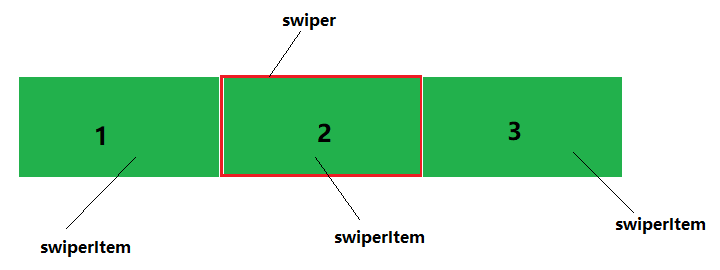

图片轮播是种很常见的场景和功能，一般移动网站首页的轮播 `banner`，商品详情页的商品图片等位置都会用到此功能

像这种常用的场景功能肯定是有人早就写好插件了的，所以遇到这种场景，一般都遵循以下三步：

- <del>打开冰箱</del> 启动 Github
- 搜索 `swiper`、`slider`、`Album`等关键字
- 找到想要的库，`npm install`之

这种做法没毛病，有现成的轮子可用当然拿来主义，因为项目用的是 `vue`，所以我在网上找了一圈 基于 `vue`的轮播组件库，找到了两个比较满意的库：[vue-awesome-swiper](https://github.com/surmon-china/vue-awesome-swiper)、[vue-swipe](https://github.com/ElemeFE/vue-swipe)

- [vue-awesome-swiper](https://github.com/surmon-china/vue-awesome-swiper)

比较知名的轮播框架，一般都会优先使用这个库，功能丰富，适用于各种轮播场景，什么 左右按钮，动态指示点、进度条指示器、垂直切换、一次性显示多个 `slides`……功能简直不要太完善
**but**
我只是想用其中一小部分基本功能而已，如此多的功能于我而言不仅是看文档费劲，更关键的是会在项目中引入太多的冗余代码，好不容易通过各种手段将代码体积降下来，结果就因为引入了一个包一下回到解放前，要不得要不得

- [vue-swipe](https://github.com/ElemeFE/vue-swipe) 

饿了么前端团队出品的一个库，比较精简，代码量也很少，但又过于精简了，例如不支持无限轮播，不支持自定义 `swiperItem`，而且总感觉有些生硬的感觉

至于其他**本人能够**搜索到的库，都没什么名气或者下载量太小，不敢轻易在生产环境引入，于是就萌生了自己造个轮子来搞定这件事，这样组价库的功能和代码体积自己都能控制，就算有什么 `bug`也能很快自行修正

先看下最终实现效果：


或者你想自己体验一下，这里也有个写好的 [Demo](https://accforgit.github.io/vue-active-swiper/basic.html)

>我已经将此功能打包成了一个 `npm package`，可直接下载安装使用，包括样式在内的代码体积压缩后不到 `18KB`，Gzipped之后不到 `7KB`，[源码](https://github.com/accforgit/vue-active-swiper) 已上传

## 滑动形式

为了描述方便，先定义一下名词，将每一个滑动小块称为 `swiperItem`，将容纳所有滑动小块的容器称为 `swiper`：



目前大多数的滑动组件库，都是通过两种方式实现组件的滑动的

第一种，同一时间只渲染三个 `swiperItem`，每次滑动到下一个 `swiperItem`之后，立即更新这三个 `swiperItem`

这种做法的优点是，无论有多少个 `swiperItem`都不会影响到浏览器的渲染性能，因为无论多少个，每次都只渲染其中的三个，缺点在于如果 `swiperItem`的数量本来就少于三个，就需要额外的处理了，而且因为每次最多只能滑动一个 `swiperItem` 的距离，使用起来不是那么顺滑，[vue-swipe](https://github.com/ElemeFE/vue-swipe)采用的是这种

第二种，一次性渲染所有的 `swiperItem`，并且有时候为了更顺滑的体验，还会在原 `swiperItem`的首尾，再各添加一个 `swiperItem`
例如，原 `swiperItem`的数据为 `1, 2, 3, 4, 5`，处理之后变成 `5, 1, 2, 3, 4, 5, 1`，[vue-awesome-swiper](https://github.com/surmon-china/vue-awesome-swiper)采用的是这种

优点在于使用起来更顺滑，缺点是如果数据量很多，比如有几百几千个的数据量，会影响到浏览器的渲染性能，但一般情况下也不会有那么大的数据量，几十个都已经很少了

综合考虑之下，本人决定采用第二种

## 数据处理

本组件库提供了两种传入 `swiperItem`数据的方式

- 第一种是直接通过 `props`传入一个图片的数组

一般来说，轮播组件主要元素都只是一张展示用的图片，所以直接通过 `props`传入图片数组的方式基本上可以满足大部分需求

```html
<swiper :urlList="urlList" />
```

对于这种情况下的首尾追加操作就比较简单，其实就是操作一个数组：
```js
this.currentList = this.urlList.length > 1
  ? this.urlList.slice(-1).concat(this.urlList, this.urlList.slice(0, 1)).map((url, index) => ({ url, _id: index }))
  : this.urlList.map((url, index) => ({ url, _id: index }))
```

然后直接渲染到模板上即可：
```html
<div class="img-box" v-for="item in currentList" :key="item._id" :style="{
  backgroundImage: `url(${item.url})`,
  backgroundSize
}"></div>
```
顺便说下关于图片布局的问题，我没有直接写个 `img`元素而是将图片当成了背景图渲染，这种处理的好处在于，可以很轻松地实现对图片无论是长宽大小还是位置的 `UI`控制，想要图片完全显示那就 `background-size: contain`，想要完全充满那就 `background-size: cover`，或者直接具体到像素的调整，水平垂直居中也根本不用什么 `display: flex;`，这东西在某些情况的某些设备上很容易出现兼容问题，直接 `background-position: 50%;`搞定

延伸开来，平时做需求碰到一些小 `icon`的布局，也完全可以采用这种方式，对齐起来非常顺手，根本不用拿什么 `vertical-align`慢慢调，也不会有任何兼容问题

- 第二种是接收 `swiperItem`子组件

这种方式给了开发者很高的定制化空间，能够自定义 `swiperItem`的内容而不仅限于一张图片，但做起啦稍微有点麻烦，因为 `slot`作为组件层面的东西，不太好动态处理，难不成直接操纵原生`API`？可以是可以，但既然都已经用框架了，再直接改 `DOM`似乎气氛有点不太对……纠结许久，后来想到了动态组件 `component`以及  `render`函数，这才解决

主要思路就是传入 `swiperItem`当成 `slot`正常渲染在 `swiper`这个父组件内，但与此同时，在`slot`的前后，再各渲染一个 `component`动态组件：

```html
<swiper>
  <swiperItem />
  <swiperItem />
  <swiperItem />
</swiper>
```

```html
<!-- 这是 swiper父组件 -->
<component :is="firstSwiperItem"></component>
<slot></slot>
<component :is="lastSwiperItem"></component>
```

这两个放在 `slot`前后位置的 `component`动态组件 `firstSwiperItem` 和 `lastSwiperItem`，就是上面说的 `5,1,2,3,4,5,1`中的 `5` 和 `1`：
```js
updateChild (slots) {
  this.firstSwiperItem = {
    render (h) {
      return h('div', {
        staticClass: 'swiper-item-box'
      }, slots.slice(-1))
    }
  }
  this.lastSwiperItem = {
    render (h) {
      return h('div', {
        staticClass: 'swiper-item-box'
      }, slots.slice(0, 1))
    }
  }
}
```

其实一开始我是想通过 `template`来解决这件事的，更简单一点，但因为要使用 `template`就必须引用同时包含运行时和编译器的完整版本的 `vue`，性价比太低，也不适合生产环境，所以最终还是选择了 `render`函数


## touch事件

对 `touch`事件的监听，结合 `translate3d`实时改变位移，就是滑动的精髓所在

>在 `touchstart`事件中记录起始位置坐标，在 `touchmove`事件中计算距离差进行实时位置的改变，在 `touchend`中进行收尾

逻辑上是很清晰的，但一些细节方面的东西处理起来还是有点头疼的

例如，如果用户用多只手指操作的怎么办？如果 `touchstart`的时候用是两指，`touchmove`的时候就剩下单指怎么办？如果用户先左滑右滑，怎么判断相比于初始到底是左滑还是右滑？如果连续滑过多个 `swiperItem`，怎么判断结束时到底是左滑还是右滑……

如果用户老老实实按照 **最佳操作指南** 来使用，这些问题当然不存在，但是你不可能要求用户这么做的，所以就必须解决这些问题

对于多指操作的问题，我一律以 `e.touches`列表中最后一个为准：
```js
stStartX = e.touches[touchCount - 1].clientX
```

左滑右滑的问题，则通过 `diffX`与基准值 `criticalWidth`的比较，结合滑动坐标 `toX`进行双重判断，在代码量尽量少的情况下得出结论：
```js
// diffX 大于0 说明是右滑，小于0 则是左滑
if (diffX > 0) {
  stDirectionFlag = -1
  stAutoNext = diffX > criticalWidth
  toX = stAutoNext ? -clientW * (activeIndex - 1) : -clientW * activeIndex
} else if (diffX < 0) {
  stDirectionFlag = 1
  stAutoNext = Math.abs(diffX) > criticalWidth
  toX = stAutoNext ? -clientW * (activeIndex + 1) : -clientW * activeIndex
} else {
  stDirectionFlag = 0
  stAutoNext = false
  toX = -clientW * activeIndex
}
```

连续滑过多个 `swiperItem`，则将其处理成通常情况，也就是只滑过最多一个 `swiperItem`的情况进行处理：
```js
// 如果连续滑过超过一个 swiperItem 块
if (Math.abs(diffX) > clientW) {
  activeIndex = Math.ceil(-this.transX / clientW)
  diffX = diffX - clientW * wholeBlock
}
```

## 更接近原生的顺滑体验

一些移动端原生的轮播组件，都提供了一种滑动拦截的能力，具体就是，滑动一个 `swiperItem`，然后手指离开，这个 `swiperItem`会自动滑动到固定的位置，但你可以通过手指触摸或再次滑动打断这个过程，改变 `swiperItem`原本的轨迹：


大概看了下，似乎 [vue-awesome-swiper](https://github.com/surmon-china/vue-awesome-swiper) 和 [vue-swipe](https://github.com/ElemeFE/vue-swipe) 都没有提供这种能力，虽说无伤大雅，但就因为少了这一个能力，总感觉就没有原生的那种顺滑的体验，所以我决定加上

针对这个功能，一开始是想将 **自动滑动** 的这个动作，使用 `js`来动态计算，利用 `requestAnimationFrame`来模拟自动滑动的动画效果，这样就能够很方便地获取任何时刻 `swiperItem`的 `translate`数值了，接下来实现拦截的能力也就很简单了

但后来又考虑到用 `js`模拟动画的性价比太低了，实际生产过程中很容易碰到卡顿的情况，于是转向了另外一种实现

自动滑动的动画交给 `css`来处理，当手指触摸正在滑动中的 `swiperItem`时，通过 `getBoundingClientRect API`获取实时位置

`getBoundingClientRect API`的[兼容性](https://caniuse.com/#search=getBoundingClientRect)已经很好了，用于实际生产环境基本上没什么问题，不过考虑到无论怎么说，也还是会有一些老旧设备不支持这个 `API`，所以我也做了降级处理：
```js
const isSupportGetBoundingClientRect = typeof document.documentElement.getBoundingClientRect === 'function'
// ...
if (this.isTransToX) {
  if (!isSupportGetBoundingClientRect) {
    return touchStatus = 0
  }
  this.isTransToX = false
  this.transX = stPrevX = this.$refs.sliderWrapper.getBoundingClientRect().left - this.$refs.swiperContainer.getBoundingClientRect().left
}
```

## 总结

在冒出要自己动手造轮子的念头时候，觉得这个轮子没什么难度，快的话一天慢点三天也差不多了，然而真正开始动手开发的时候，才发现没那么简单，因为只有工作之余才有时间做这个东西，所以最终愣是捣鼓了一星期都还没搞定，主体部分的代码很快写完，但解决各种异常情况和自测却占据了绝大部分的时间，不过不管怎么说，最终还是做完了

源码已经放到 [github](https://github.com/accforgit/vue-active-swiper)上了，代码注释得也算是比较详细，感兴趣的可以参考下，如果有什么问题，欢迎提 [issues](https://github.com/accforgit/vue-active-swiper/issues)