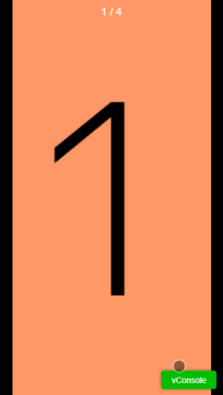
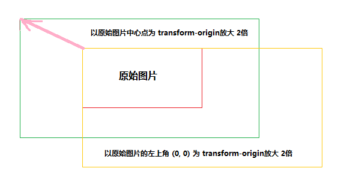

图片放大预览是种很常见的场景和功能，一般移动网站首页的轮播 `banner`，商品详情页的商品图片等位置都会用到此功能

像这种常用的场景功能肯定是有人早就写好插件了的，所以遇到这种场景，一般都遵循以下三步：

- <del>打开冰箱</del> 启动 Github
- 搜索 `photo`、`preview`、`carousel`、`photoSwipe`等关键字
- 找到想要的库，`npm install`之

这种做法没毛病，有现成的轮子可用当然拿来主义，因为项目用的是 `vue`，所以我在网上找了一圈 基于 `vue`的放大预览组件库，结果令我有点意外，图片放大预览的库的数量明显比不上轮播组件库，并且更令人 **智熄** 的是，这些少得可怜的组件库中，其中一大半都是基于 [PhotoSwipe](https://github.com/dimsemenov/PhotoSwipe) 这个开源库进行的二次封装，除此之外，能用于实际生产的预览组件库(`image gallery`)……好像没有（也可能是我见识短浅），这种情况不仅体现在 `vue`库上，其他框架乃至是原生的相关库都是如此

虽说不提倡重复造轮子，但轮子太少没有选择的余地也有点说不过去， [PhotoSwipe](https://github.com/dimsemenov/PhotoSwipe) 用起来很顺手，功能也很齐全，足以应对实际生产环境中的绝大部分场景

但与此同时，也就代表它代码体积会比较大，引入的冗余代码会比较多，于是，抱着精简代码以及顺便丰富放大预览插件家族的想法，决定自己造个轮子

先看下最终实现效果：



或者你想自己体验一下，这里也有个写好的 [Demo](https://accforgit.github.io/vue-active-preview/basic.html)

>我已经将此功能打包成了一个 `npm package`，可直接下载安装使用，包括样式在内的代码体积压缩后不到 `22KB`，Gzipped之后不到 `8KB`，[源码](https://github.com/accforgit/vue-active-preview) 已上传

## 滑动形式

滑动形式的选型与 [造轮子之图片轮播组件(swiper)](https://juejin.im/post/5c2d7852e51d455e860dc164)中的一样，就不多说了

## 数据处理

数据处理和 [造轮子之图片轮播组件(swiper)](https://juejin.im/post/5c2d7852e51d455e860dc164) 中的第一种方法一样，就不多说了：
```html
<VueActivePreview :urlList="urlList" />
```

## touch事件

此组件的 `touch`事件比较复杂，并且涉及到不同 `touch`事件之间的交互，所以稍微麻烦点，不过只要条理清晰，考虑清晰，还是可以解决的

### 单指滑动

单指滑动的主体逻辑与 [造轮子之图片轮播组件(swiper)](https://juejin.im/post/5c2d7852e51d455e860dc164)的相差不多，都是计算手指滑动的距离，通过不断改变 `translate`的值进行位移

### 双指缩放

支持对单个图片的缩放操作，原理其实很简单，通过计算在起始时与滑动过程中双指间距离的比例，就可以得到图片的缩放比例

获取双指间距离：
```js
getDistance (p1, p2) {
  return Math.sqrt(Math.pow(p2.clientX - p1.clientX, 2) + Math.pow(p2.clientY - p1.clientY, 2))
}
```

获取图片缩放比例：
```js
this.scaleValue = this.getDistance(targetTouch1, targetTouch2) / doubleTransferInfo.startDistance
```

通过改变 `transform: scale(scaleValue)`，就可以实现图片的即时缩放

不过，这个时候有个问题，那就是 `CSS3 scale`的缩放中心坐标，默认是 `50% 50% 0`，也就是元素的中心位置，所以如果在不设置 `transform-origin`的情况下，直接设置 `scale`，那么图片也可以正常缩放，但缩放的结果却并不一定是所想要的

比如，双指中心坐标是 `(10, 56)`，按照正常习惯，当进行放大时，整张图片应该是以这个点为中心进行放大，而不应该是图片的中心的位置

有两种方法可以解决这个问题

- 动态设置 `transform-origin`

直接将双指之间的中心坐标设置为 `transform-origin`，然后进行缩放即可，这是最简单的方法

所以需要动态设置 `transform-origin`
```js
const targetTouch1 = e.touches[0]
const targetTouch2 = e.touches[1]
this.transOriginX = (targetTouch1.clientX + targetTouch2.clientX) / 2 - this.left
this.transOriginY = (targetTouch1.clientY + targetTouch2.clientY) / 2 - this.top
```

- 动态设置图片的位置坐标

`transform-origin`的改变，其实就是改变了图片的位置状态，无需关心 `transform-origin`到底应该是什么，直接默认图片的中心位置就是每次图片缩放的 `transform-origin`，然后在图片缩放的过程中，动态地修正图片的位置，抵消 `transform-origin`带来的影响，就可保持视觉上的统一

例如，图片的默认 `transform-origin`是 `(100, 100)`，如果以此为中心放大两倍，那么结束放大后，图片的左上角相比于原始状态向左偏移了 `100`个单位，但是现在双指的起始中心坐标是 `(0, 0)`（只是个假设，为了方便计算说明），并将此设置为 `transform-rogin`的话，放大两倍后，图片的左上角相比于原始状态向左将偏移 `0`个单位，也就是没有任何偏移

所以，当缩放中心是 `(0, 0)`时，在不改变 `transform-origin`的情况下，要想保持视觉上的统一，必须在图片放大的过程中，将图片进行持续地右移，保证在每一帧中移动的距离都能抵消因为 `transform-origin`带来的差距，直到最终移出 `100`个单位



因为考虑到后面图片的位置坐标还有其他地方需要用到，而且直接设置 `transform-origin`的方式更简单方便，所以这里我选择了第一种方法

`but`，很快我就发现，我还是想得太简单了

假设现在手指离开屏幕后，图片以 `(10, 56)`为缩放中心放大了 `2`倍，然后双指再次放在屏幕上，这个时候双指的中心坐标为 `(70, 88)`，这个时候按照上面说的，就需要动态地将 `transform-origin` 由之前的 `(10, 56)` 改为 `(70, 88)`，但是如果真的改了，你就会发现，图片立刻产生了跳动

这是因为在第二次双指触摸屏幕之前，图片放大两倍的状态是基于 `transform-origin(10, 56)`，现在改变了 `transform-origin`，那就相当于是改变了图片的放大基点，图片的状态必然会改变


难道要换成第二种方法？但是总感觉频繁地修改 `left/top`的值有点不太对劲，而且这种方法的计算方式也比较复杂，担心影响性能

仔细想了下，也是可以解决的

之所以第二次缩放会产生跳动，就在于是改变了第一次结束后的状态，因为这个状态并不是固定的，此时图片的 `scale`和 `transform-origin`都是被动态修改过的，只要能把这个状态给固定下来，固定为默认状态的值，那不就行了吗？

至于如何固定这个状态，其实也是很简单的

对于一个尺寸为 `100*100`的图片，以 `(10, 10)`为 `transform-origin`放大 `2`倍，则放大后的图片尺寸为 `200*200`，左上角偏移量为 `(-10, -10)`
`SO`
在第一次缩放结束后，立即将图片的宽高设置为 `200*200`，并且给个 `left: -10; top: -10`的偏移量，然后就可以将 `scale`与 `transform-origin`恢复到默认状态了，这个时候的图片状态也就相当于是没有使用任何 `transform`属性

那么第二次缩放的时候，初始状态就以当前这个 `200*200`的图片为起始状态而非是一开始的 `100*100`，这样一来，就无需关心状态问题了，因为每一次缩放都是一个全新的状态

直观示例：
```
transform: scale(2);  =>  width: 200; height: 200;
transform-origin: 10 10;  =>  left: -10; top: -10;
```

代码示例：
```js
this.left = left
this.top = top
this.currentW = currentW
this.currentH = currentH
this.scaleValue = 1
```

### 缩放过程中的滑动查看

单个图片缩放后，为了允许用户更自由地查看图片的每个细节，允许对缩放后的图片进行滑动查看

这个功能的主体逻辑还是比较简单的，通过监听 `touch`事件，计算得到每一帧间的 `move`距离，动态位移图片位置即可

不过为了更贴近实际的物理交互，达到更好的用户体验，添加了一个惯性滑动的能力，即当用户在滑动图片的过程中结束触摸时，图片还会继续往前滑动一定的距离

这个场景有两种解决方案

- css 动画

在触摸结束的瞬间，以当前速度为条件，计算出图片应该滑动多少距离才停下来，并设置一个速度逐渐降低的 `transition`动画

- js 动态动画

规定一个速度递减的系数，每一帧的速度都在前一帧的基础上，以这个系数为前提进行递减，直到最后停下来

综合考虑了一下，第一种的方式可能更加节约性能，但是不太好模拟出那种物理惯性的感觉，数值不太好计算，相比于节约的那一点性能来说，性价比不高

第二种方式更加容易控制，所以选择了第二种方式

主要是借助了 `requestAnimationFrame`这个 `API`（已经对不兼容此 `API`的设备做了降级处理）：
```js
rafHandler = raf(() => {
  speedX *= 0.9
  speedY *= 0.9
  // ...
  if (Math.abs(speedX) < 1) speedX = 0
  if (Math.abs(speedY) < 1) speedY = 0
  if (speedX !== 0 || speedY !== 0) {
    this.frictionMove(speedX, speedY)
  } else {
    // ...
  }
})
```

## 总结

其实这个组件的主体逻辑还是蛮清晰的，没什么太多的道道，但是需要考虑的情况太多，而且还有三种不同情况下 `touch`事件的交互与判断，所有的情况综合在一起还是蛮伤脑筋的，五分之一不到的时间用来写主体逻辑，剩下的时间全耗在 `if...else`上了，等我把这个轮子写完，我也算是明白为何这个场景的轮子那么少了，因为真的脑阔疼，不是功能逻辑的疼，功能逻辑写起来毕竟还有点意思，而是 `if...else`的疼

源码已经放到 [github](https://github.com/accforgit/vue-active-preview)上了，代码注释得也算是比较详细，感兴趣的可以参考下，如果有什么问题，欢迎提 [issues](https://github.com/accforgit/vue-active-preview/issues)