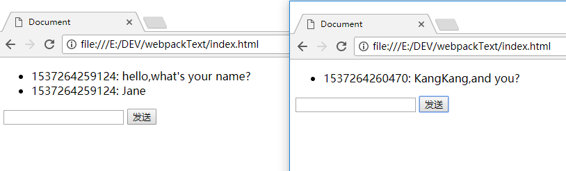

最近在看微服务方面的东西，看到关于 **多个微服务页面间通信和数据共享的解决方案**，发现了一些比较陌生的 `API`，说是陌生其实专门拿出来也能说出个所以然来，也知道是个什么东西，但就是不熟练，凭空想的话就很难能想到，看了一下觉得有些门道，于是索性扩展开来整理了一下

## [BroadcastChannel](https://developer.mozilla.org/en-US/docs/Web/API/BroadcastChannel)

`Broadcast` 也是“广播”的意思，将信号广播出去，允许其他人接听。

此 `API`允许同一原始域和用户代理下的所有窗口、`iFrames`等进行交互，属于 **同源通信**。也就是说，如果用户打开了同一个网站的的两个标签窗口，如果网站内容发生了变化，那么两个窗口会同时得到更新通知。

使用的场景，如，用户同时依次打开某个网站的几个页面，然后在其中一个页面 `A`进行登录操作，那么其他的页面就可以通过 `BroadcastChannel`收到来自页面 `A`的登录状态，从而能够完成多个页面自动同步登录状态的目的。

```js
// A页面向外广播信号
// 创建句柄
const cast = new BroadcastChannel('mychannel')
// data 可以是任何 JS数据类型
const data = 'I\'m from Page A'
// 广播信号
cast.postMessage(data)
// 关闭连接
cast.close()
```

```js
// B页面监听同源下所有页面发送出的“广播”
//  BroadcastChannel的参数，即channel号必须与想要监听的广播源相同，这里是 mychannel
const cast = new BroadcastChannel('mychannel')
// 接收信号
cast.onmessage = function (e) {
  console.log(e.data) // => I'm from Page A
}
// 关闭连接
cast.close()
```


用起来很顺手，也没什么复杂的道道，`BroadcastChannel`的初始化参数 `channel`，可以看做是一个广播频道，只要同源下加入这个频道的页面，都能够互相收发信号进行通信，但是浏览器支持度很不乐观，而且一直也都没什么进展，总感觉将来某天就要嗝屁了

## [postMessage](https://developer.mozilla.org/zh-CN/docs/Web/API/Window/postMessage)

>otherWindow.postMessage(message, targetOrigin, [transfer]);

相比于 `BroadcastChannel`来说， `postMessage`明显幸福多了，`postMessage`支持 **跨域通信**，浏览器支持度也秒杀 `BroadcastChannel`，达到了完全可在生产环境使用的地步，说明浏览器厂商对这个还是很热衷的。<del>资本推动技术，没毛病</del>


`A`页面通过 `window.open`获得 `B`页面的句柄，向 `B`页面发送信号，并监听 `B`页面回传回来的信号
```html
<!-- A页面 -->
<div id="msg"></div>
<script>
  window.onload = () => {
    // 获取句柄
    var opener = window.open('http://127.0.0.1:9001/b.html')
    // setTimeout 是为了等到真正获取到 opener的句柄再发送数据
    setTimeout(() => {
      // 只对 域名为 http://127.0.0.1:9001的页面发送数据信号
      opener.postMessage('red', 'http://127.0.0.1:9001');
    }, 0)
    // 监听从句柄页面发送回来的数据信号
    window.addEventListener('message', event => {
      if(event.origin === 'http://127.0.0.1:9001'){
        document.getElementById('msg').innerHTML = event.data
      }
    })
  }
</script>
```
`B`页面接收 `A`页面的信号，并通过事件句柄反向对 `A`页面发送数据信号
```html
<div id="box">color from a.html</div>
<script type="text/javascript">
  window.addEventListener('message', event => {
    // 通过origin属性判断消息来源地址
    // 只有当数据信号来源于 http://127.0.0.1:9001的服务器才接收
    if(event.origin === 'http://127.0.0.1:9001'){
      // 获取信息员的数据信号
      document.getElementById('box').style.color = event.data
      // 通过 event.source向信号源反向发送数据
      event.source.postMessage('got your color!', event.origin)
    }
  })
</script>
```

`postMessage`用起来也比较简单，稍微需要注意一下的是，由于此 `API`可以跨域通信，能力越大责任也就越大，所以涉及到安全性问题，一般在发送信号和接收信号的时候，都需要指定信号源以规避安全问题


相比于 `BroadcastChannel`的一局限点是，`postMessage`信号的传递有点受限，必须要有 `其他窗口的一个引用`，然后通过这个引用才能继续下面一系列的操作，这种 `引用`的来源有 `iframe`的 `contentWindow`属性、执行 `window.open`返回的窗口对象、或者是命名过或数值索引的`window.frames`，场景有限，明显不如 `BroadcastChannel` 直接指定一个 `channel`号来得灵活

## [SharedWorker](https://developer.mozilla.org/zh-CN/docs/Web/API/SharedWorker)

`Web worker`分为两种：专用线程 `dedicated web worker`、共享线程 `shared web worker`

`Dedicated web worker`随当前页面的关闭而结束；这意味着 `Dedicated web worker`只能被创建它的页面访问；与之相对应的 `Shared web worker`可以被多个页面访问（包括多个标签页和 `iframe`），不过这些页面必须是同源的，即 `Shared web worker`支持的是 **同源通信**


下面是一个 `SharedWorker`
```js
// worker.js
// 共享的数据
let shareData = 0
// 监听主线程的连接
onconnect = function(e) {
  const port = e.ports[0]
  port.onmessage = function(e) {
    if (e.data === 'get') {
      // 向连接的主线程发送信号
      port.postMessage(shareData)
    } else {
      // 将主线程发来的数据设置为 worder内的 共享数据
      shareData = e.data
    }
  }
}
```

`A`页面设置 `SharedWorker`中的数据字段
```html
<input type="text" id="textInput" />
<input type="button" value="设置共享数据" />

<script>
  const worker = new SharedWorker('worker.js')
  const inputEle = document.querySelector('#textInput')

  inputEle.onchange = () => {
    console.log('Message posted to worker')
    // 向 worker 发送数据信号
    worker.port.postMessage(inputEle.value)
  }
</script>
```

`B`页面获取 `SharedWorker`中的数据字段
```html
<div id="result"></div>
<button id="btn">获取 SharedWorker中的共享数据</button>
<script>
  const worker = new SharedWorker('worker.js')
  var result = document.querySelector('#result')
  // 发送获取获取 SharedWorder 中共享数据的请求
  document.getElementById('btn').addEventListener('click' , () => {
    // 向 worker发送信号
    worker.port.postMessage('get')
  })
  // 接收从 SharedWorder发送来的共享的数据
  worker.port.onmessage = e => {
    console.log('Message received from worker')
    // 在页面上显示获取到的 worker共享数据
    result.textContent = e.data
  }
</script>
```

最终，在 `A`页面中设置的值，或被 `B`页面获取到

`worker.js` 这个文件被 `A`页面和 `B`页面分别加载，但却可以共享数据，类似于 **单例模式**，虽然使用了 `new`操作符，但最后两个页面获取到的东西却是一样的

之前对于这个 `SharedWorker`并不熟悉，只知道大概是干什么用的，但不知道具体细节，一直以为这个东西可以像 `BroadcastChannel` 或 `postMessge`一样，在一个页面发送信号，另外一个页面就可以即时自动接收，就像是两个人打电话，一个人说话，另外一个人什么都需要做就可以立马听到，但是现在弄完了才发现并不是这样

`B`页面确实可以获取到 `A`页面设置的数据，但这种获取是需要主动的操作，不像是打电话，倒像是存储，一个页面在公共区域存了一个数据，另外一个页面想要了，需要主动去获取，我是感觉这个东西可能并不是适合于页面通信，当然了，`SharedWorker`本来就不是用于页面通信的，所以没有预期的效果也是情有可原的

另外，在测试 `SharedWorker`的时候，碰到了几个坑，这里提一下：

- worker.js 脚本会存在缓存

当页面第一次加载完了 `worker.js`后，后续再修改 `worker.js`这个文件，然后刷新页面，会发现 `worker.js`其实并没有变化，还是修改之前的那一个，这是因为 `worker.js`被浏览器缓存了，强制刷新浏览器也没用

一个解决方案就是给 `worker.js`文件加上 `hash`，例如：
```js
const worker = new SharedWorker('worker.js?hash=v1')
```

- 加载的 `worker.js`全名称要一致

根据上面的方法，页面就能更新 `worker.js`了，但还需要注意的是，如果想要 `A`页面和 `B`页面(或者更多的页面) `new`出来的 `worker`是同一个，也就是说可以共享数据，那么这些页面加载的 `worker.js`不仅需要是同一个文件，而且全名称也必须要完全一样，包括 `hash`值

下面这种情况，`A`页面和 `B`页面就无法进行数据共享，因为它们加载的 `worker.js`的 `hash`值不同，单例模式无法成立：
```js
// A 页面，hash值为 v111
const worker = new SharedWorker('worker.js?hash=v111')
// ...

// B页面，hash值为 v222
const worker = new SharedWorker('worker.js?hash=v222')
```


相比于 `dedicated web worker`来说，`shared web worker`的浏览器支持度明显弱了一截，可能是因为现今 `dedicated web worker`的应用场景要比 `shared web worker`多上很多
另外，微软系的 `IE`浏览器以及 `Edge`都完全不支持此特性，原因是微软认为此 `API`存在[安全隐患](http://lists.w3.org/Archives/Public/public-webapps/2011AprJun/thread.html#msg269)，估计以后也不太可能支持了

## [Local Storage](https://developer.mozilla.org/zh-CN/docs/Web/API/Window/localStorage)

`Local Storage`用于存储数据，但由于存在 `storage`这个事件，所以也可以对存储状态进行监听，从而达到页面间通信的目标

```js
// A页面
window.onstorage = function(e) {
  console.log(e.newValue); // previous value at e.oldValue
};
// B页面
localStorage.setItem('key', 'value');
```

一开始，我一直以为同一个页面是可以自己监听自己的 `storage`事件，谁知试了半天都没用，`MDN`文档也翻了好几遍也没找出来原因，大眼瞪小眼了半天，后来终于在网上找到原因，原来 `Chrome`、`Edge`等浏览器下的这个 `storage`事件必须由其他同源页面触发，同一个页面是无法自己监听自己的 `storage`事件的(好像 `FireFox`可以自己监听自己？没测过不确定)，这种设计简直就差点没在自己身上写个 **支持页面间通信** 的字符串了

## [websocket](https://developer.mozilla.org/zh-CN/docs/Web/API/WebSocket)

`WebSocket`是 `HTML5`开始提供的一种在单个 `TCP` 连接上进行全双工通讯的协议，常用的场景是即时通讯

想要使用此项技术，必须浏览器端和服务器端都支持，`node.js`的 `websocket`解决方案，比较知名的是 `socket.io`

服务器端
```js
// index.js
const server = require('http').createServer()
const io = require('socket.io')(server)

io.on('connection', socket => {
  socket.on('clientMsg', data => {
    // broadcast 直接广播出去，除了发送者外，其他所有连接者都可以接收到
    socket.broadcast.emit('serverMsg', data)
  })
})
server.listen(3000)
```

上面是服务器端的全部代码，需要安装 `socket.io`这个包，为了方便演示，所以去除了其他不必要的逻辑，主要功能就是开启一个 `socket`连接，能接收并广播消息，类似于一个聊天室服务器

客户端代码：
```html
<!-- client.html -->
<!-- 消息列表 -->
<ul id="ul"></ul>
<input type="text" id="textInput" />
<button onclick="btnClick()">发送</button>
<script>
  const socket = io('http://localhost:3000')
  // 接收服务器发过来的消息
  socket.on('serverMsg', data => {
    addLi(`${data.id}: ${data.msg}`)
  })
  
  const ul = document.getElementById('ul')
  const textInput = document.getElementById('textInput')
  const id = new Date().getTime()
  
  // 向服务器发送消息
  function btnClick() {
    socket.emit('clientMsg', { msg: textInput.value, id })
    textInput.value = ''
  }
  function addLi(text) {
    const li = document.createElement('li')
    li.innerText = text
    ul.appendChild(li)
  }
</script>
```

上面是客户端的主体代码，为了能与服务器端配合使用，需要在页面上引入 `socket.io.js`这个文件，从而开启浏览器端的 `websocket`：
```js
<script src="https://cdn.bootcss.com/socket.io/2.1.1/socket.io.js"></script>
```



`socket.io`服务器启动后，在本地打开客户端页面 `client.html`，多打开几个标签页，每个 `client.html`就是一个消息接收者，发送的消息，其他页面都能即时接收

`websocket`技术已经很成熟了，完全可以用于生产环境，除了稍微有点学习成本外，使用起来也没什么难度，也没什么使用限制，应用场景广泛，不过如果仅仅是页面间的通信，用这个东西似乎就有点杀鸡用牛刀的感觉，毕竟无论如何一个专门的 `websocket`服务器是跑不了的

## [indexDB](https://developer.mozilla.org/zh-CN/docs/Web/API/IndexedDB_API/Using_IndexedDB)

和 `LocalStorage`一样，`indexDB`也用于数据存储，不过更“专业”

`IndexedDB` 是一种低级 `API`，用于客户端存储大量结构化数据(包括 文件、`blobs`)，该API使用索引来实现对该数据的高性能搜索，区别于 `LocalStorage`只能存储字符串，`IndexedDB`可以存储 `JS`所有的数据类型，包括 `null`、`undefined`等，是 `HTML5`规范里新出现的 `API`

`IndexedDB` 是一种使用浏览器存储大量数据的方法.它创造的数据可以被查询，并且可以离线使用。`IndexedDB`对于那些需要存储大量数据，或者是需要离线使用的程序是非常有效的解决方法

```js
const request = indexedDB.open('dbBox')
request.onsuccess = function(e) {
  console.log('成功打开 IndexDB')
  const myDB = e.target.result
  // 开启一个读写的事物
  const transaction = myDB.transaction('person', 'readwrite')
  // 拿到 person表格的句柄
  const store = transaction.objectStore('person')
  // 向 person表格中添加两条数据
  store.add({name: 'jane', email:'jane@gmail.com'})
  store.add({name: 'kangkang', email:'kangkang@gmail.com'})
  // 所有的数据添加成功，触发事务的 oncomplete事件
  transaction.oncomplete = function(event) {
    // 重新开启一个查询事务
    const getResult = myDB.transaction('person', 'readwrite').objectStore('person').get('jane')
    getResult.onsuccess= e => {
      console.log('查询结果：', e.target.resule)
      // => {name: 'jane', email:'jane@gmail.com'}
    }
  }
}

// 在数据库首次 open数据库，或数据库版本更新时会触发此事件
request.onupgradeneeded = function(e) {
  const db = e.target.result
  // 如果不存在 person数据表
  if (!db.objectStoreNames.contains('person')) {
    // 新建数据表 person
    const objectStore = db.createObjectStore('person', {
      // 指定主键，类似于 primaryKey，后续查找数据库，就是通过这个主键的值，进行查找的
      keyPath: "name"
    })
    // 创建数据表字段 name
    objectStore.createIndex("name", "name", {
      //指定可以被索引的字段，unique字段用于指定是否唯一
      unique: true
    })
    // 创建数据表字段 phone
    objectStore.createIndex("phone", "phone", {
      unique: false
    })
  }
}
```

上述简单示例包括了 连接数据库、创建表、创建表字段结构、添加数据、查询数据等操作，注释得比较清楚，就不多加解释了

做完上述操作后， `F12`打开浏览器的控制台，选中 `Application`选项卡，选中 `IndexeddDB`，展开，即可看到存储的数据


`IndexDB`作为本地存储 `API`，没有全局监听事件，所以无法用于页面通信，但可用于数据共享，此`API`涉及到较多的专属名词和概念，可能对于纯正的前端来说不太好理解，不过只要是计算机专业出身的，对于数据库的基本概念还是能够理解的，本质上也没什么可说的，就是一个简化版的本地数据库

对于 `indexedDB`，浏览器桌面版的支持度还是不错的


## [webSql](http://www.runoob.com/html/html5-web-sql.html)

同样是浏览器数据库的一种，`IndexedDB` 可以看做是 `NoSql`数据库，操作指令(增删改查等)的调用方式更偏向于 “前端化”，`Web SQL`则更像是 `关系型数据库`，无论是诸多概念的定义，还是操作指令都跟后端的一些关系型数据库，例如 `mysql`、`sqlserver`等更像，相比于 `IndexexDB`，`Web SQL`更像是一个数据库

另外，`Web SQL` 数据库 `API` 并不是 `HTML5` 规范的一部分，但是它是一个独立的规范，引入了一组使用 `SQL` 操作客户端数据库的 `APIs`，不过奇怪的是，这东西好像不是持久型存储，页面刷新后，之前存储的数据，包括数据库、数据表就完全 `drop`了

```js
// 打开一个名为 mydb 的数据库，如果不存在则创建，并指定版本号为 1.0，数据库的描述文本为 Test DB，大小限制在 2 * 1024 * 1024
var db = openDatabase('mydb', '1.0', 'Test DB', 2 * 1024 * 1024)
var msg
// 开启事务
db.transaction(function (tx) {
  // 创建一个名为 LOGS的表，并且此表存在id 和 log两个字段
  tx.executeSql('CREATE TABLE IF NOT EXISTS LOGS (id unique, log)')
  // 向数据表中插入两条数据
  tx.executeSql('INSERT INTO LOGS (id, log) VALUES (1, "菜鸟教程")')
  tx.executeSql('INSERT INTO LOGS (id, log) VALUES (2, "www.runoob.com")')
})
// 开始事务
db.transaction(function (tx) {
  // 从 LOGS 数据表查询出所有的数据
  tx.executeSql('SELECT * FROM LOGS', [], function (tx, results) {
    const len = results.rows.length
    // 格式化查询出的结果
    const rst = Array(len).fill(1).map((v, index) => results.rows.item(index))
    console.log('查询到的数据列表为：', rst)
  }, null)
});
```

做完上述操作后， `F12`打开浏览器的控制台，选中 `Application`选项卡，选中 `Web SQL`，展开，即可看到存储的数据


可以看到，上述操作出现了很多 `sql`，对于不熟悉数据库的人来说相当于要多学一门 `sql`语言，虽然如果只是学习基本使用也没什么难度，但终归对前端程序员不友好，另外，关系型数据库出现在灵活到上天的 `JavaScript`世界，似乎有种不太和谐的感觉，于是对于 `Web Sql`的定论是：

>`IndexedDB` 是 `WebSQL` 数据库的取代品, `W3C`组织在`2010`年`11`月`18`日废弃了 `webSql`。 `IndexedDB` 和 `WebSQL`的不同点在于 `WebSQL` 是关系型数据库（复杂）`IndexedDB` 是 `key-value`型数据库（简单好使）.

呵呵，在没看到这句话之前，我一直以为 `WebSql`更先进，该被替换掉的是 `IndexedDB`，没想到<del>皂滑</del>造化弄人，人生处处有惊喜

## 总结

只是随便从微服务方面知识中看到的一个点，扩展开来就是一篇文章，果然是学无止境啊。以前上大学的时候，每天时间多的是，于是每天都在欢快地学习，新知识出来一个学一个，不亦乐乎，现在工作了，每天业务代码都写不完，然而还是要挤出时间来学习新知识，关注了一大堆的技术公众号，每天推送的文章看都看不完，对技术了解得越多就越感觉技术的无边无际，只想感慨一句，<del>求求你们别再弄新东西出来了，老子学不下去了 </del>活到老学到老。
